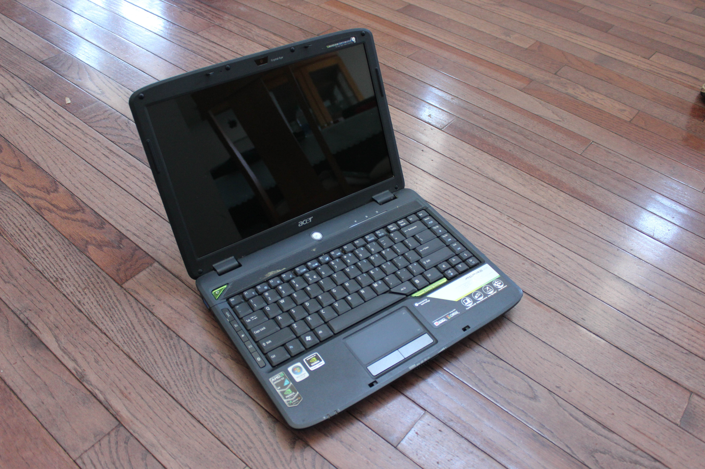
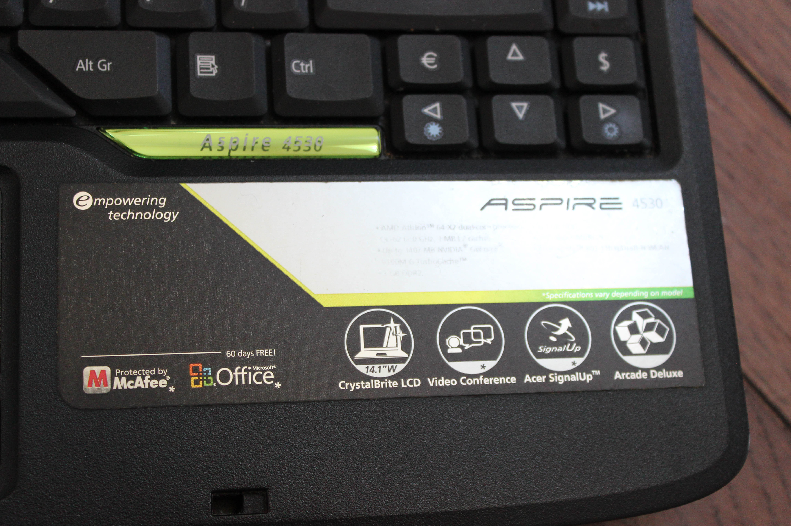
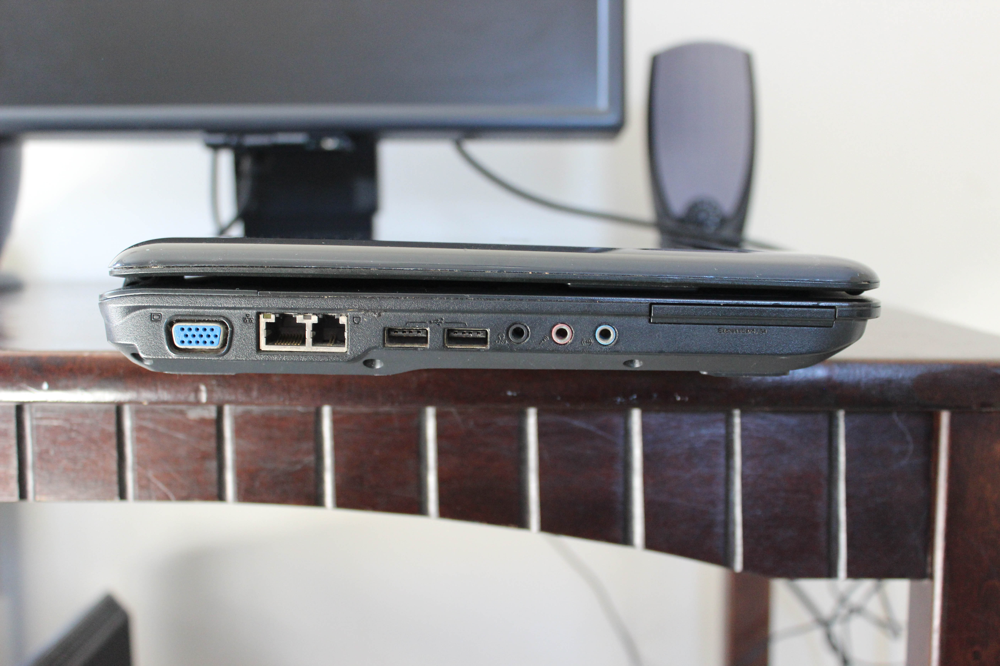

# Acer Aspire 4530
[Parent directory](../index.md)

|  |  | 
|:---:|:---:|:---:|
|  |  | 
|  |  | 
|  |  | 
|  |  | 

### Specs

* CPU: AMD Athlon X2 QL-62 2.0 GHz
* RAM: 3GB DDR2-667
* Video: nVidia GeForce 9100M G
* Storage: 320GB WD Caviar Blue 5400RPM
* Screen: 1280x800 14" TN
