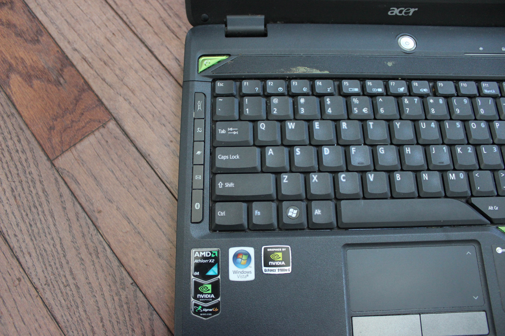
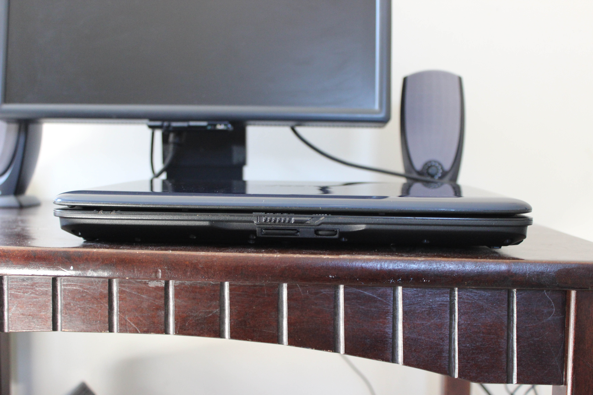
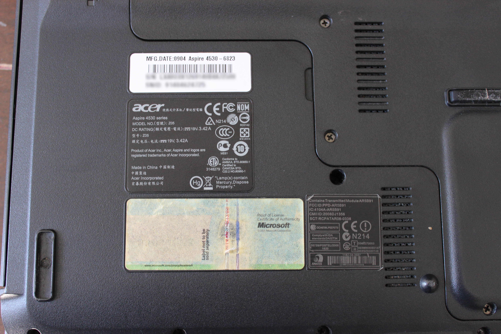
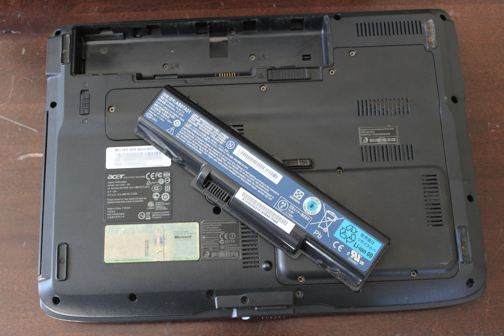

# Acer Aspire 4530
[Parent directory](../index.md)

<table>
  <tr>
    <td></td>
    <td></td>
    <td></td>
  </tr>
  <tr>
    <td></td>
    <td></td>
    <td></td>
  </tr>
  <tr>
    <td></td>
    <td></td>
    <td></td>
  </tr>
  <tr>
    <td></td>
    <td></td>
    <td></td>
  </tr>
  <tr>
    <td></td>
    <td></td>
    <td></td>
  </tr>
</table>

### Specs

* CPU: AMD Athlon X2 QL-62 2.0 GHz
* RAM: 3GB DDR2-667
* Video: nVidia GeForce 9100M G
* Storage: 320GB WD Caviar Blue 5400RPM
* Screen: 1280x800 14" TN