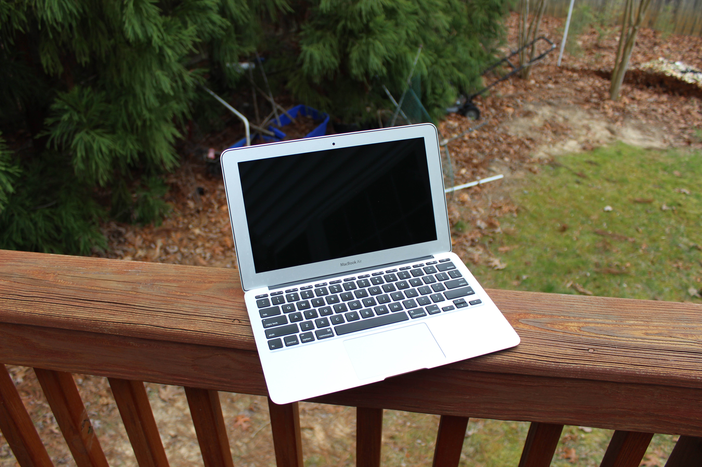
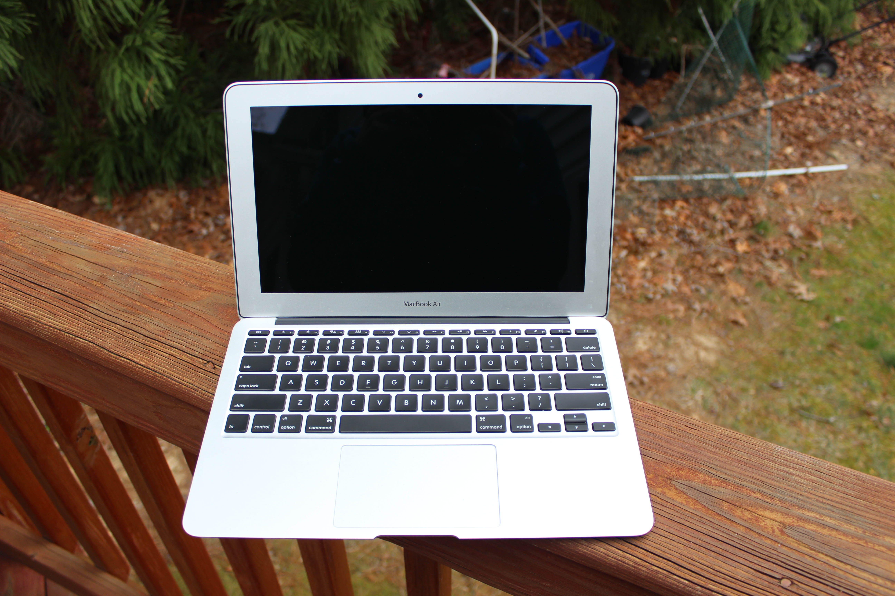
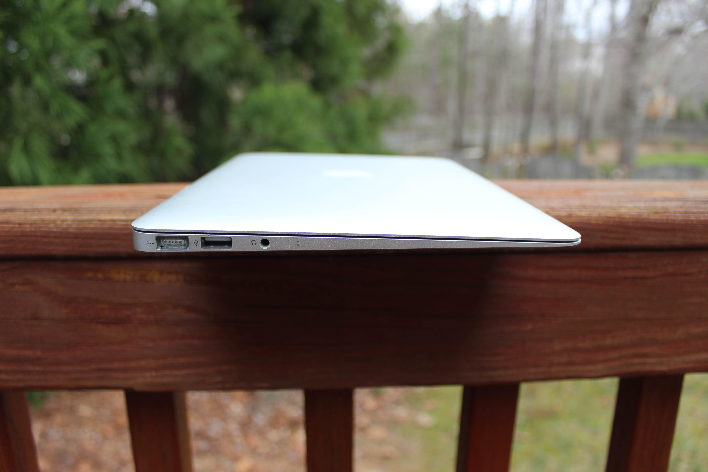
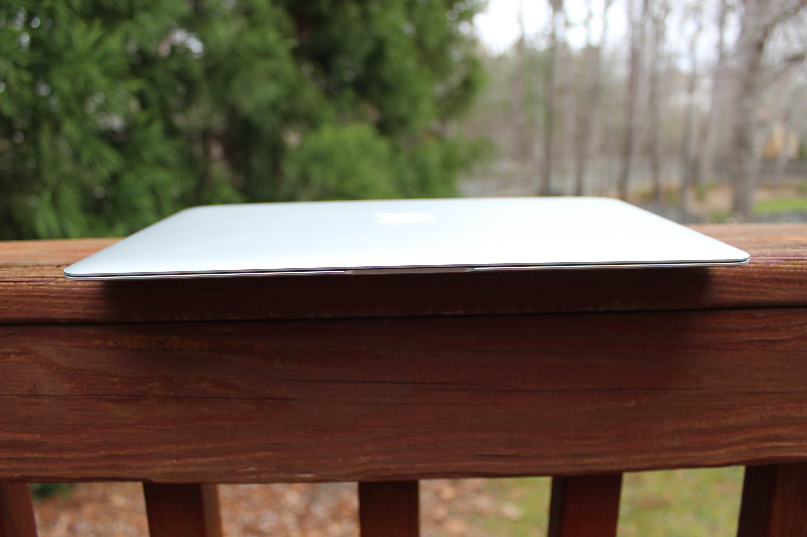
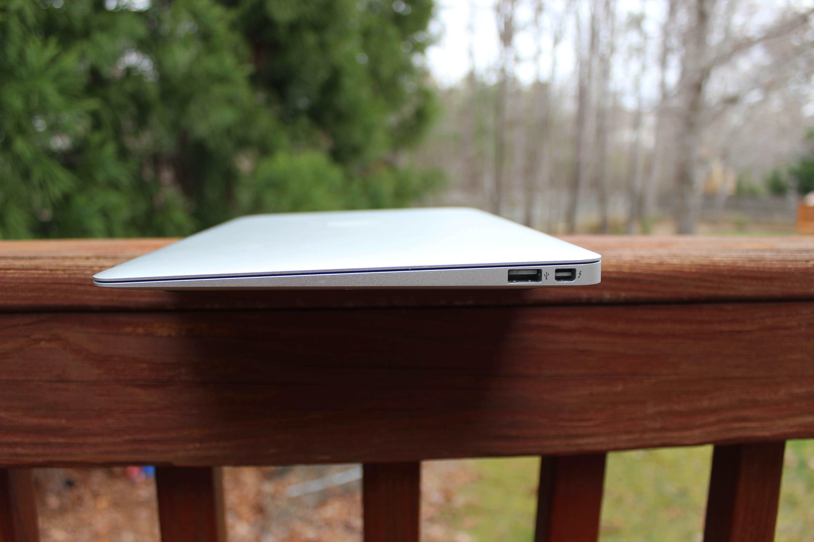
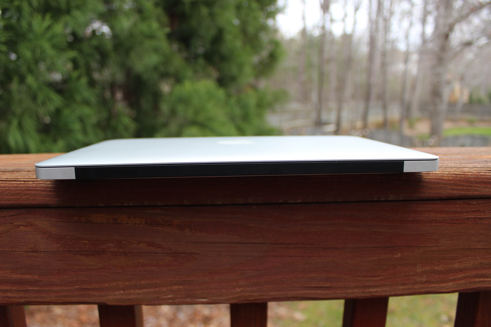
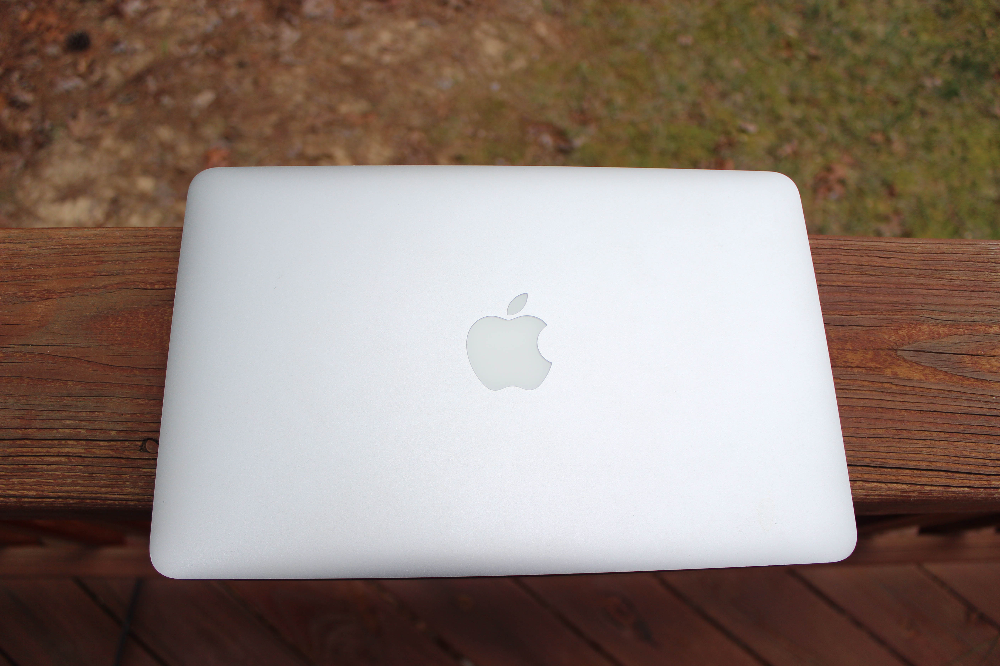
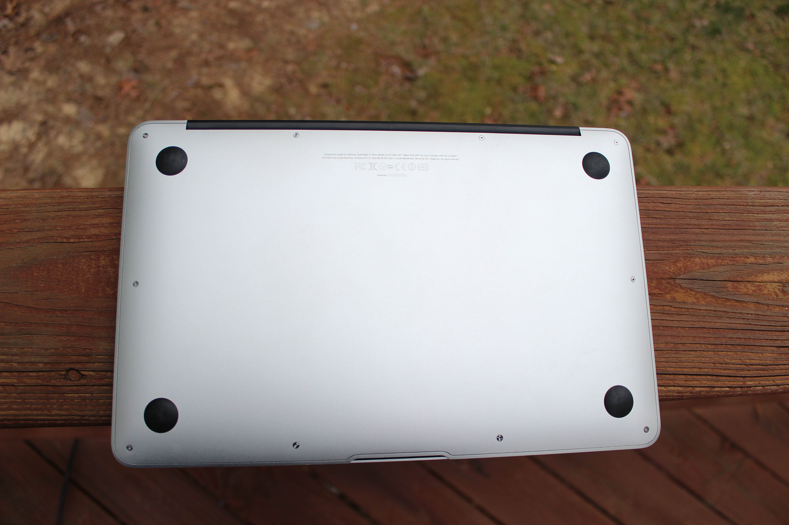
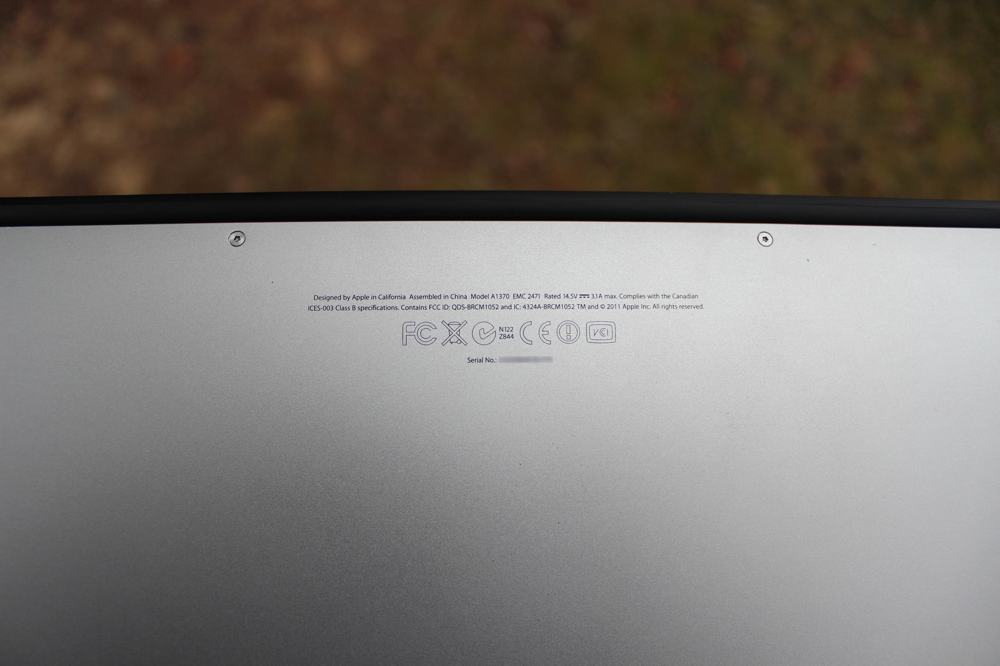
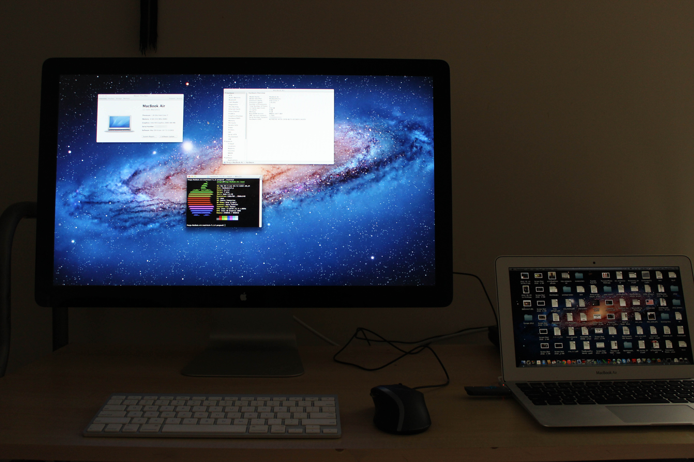

# Apple MacBook Air 11" (Mid 2011)
[Parent directory](../index.md)

<table>
  <tr>
    <td></td>
    <td></td>
    <td></td>
  </tr>
  <tr>
    <td></td>
    <td></td>
    <td></td>
  </tr>
  <tr>
    <td></td>
    <td></td>
    <td></td>
  </tr>
  <tr>
    <td></td>
    <td></td>
  </tr>
</table>

### Specs

* CPU: Intel Core i7-2677M 1.8 GHz
* RAM: 4GB DDR3-1333 (soldered)
* Video: Intel HD Graphics 3000
* Storage: 256GB Flash (PCIe-based)
* Screen: 1366x768 11" TN