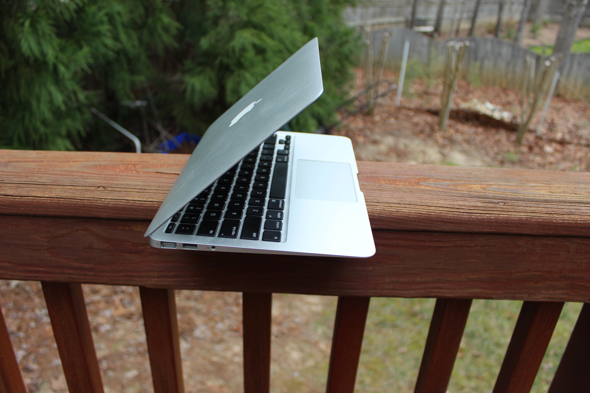

# Apple MacBook Air 11" (Mid 2011)
[Parent directory](../index.md)

|  |  | 
|:---:|:---:|:---:|
|  |  | 
|  |  | 
|  | 

### Specs

* CPU: Intel Core i7-2677M 1.8 GHz
* RAM: 4GB DDR3-1333 (soldered)
* Video: Intel HD Graphics 3000
* Storage: 256GB Flash (SATA-based)
* Screen: 1366x768 11" TN
