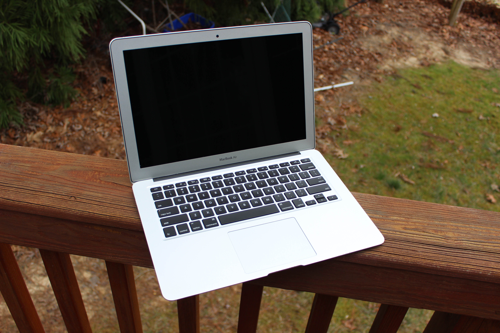
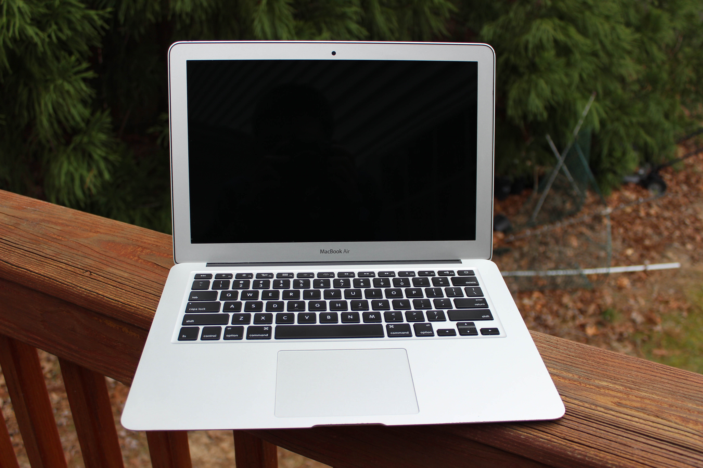
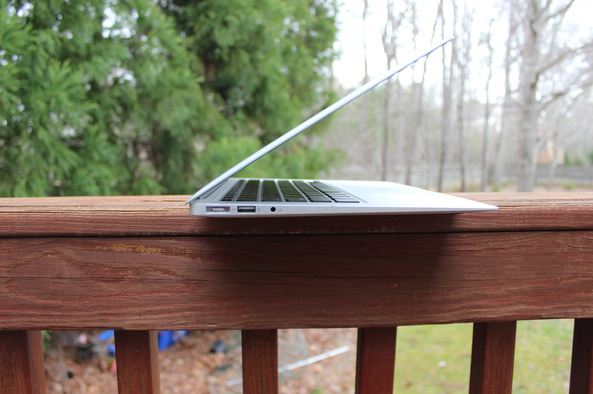
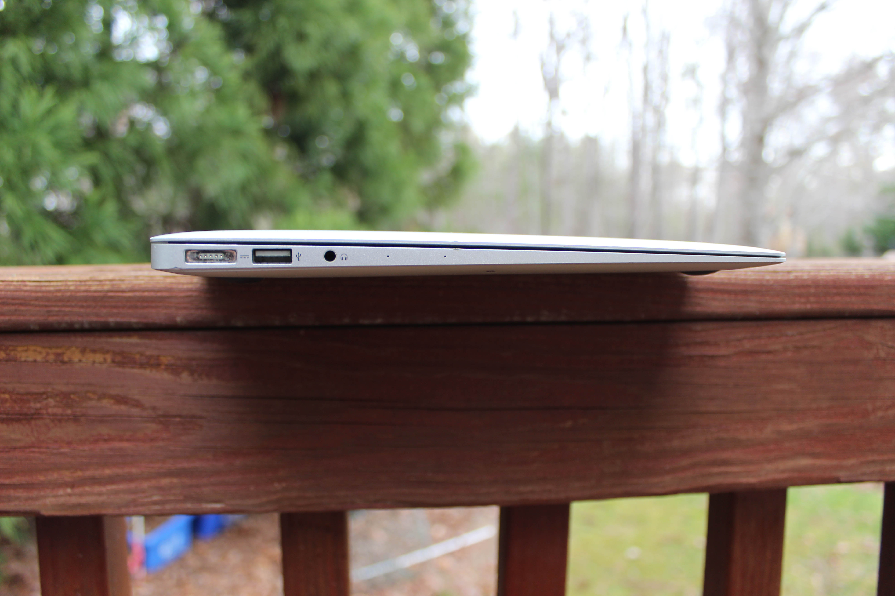
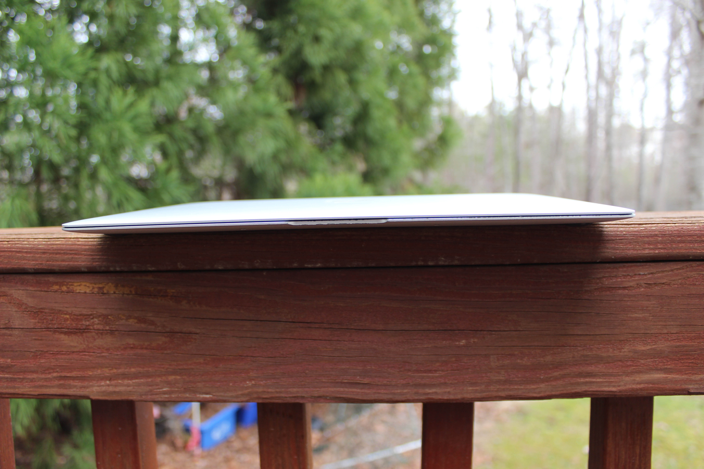
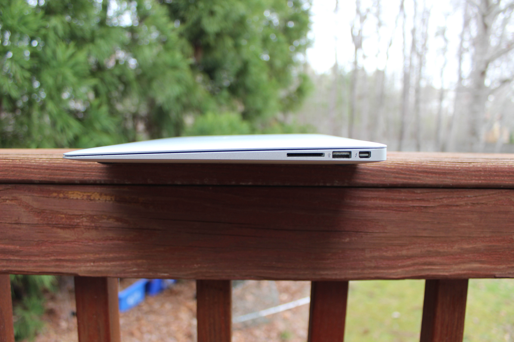
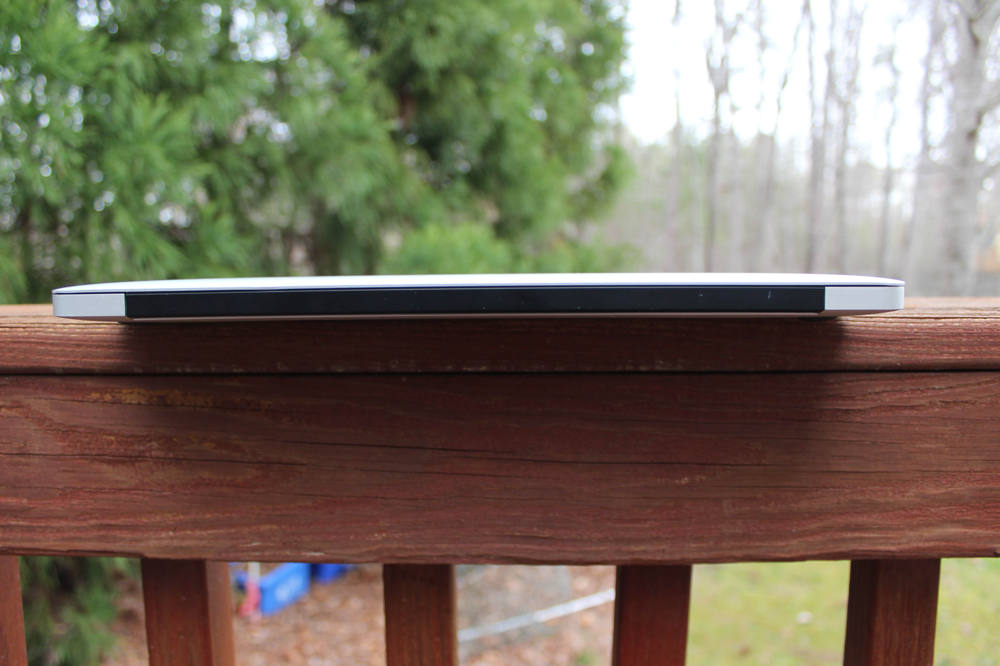
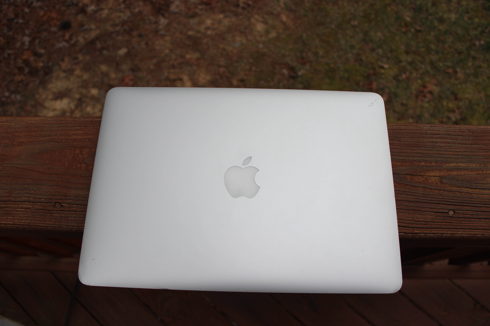
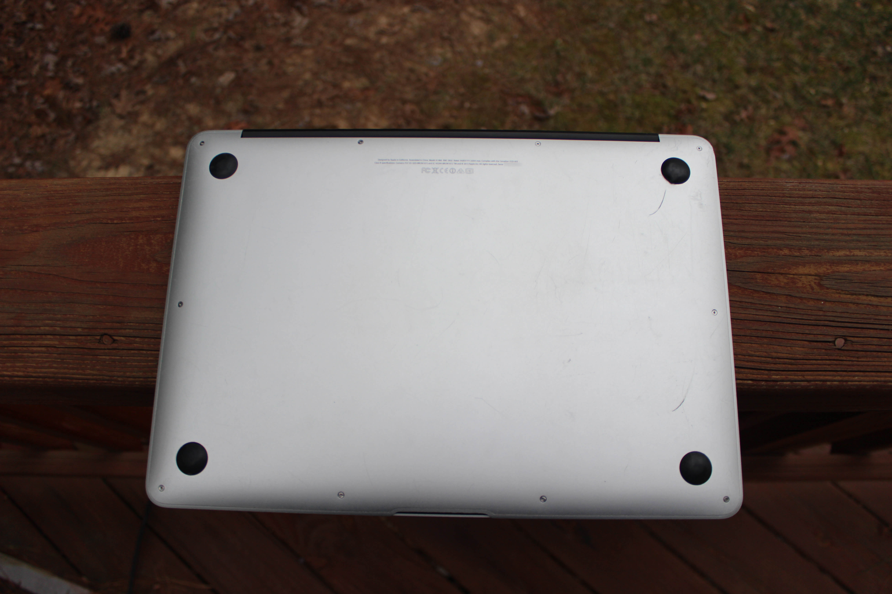

# Apple MacBook Air 13" (Mid 2013)
[Parent directory](../index.md)

|  |  | 
|:---:|:---:|:---:|
|  |  | 
|  |  | 
|  | 

### Specs

* CPU: Intel Core i7-4650U 1.7 GHz
* RAM: 8GB DDR3-1600 (soldered)
* Video: Intel HD Graphics 5000
* Storage: 500GB Flash (PCIe-based)
* Screen: 1440x900 13" TN

### Notes
This computer has seen a lot. One of the things it's been through is the beginning of my YouTube channel. Time flies!
