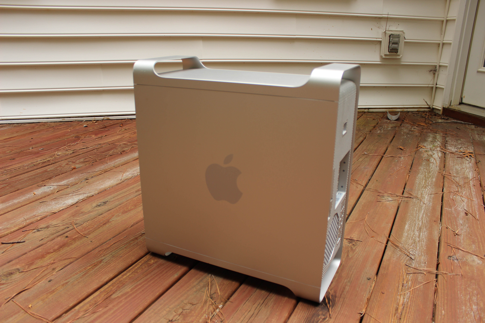
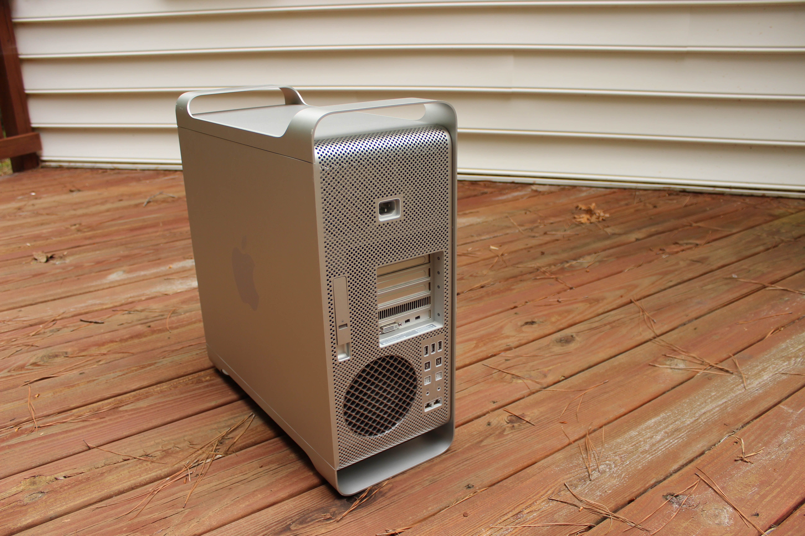
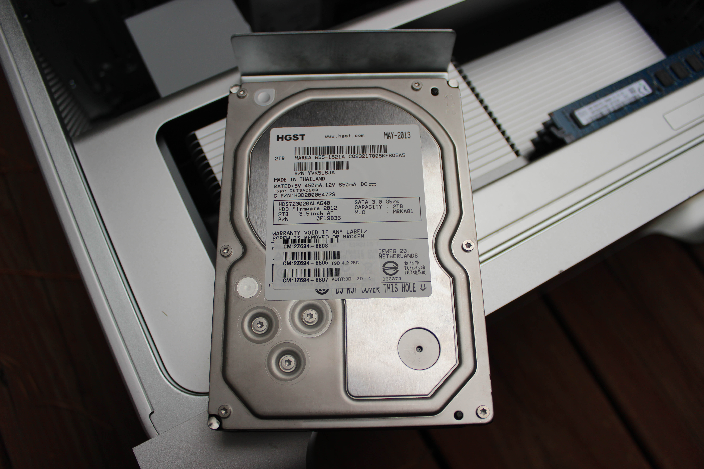
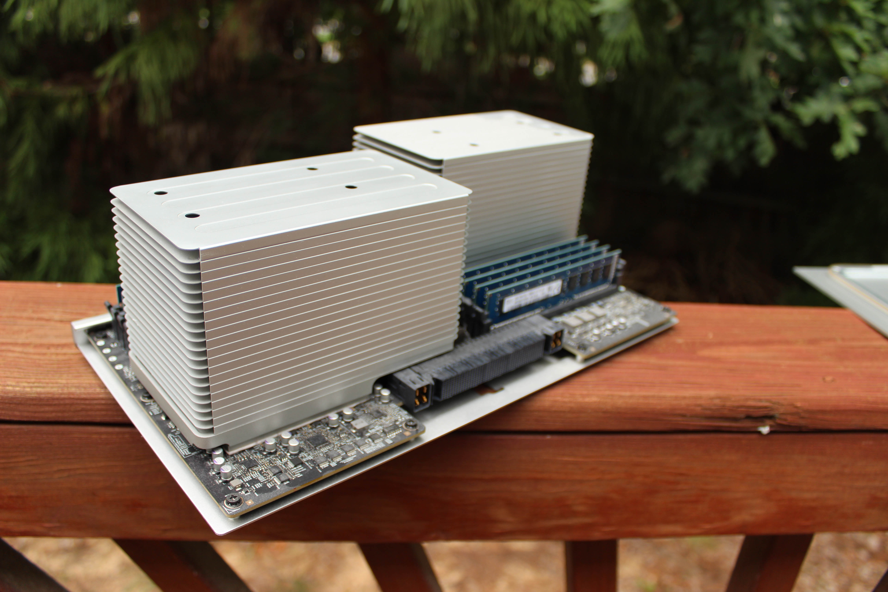
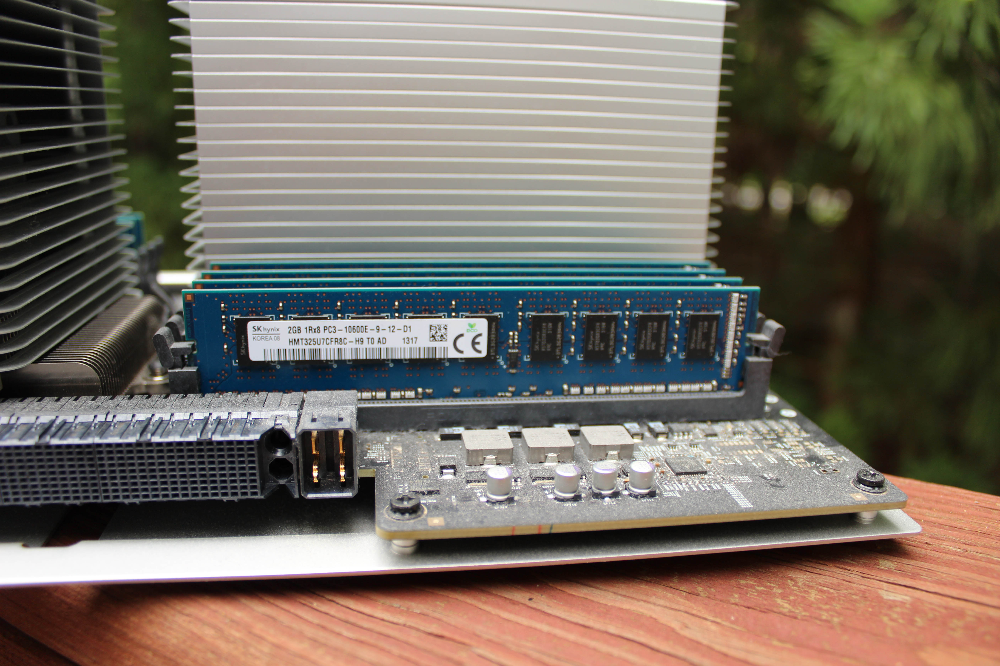
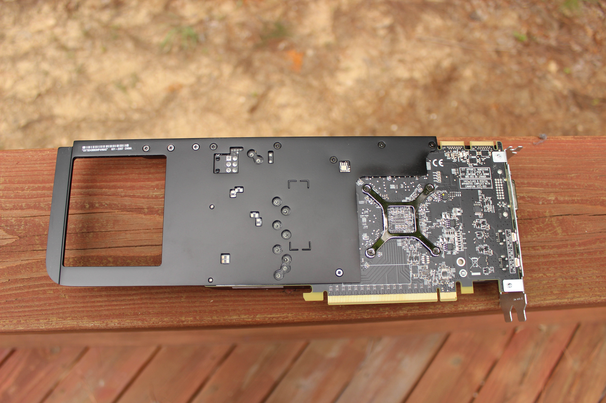
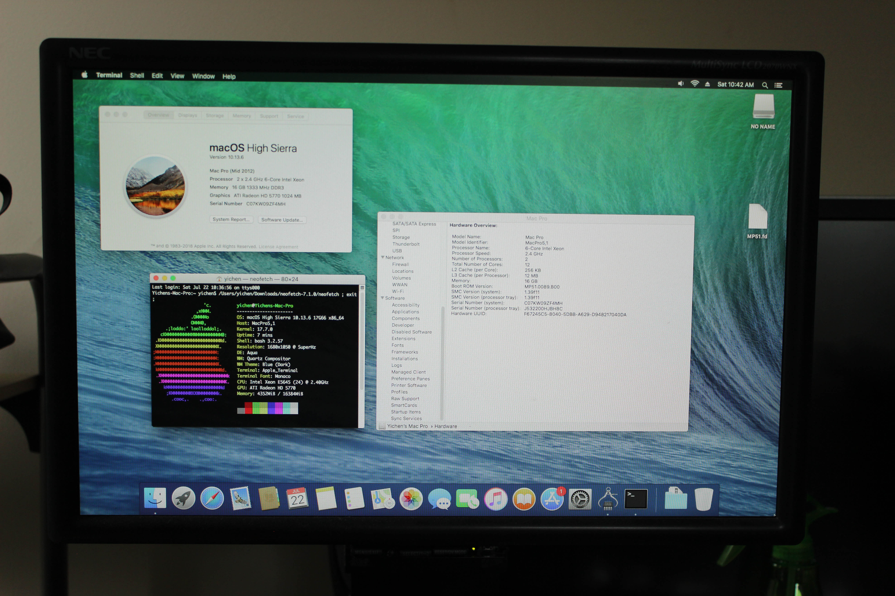

# Apple Mac Pro (Mid 2012)
[Parent directory](../index.md)

<table>
  <tr>
    <td></td>
    <td></td>
    <td></td>
  </tr>
  <tr>
    <td></td>
    <td></td>
    <td></td>
  </tr>
  <tr>
    <td></td>
    <td></td>
    <td></td>
  </tr>
  <tr>
    <td></td>
    <td></td>
    <td></td>
  </tr>
  <tr>
    <td></td>
    <td></td>
    <td></td>
  </tr>
  <tr>
    <td></td>
  </tr>
</table>

### Specs

* CPU: 2 x Intel Xeon E5645 2.4 GHz
* RAM: 16GB DDR3-1333
* Video: ATI Radeon HD 5770
* Storage: 2TB HGST 7200RPM