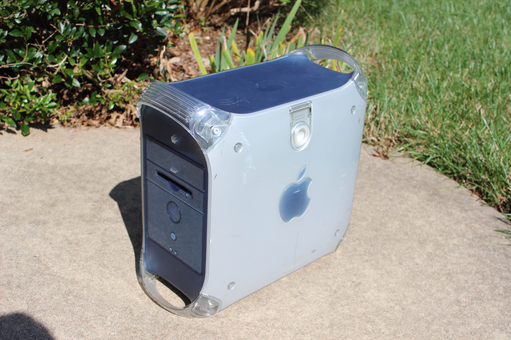
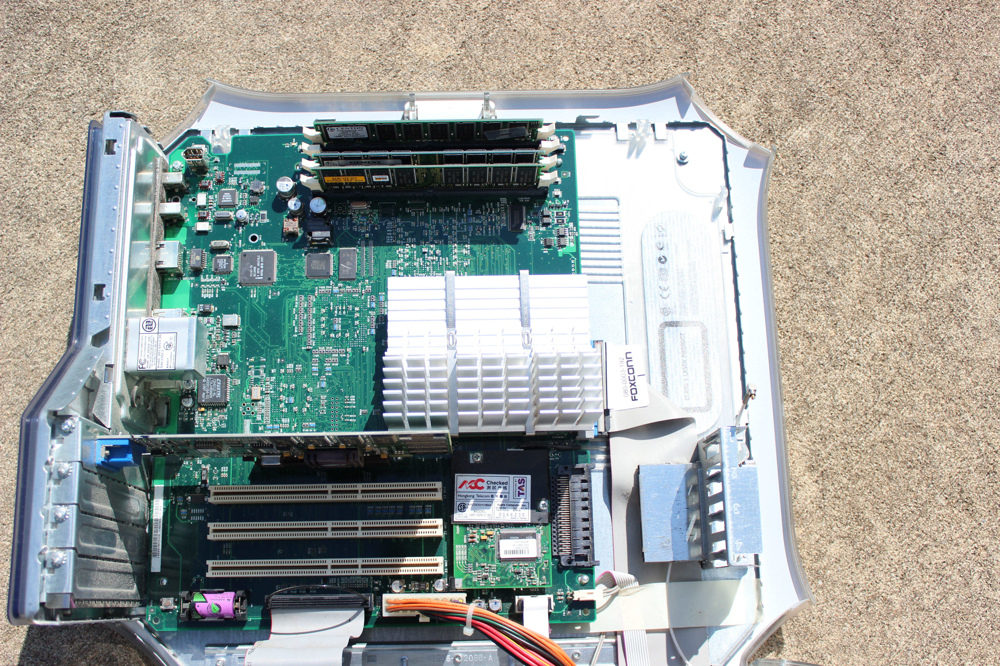
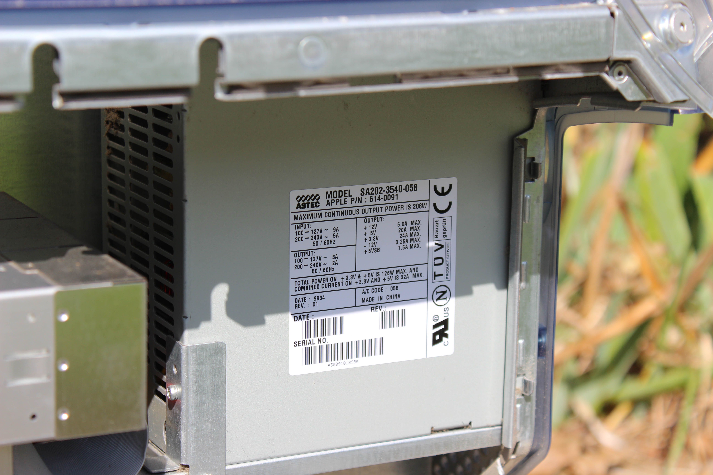
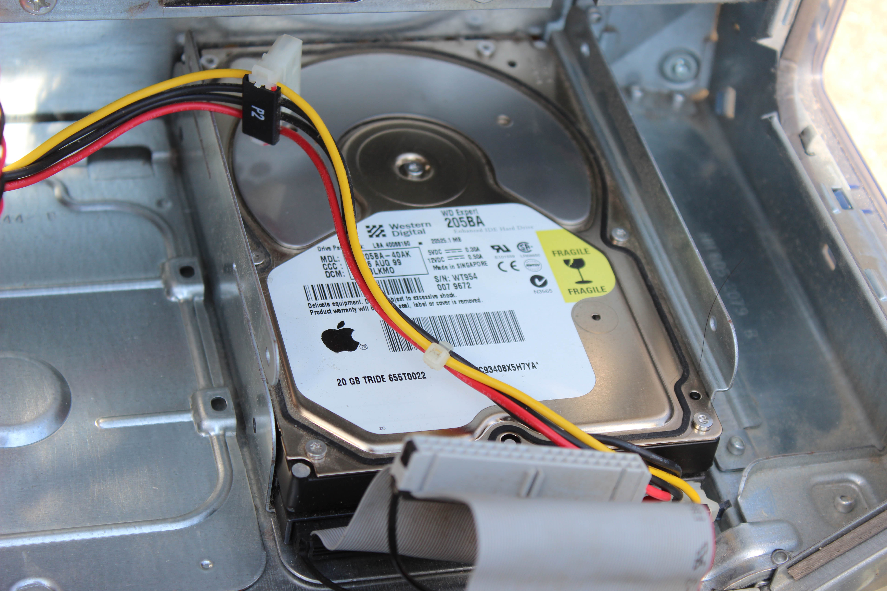
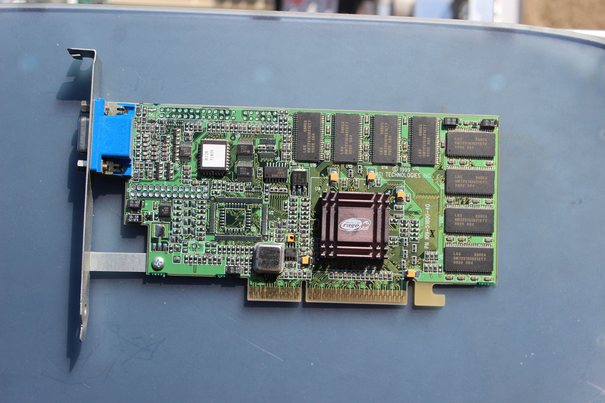
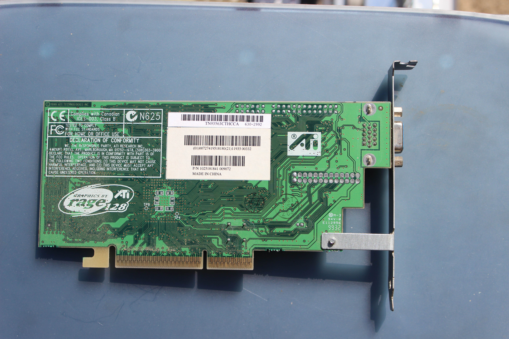
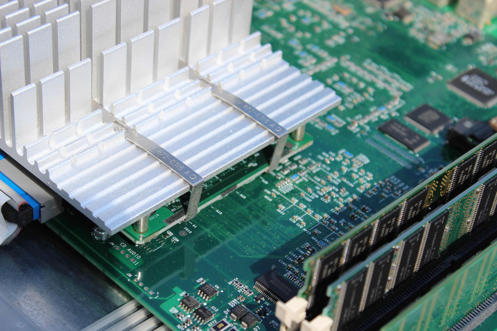

# Apple Power Mac G4
[Parent directory](../index.md)

|  |  | 
|:---:|:---:|:---:|
|  |  | 
|  |  | 
|  |  | 
|  |  | 
|  |  | 
|  | 

### Specs

* CPU: PowerPC G4 ??? 450 MHz
* RAM: 384MB? SDRAM
* Video: ATI Rage 128
* Storage: 20GB WD Expert WD205BA 7200RPM
