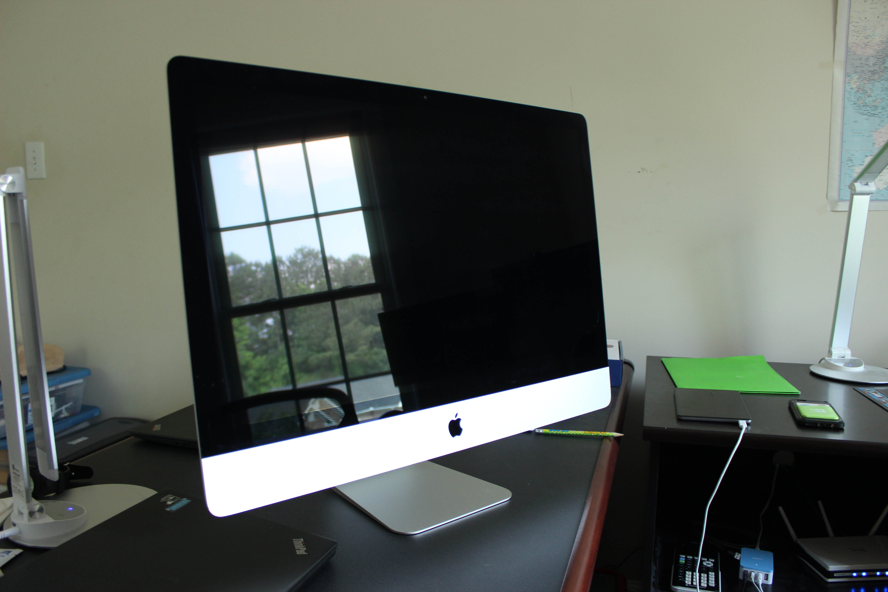
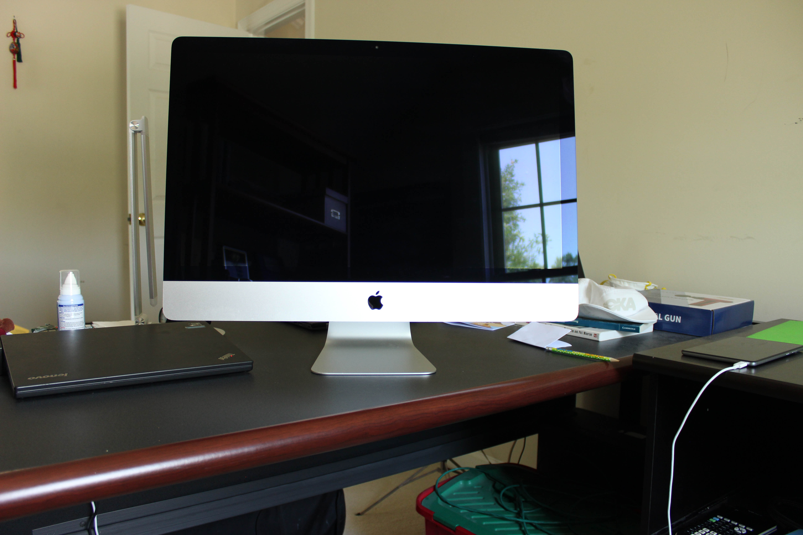
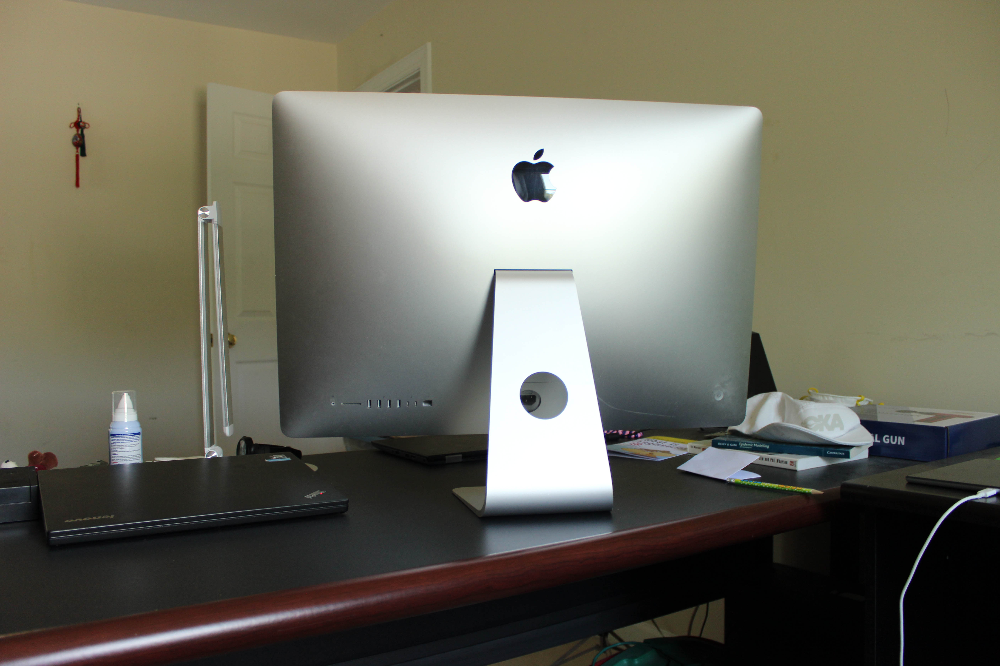
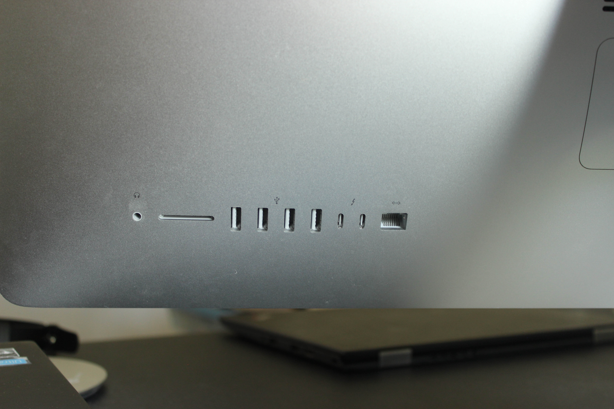
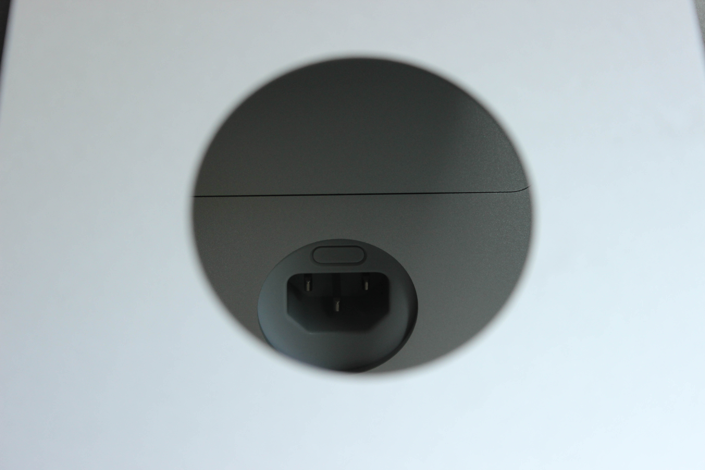
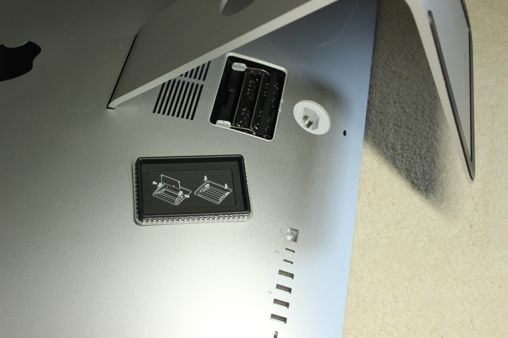
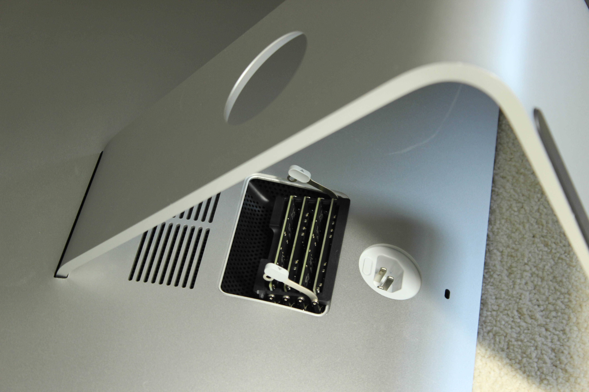

# Apple iMac 27" (Mid 2017)
[Parent directory](../index.md)

<table>
  <tr>
    <td></td>
    <td></td>
    <td></td>
  </tr>
  <tr>
    <td></td>
    <td></td>
    <td></td>
  </tr>
  <tr>
    <td></td>
  </tr>
</table>

### Specs

* CPU: Intel Core i5-7600K 3.8 GHz
* RAM: 48GB DDR4-2400 (upgraded from 16GB DDR4-2400)
* Video: AMD Radeon Pro 580
* Storage: 2TB Fusion Drive (128GB PCIe SSD + 2TB 7200RPM HDD)
* Screen: 5120x2880 27" IPS

### Notes
I decided to archive this computer after upgrading the memory because the old Apple Fusion Drive died. It was a work computer, so it unfortunately went to the Apple store for repairs (company policy prevented them from changing the system configuration so in went another "Fusion Drive"). To be fair, the drives were abused: swap often totaled above physical memory, so the poor already-small SSD was being hit with extra writes from caching and swapping. Yet another one of Apple's design decisions ended up resulting in reduced longetivity, but it seems that that is what they are going for.