# Main PC
[Parent directory](../index.md)

<table>
  <tr>
    <td>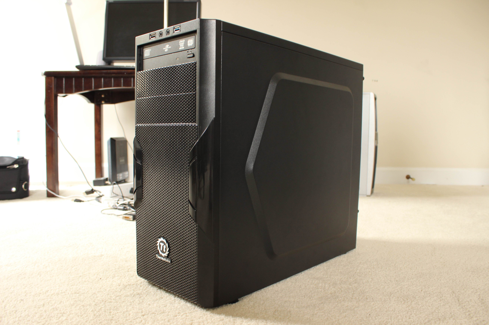</td>
    <td>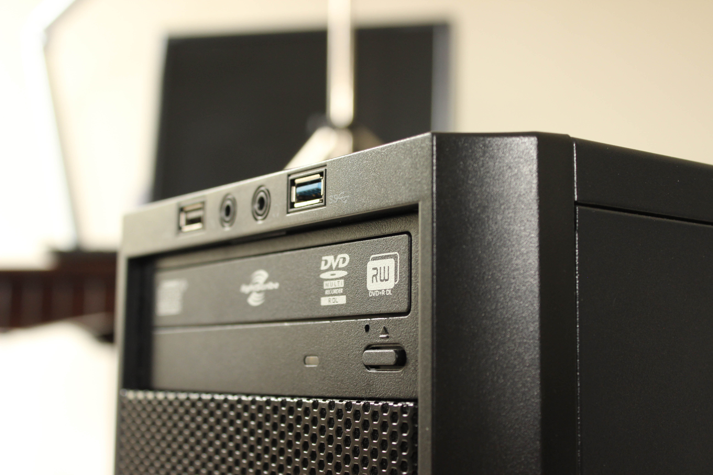</td>
    <td>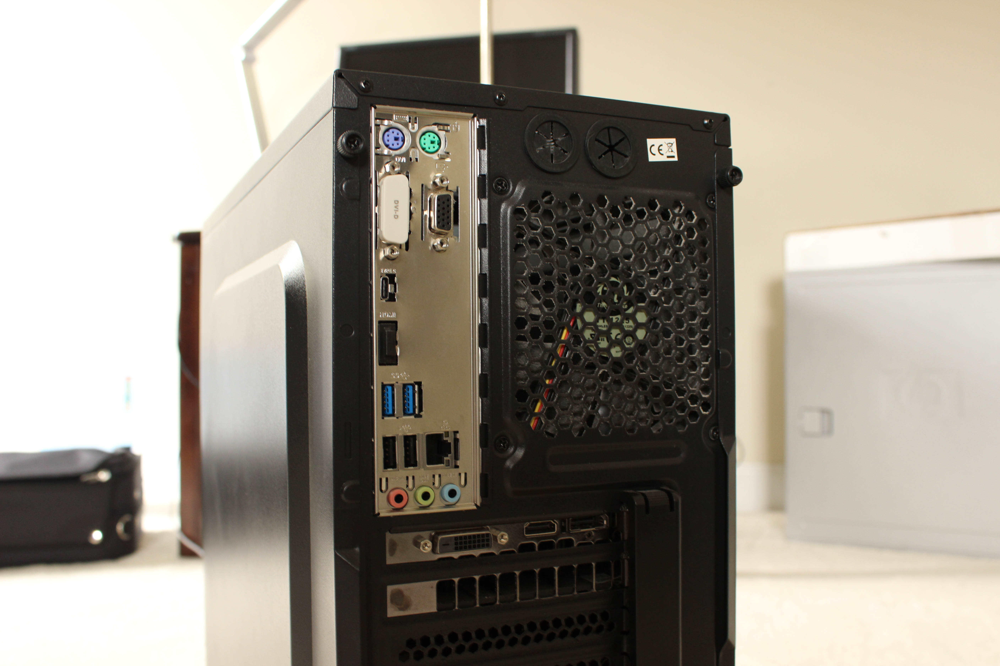</td>
  </tr>
  <tr>
    <td>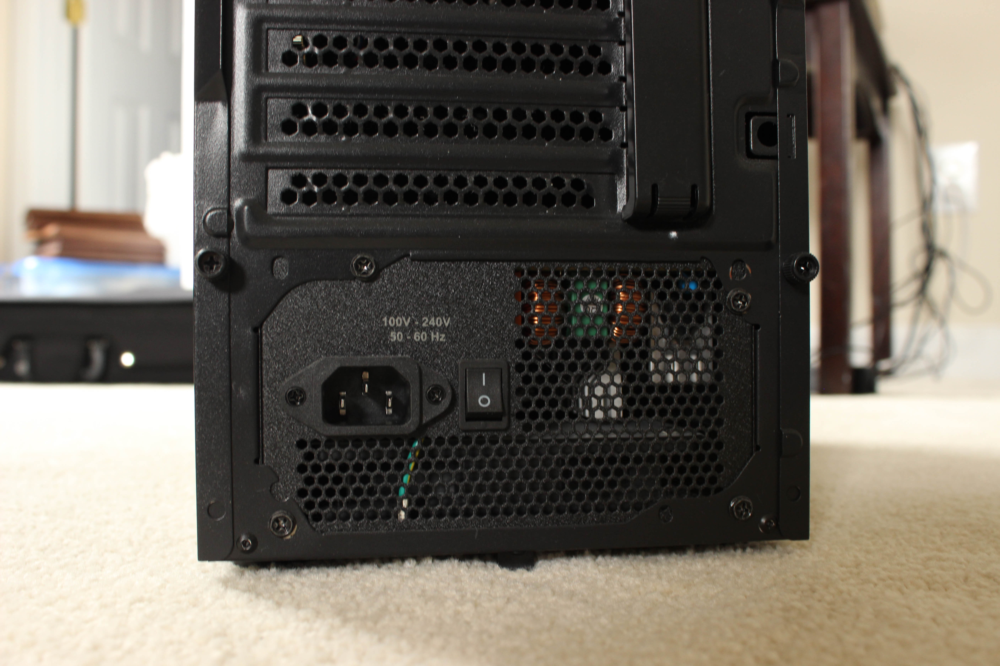</td>
    <td>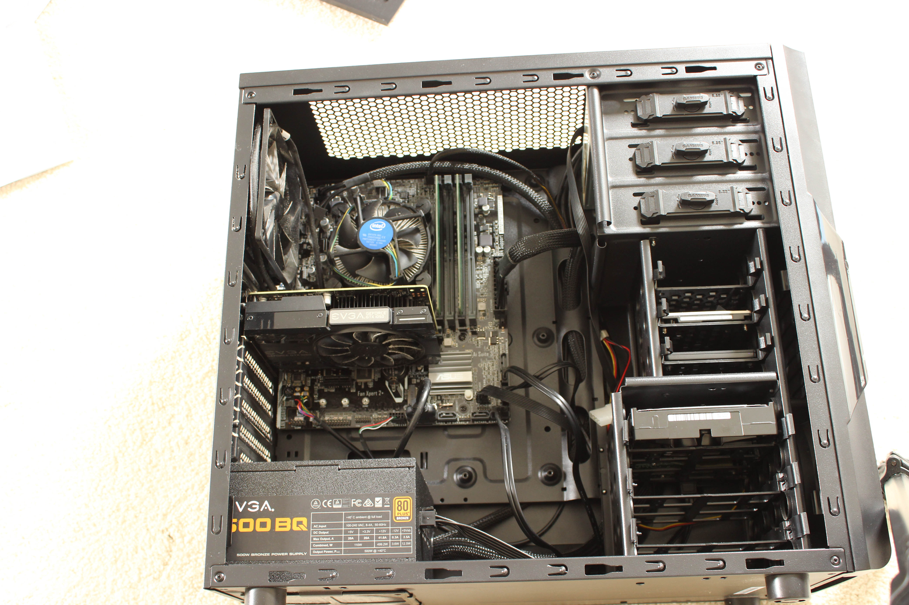</td>
    <td>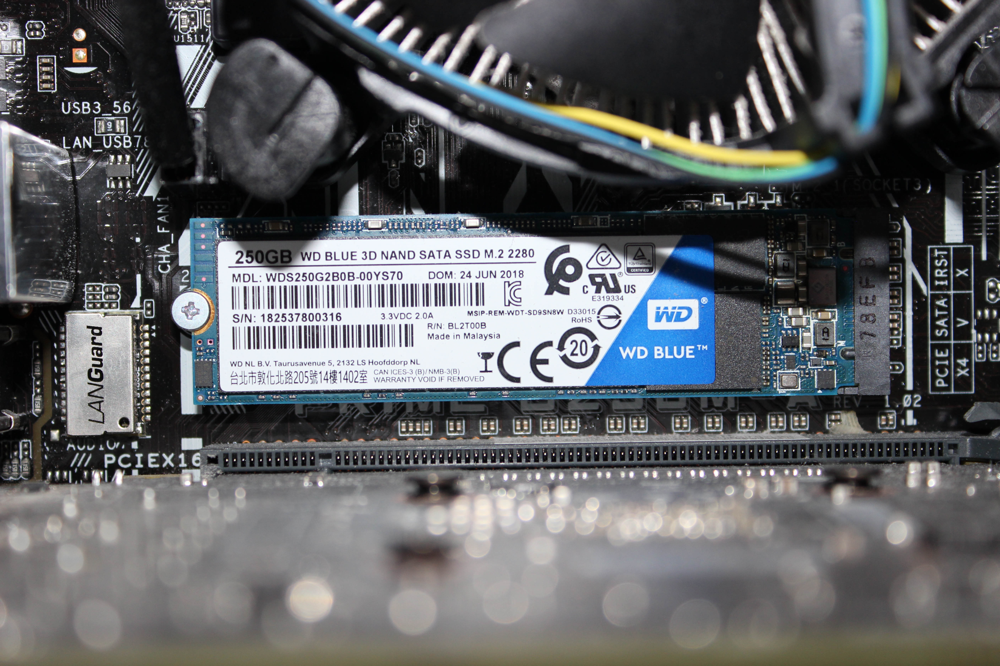</td>
  </tr>
  <tr>
    <td>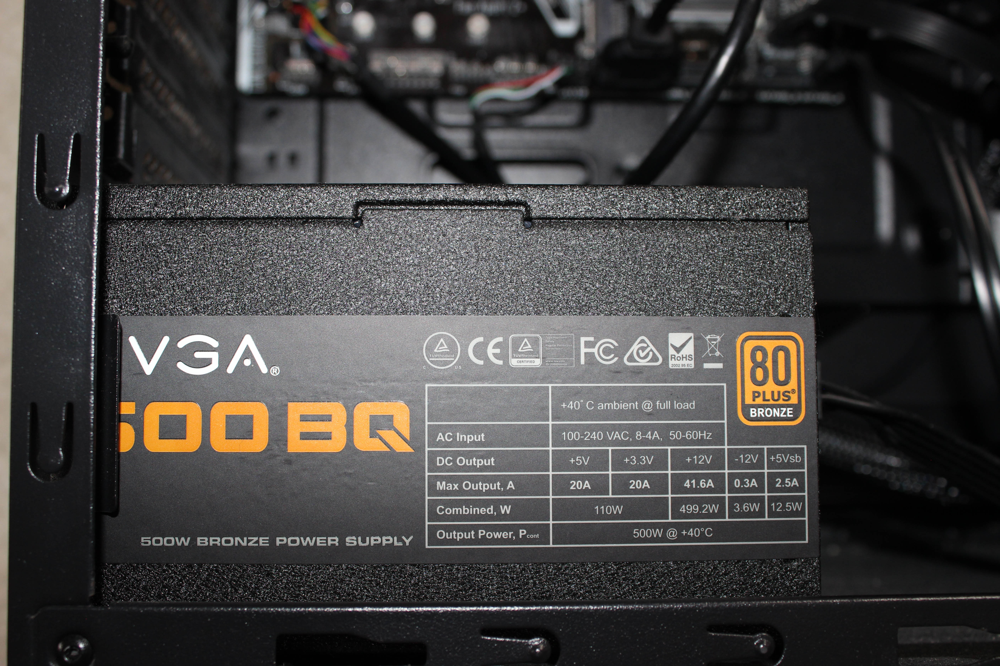</td>
    <td>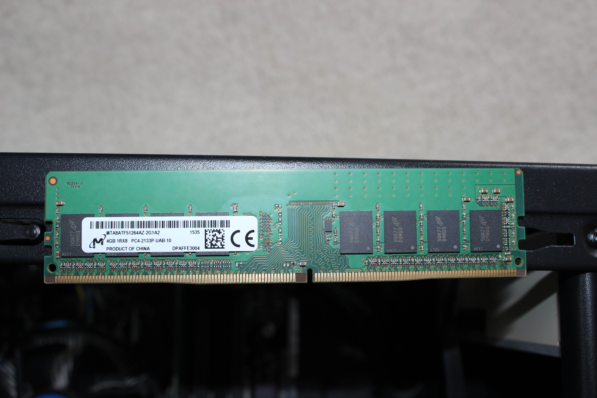</td>
    <td>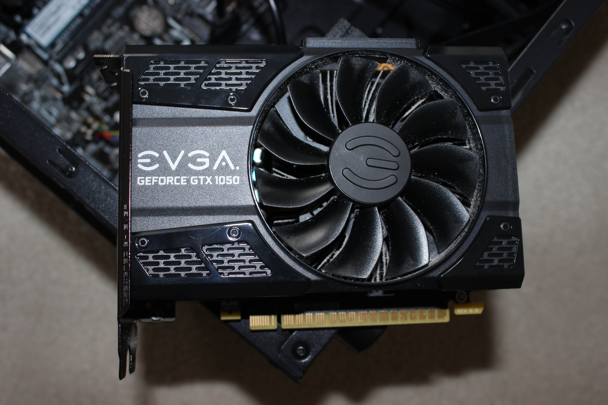</td>
  </tr>
  <tr>
    <td>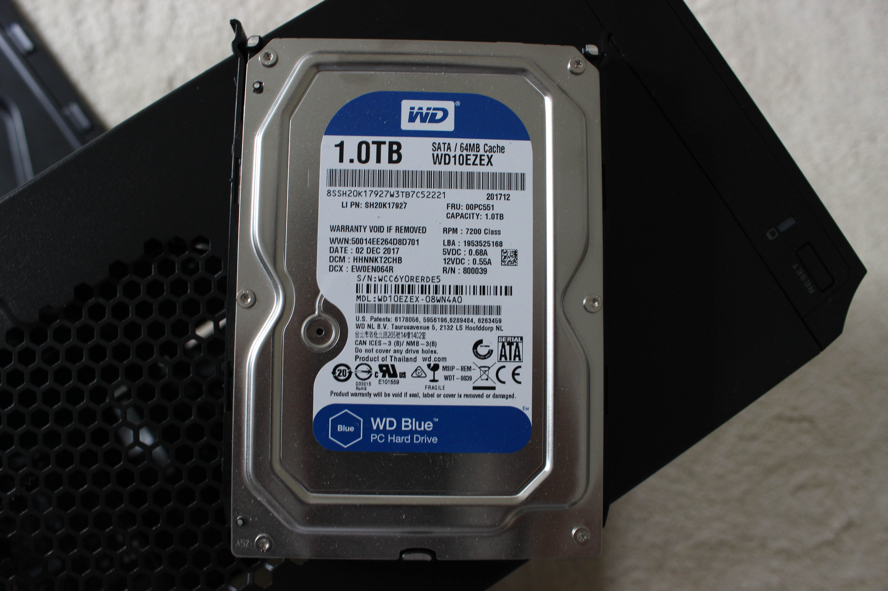</td>
    <td>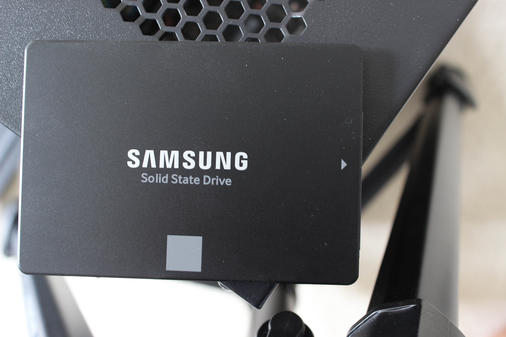</td>
    <td>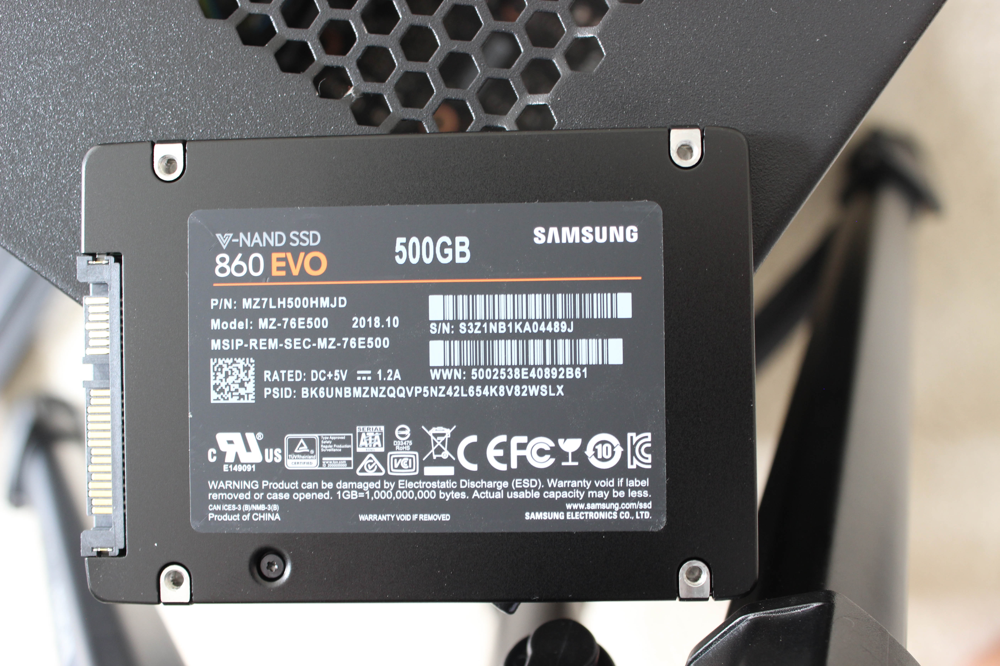</td>
  </tr>
  <tr>
    <td>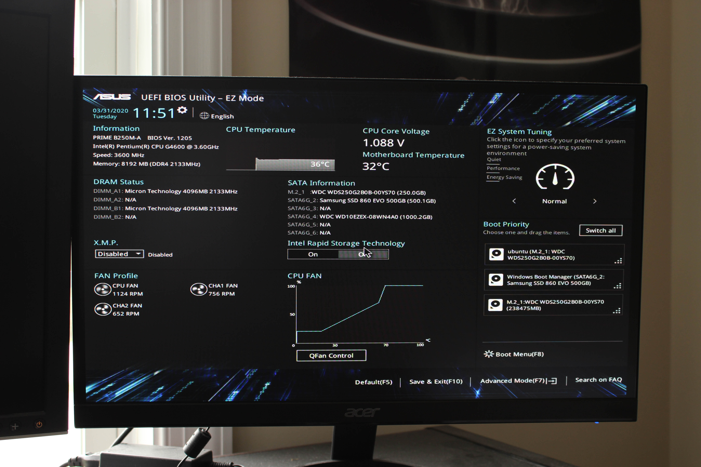</td>
  </tr>
</table>

### [Specs](Specs.txt)

<embed src='Specs.txt'>

### Notes
This was the first (and only as of 2021) PC that I built myself. I built it in late 2017 on a 300-dollar budget. This happened to be when manufacturers were fixing memory prices, so I could only afford 8GB of second-hand RAM. Despite this, I was able to get some good deals, such as a new GTX 1050 from Amazon for under $90. I have since upgraded it by adding SSDs and a spare laptop hard drive. Although it has minor issues (such as the second-hand 2008-era optical drive breaking) this system has served me well for a few years.
