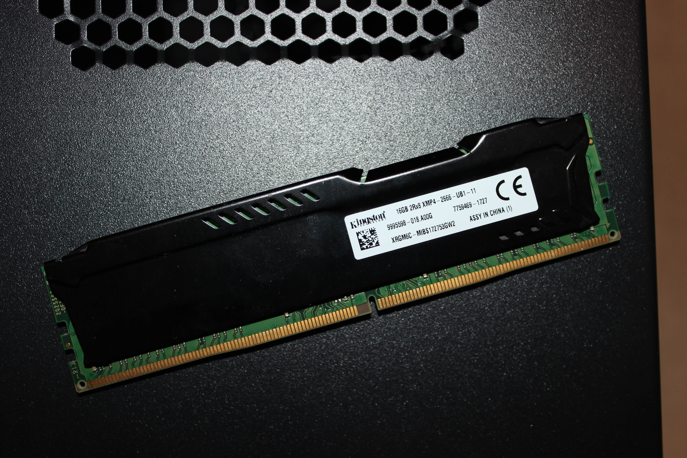
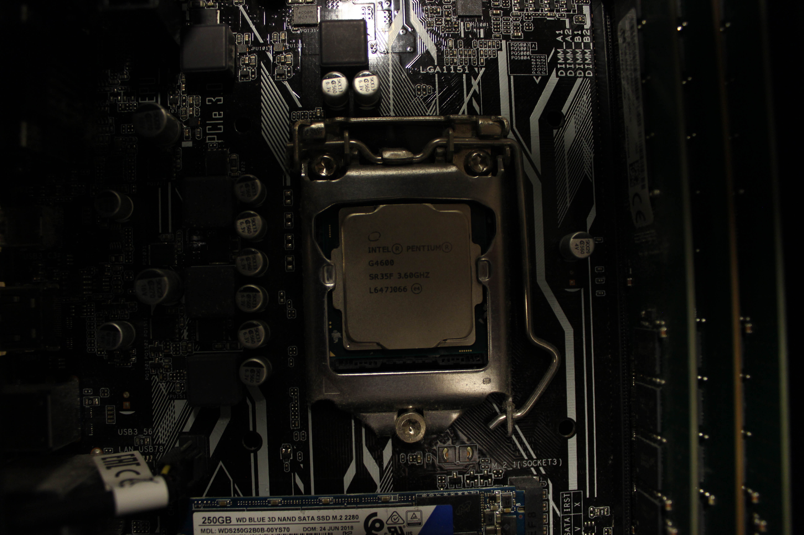
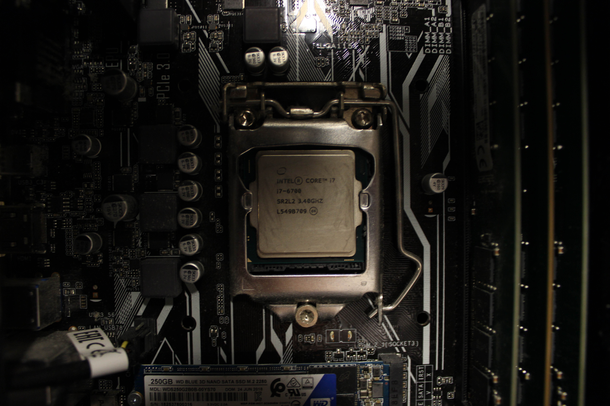
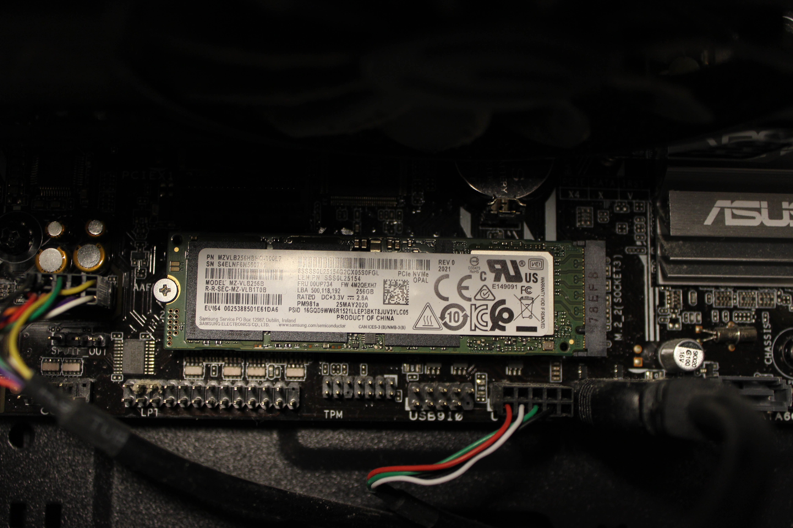
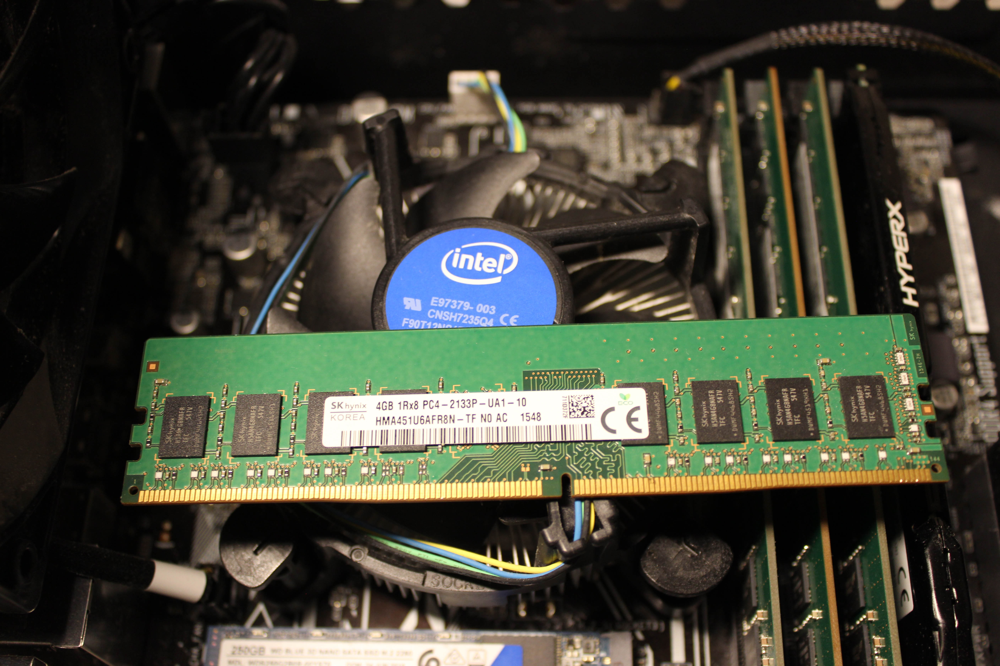

# Main PC
[Parent directory](../index.md)

|  |  | 
|:---:|:---:|:---:|
|  |  | 
|  |  | 
|  |  | 
|  |  | 
|  |  | 

### Specs

* CPU: Intel Core i7-6700 3.4GHz
* RAM: 28GB DDR4 (12GB 2133 + 16GB 2400)
* Video: nVidia GeForce GTX 1050
* Storage:  256GB Samsung PM981a, 250GB WD Blue SATA M.2, 500GB Samsung 860 EVO, 1TB WD Blue 7200RPM, 500GB Toshiba Apple 5400RPM

### Notes
This was the first (and only as of 2025) PC that I built myself. I built it in late 2017 on a 300-dollar budget. This happened to be when manufacturers were fixing memory prices, so I could only afford 8GB of second-hand RAM. Despite this, I was able to get some good deals, such as a new GTX 1050 from Amazon for under $90. I have since upgraded it by adding SSDs, spare drives, more RAM (thanks Allen!), and a CPU fished from an OptiPlex in an e-cycling pile. The upgrades have helped this system serve me well for quite a few years.
