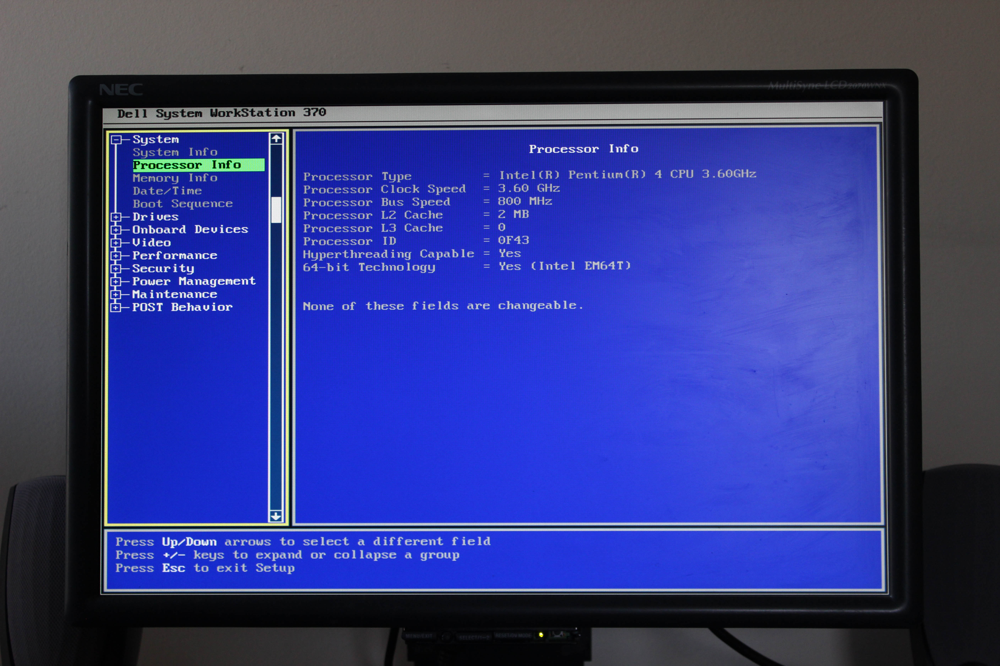

# Dell Precision 370
[Parent directory](../index.md)

|  |  | 
|:---:|:---:|:---:|
|  |  | 
|  |  | 
|  |  | 
|  |  | 
|  |  | 
|  |  | 
| 

### Specs

* CPU: Intel Pentium 4 660 3.6GHz
* RAM: 3GB DDR2-533 ECC
* Video: nVidia Quadro FX 1400
* Storage: 160GB WD Caviar Blue 7200RPM
