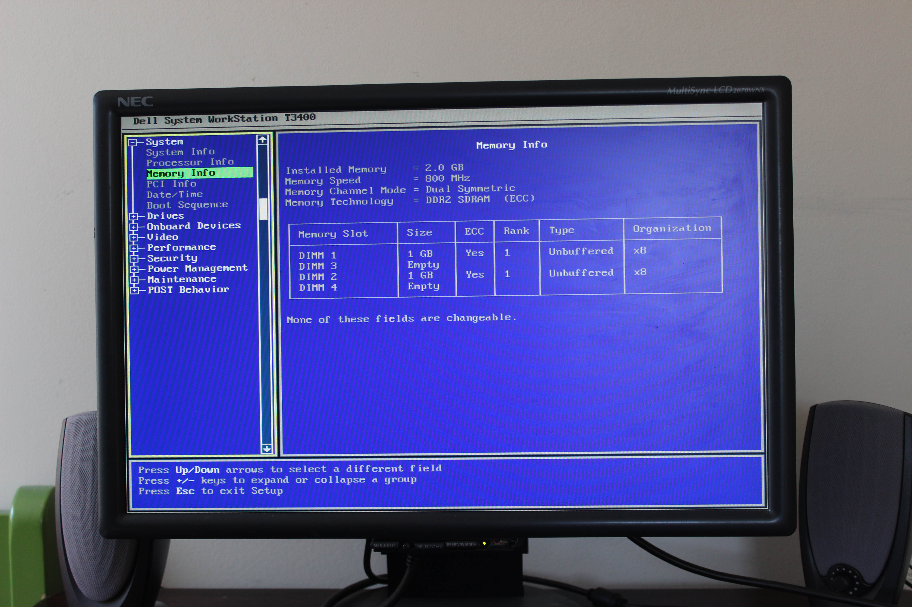

# Dell Precision T3400
[Parent directory](../index.md)

|  |  | 
|:---:|:---:|:---:|
|  |  | 
|  |  | 
|  |  | 
|  |  | 
|  |  | 
|  |  | 

### Specs

* CPU: Intel Core 2 Duo E8400 3GHz
* RAM: 2GB DDR2-800 ECC
* Video: nVidia Quadro NVS 290
* Storage: 750GB Seagate 7200.11 7200RPM, 1TB WD Caviar Black 7200RPM, 160GB WD Caviar 7200RPM
