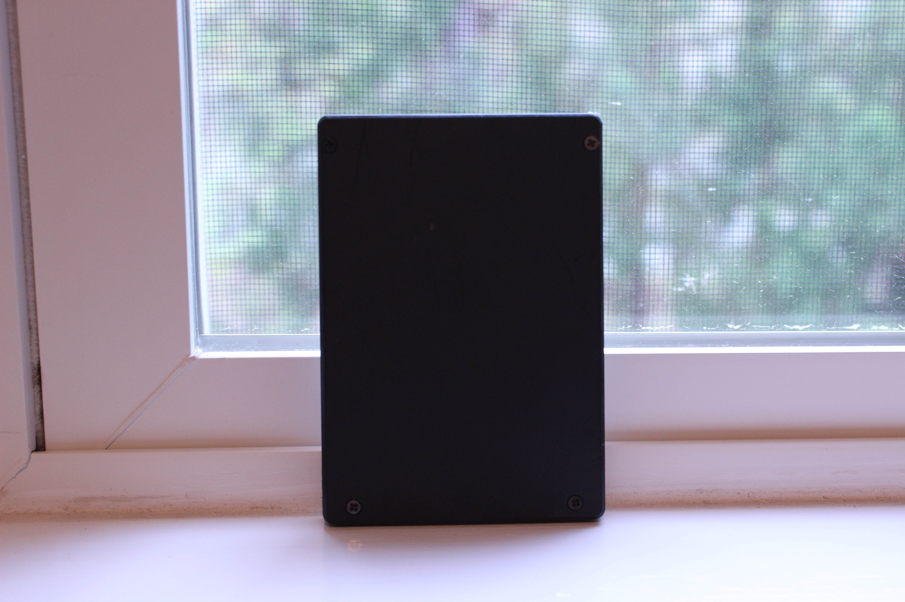

# Dell Precision T3500
[Parent directory](../index.md)

|  |  | 
|:---:|:---:|:---:|
|  |  | 
|  |  | 
|  |  | 
|  |  | 
|  |  | 

### Specs

* CPU: Intel Xeon W3565 3.2GHz
* RAM: 12GB DDR3-1333 ECC
* Video: nVidia Quadro NVS 295
* Storage: 750GB Seagate 7200.12 7200RPM, 128GB Samsung SSD (Upgraded)
