# Dell Precision Tower 5810
[Parent directory](../index.md)

| 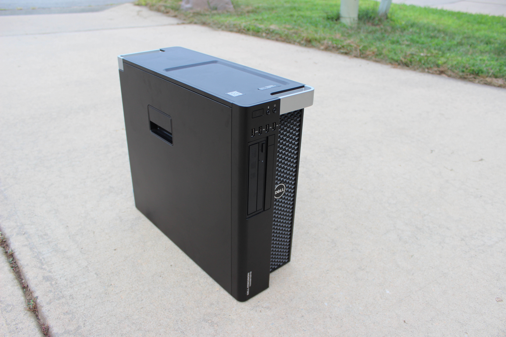 | 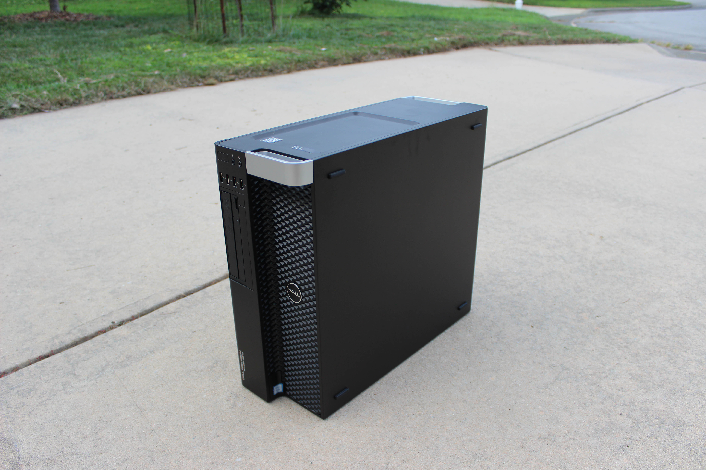 | 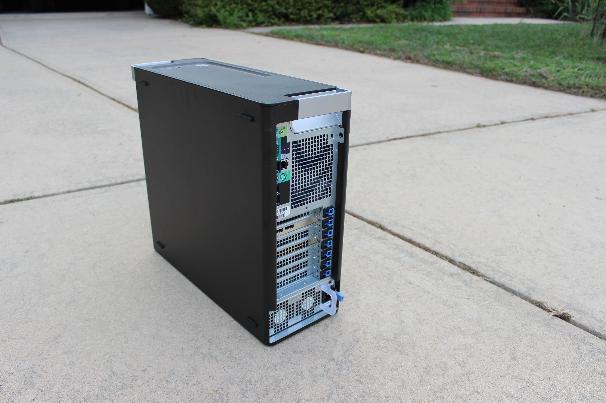
|:---:|:---:|:---:|
| 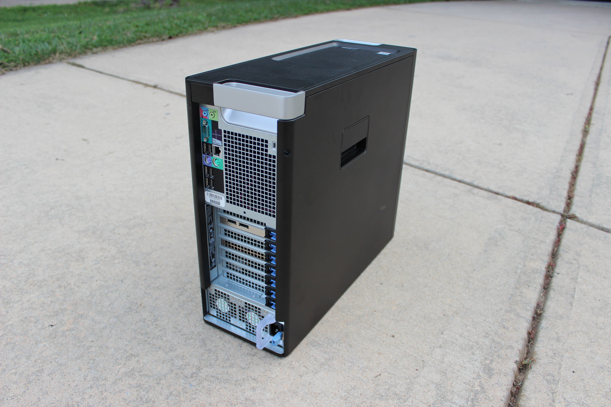 | 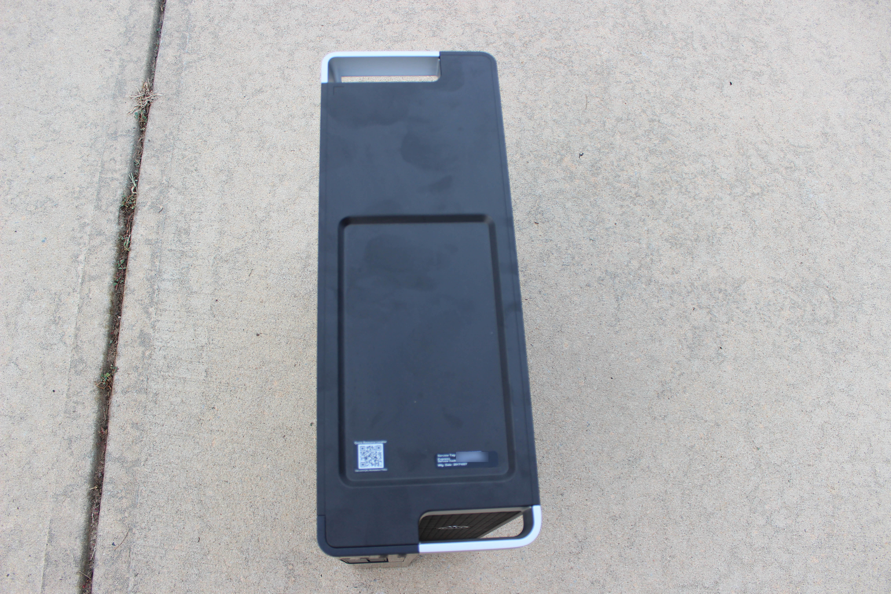 | 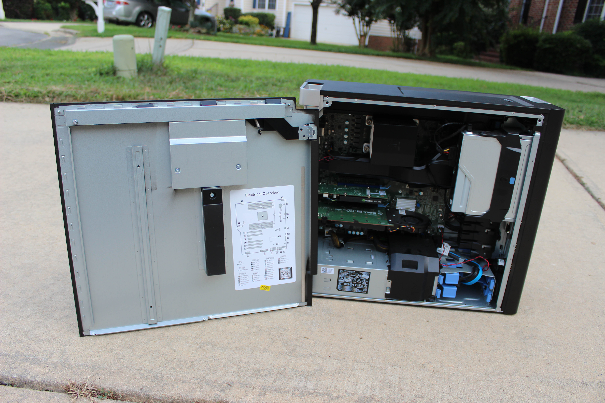
| 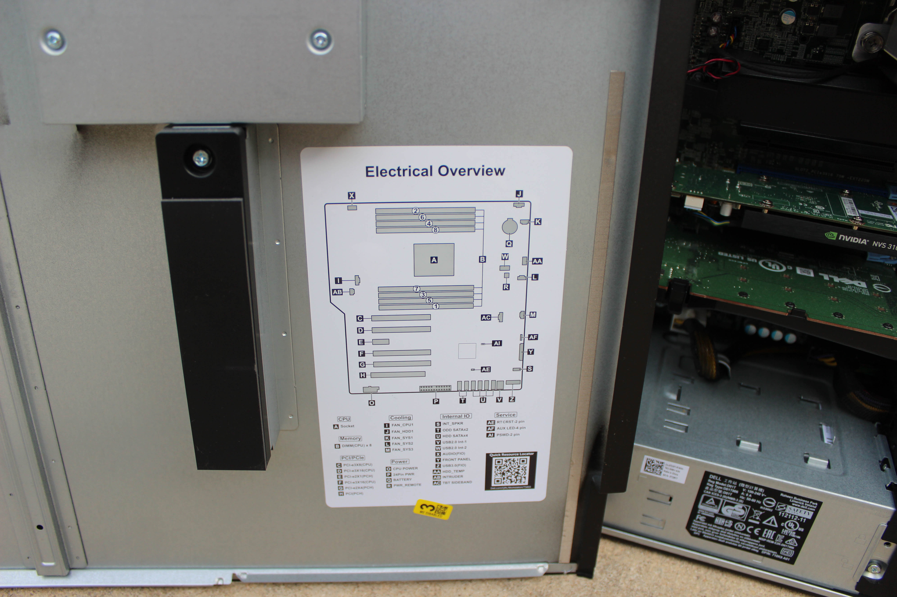 | 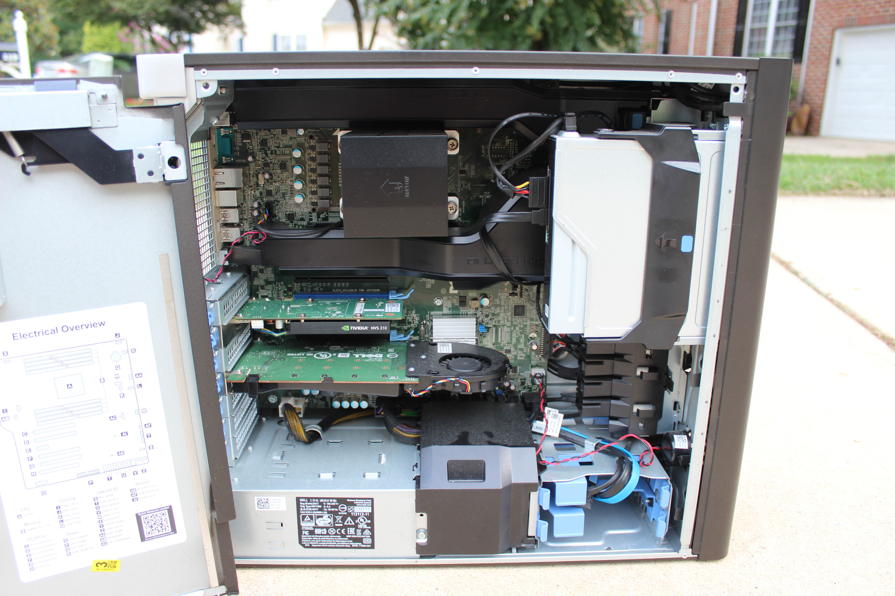 | 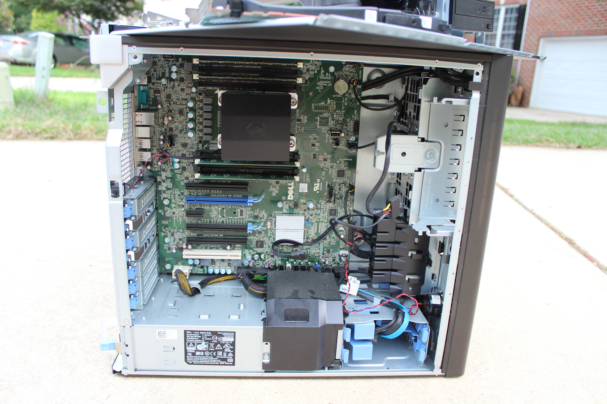
| 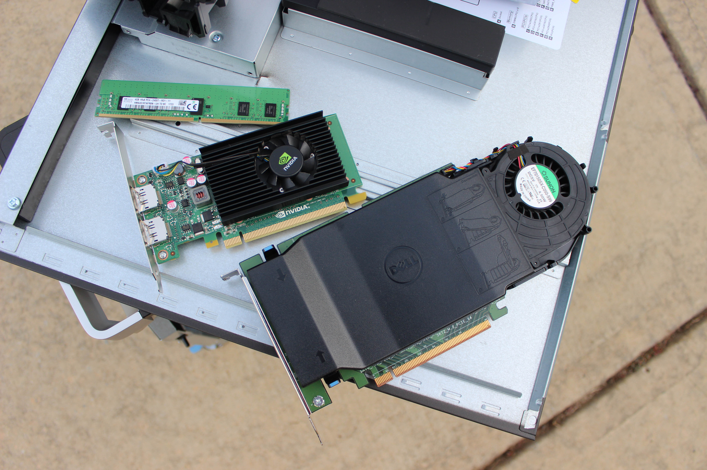 | 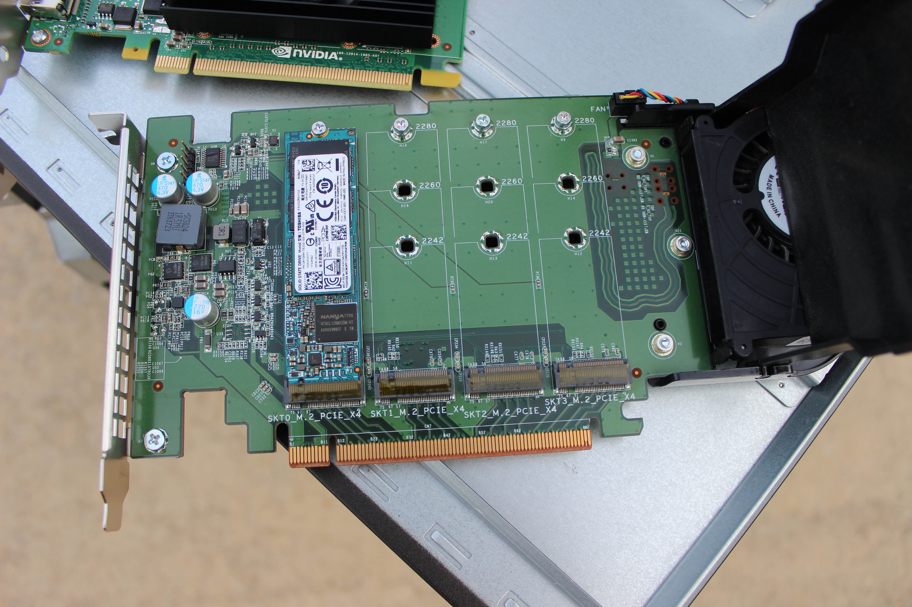 | 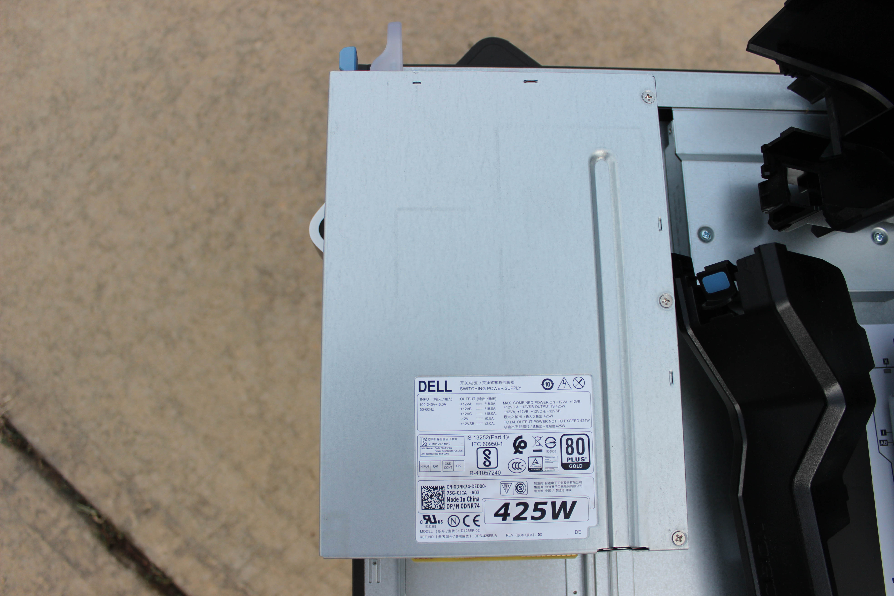
| 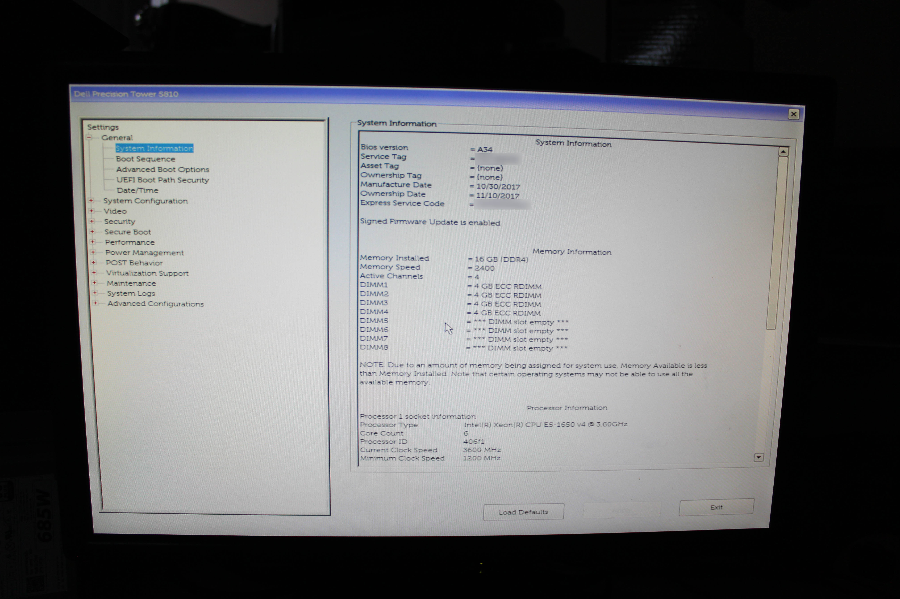 | 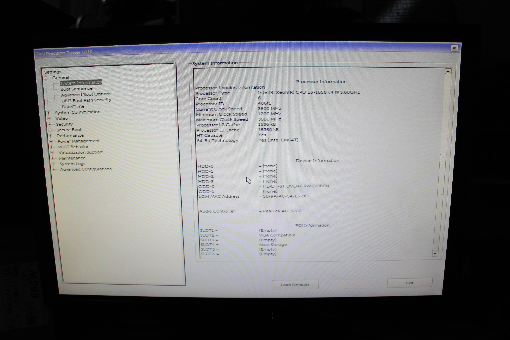 |

### Specs

* CPU: Intel Xeon E5-1650 v4 3.6GHz
* RAM: 16GB DDR4-2400 ECC
* Video: Nvidia Quadro NVS 310
* Storage: 1TB Toshiba NVMe SSD