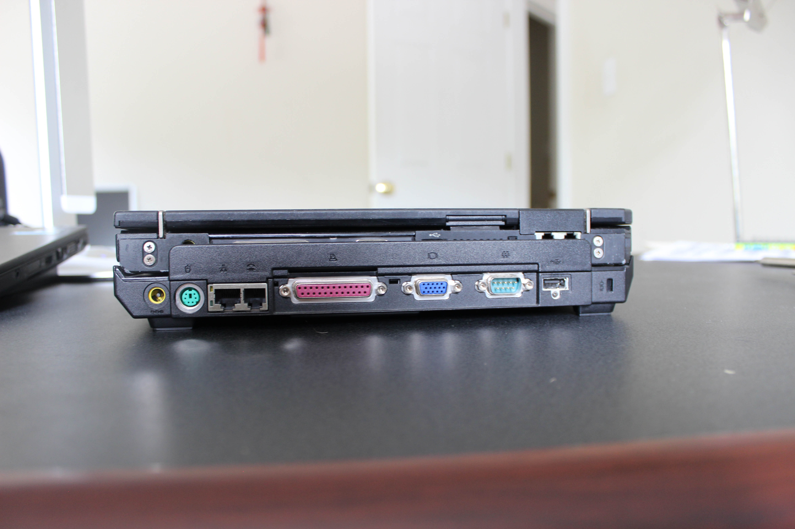

# IBM ThinkPad X31
[Parent directory](../index.md)

<table>
  <tr>
    <td></td>
    <td></td>
    <td></td>
  </tr>
  <tr>
    <td></td>
    <td></td>
    <td></td>
  </tr>
  <tr>
    <td></td>
    <td></td>
    <td></td>
  </tr>
  <tr>
    <td></td>
    <td></td>
    <td></td>
  </tr>
  <tr>
    <td></td>
    <td></td>
    <td></td>
  </tr>
  <tr>
    <td></td>
    <td></td>
    <td></td>
  </tr>
  
</table>

### Specs

* CPU: Intel Pentium M Banias 1.3 GHz
* RAM: 512MB DDR-266 PC2100
* Video: ATI Radeon Mobility 7000
* Storage: 20GB Hitachi 4200RPM IDE
* Screen: 1024x768 12" TFT

### Notes
This was my dad's first laptop. It's older than I am and predates Lenovo's acquisition of the ThinkPad brand. I don't have too many memories of when it was my dad's primary laptop, but it has been with my family for a long time and has a special place in my heart :)
