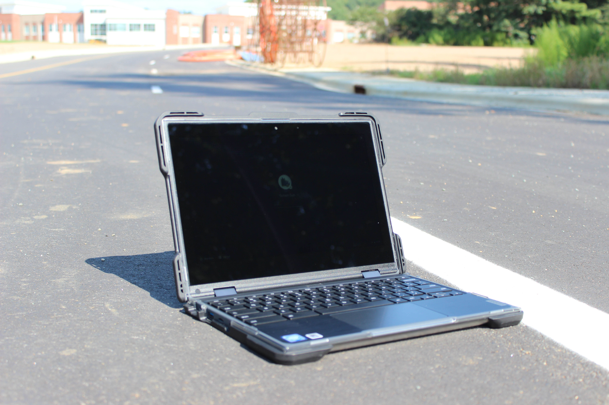
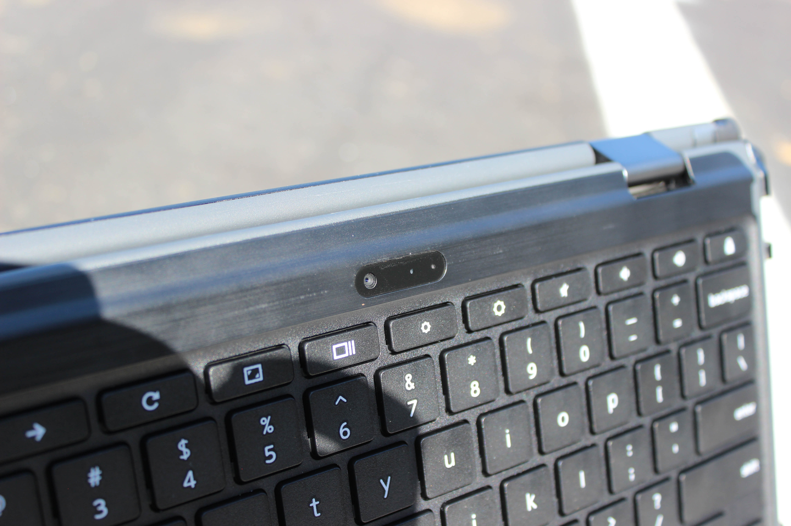
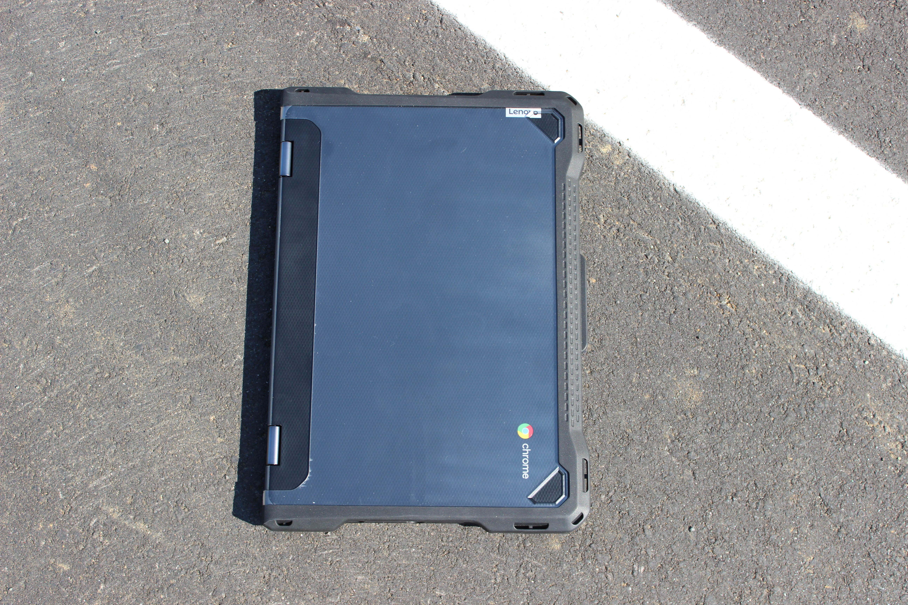
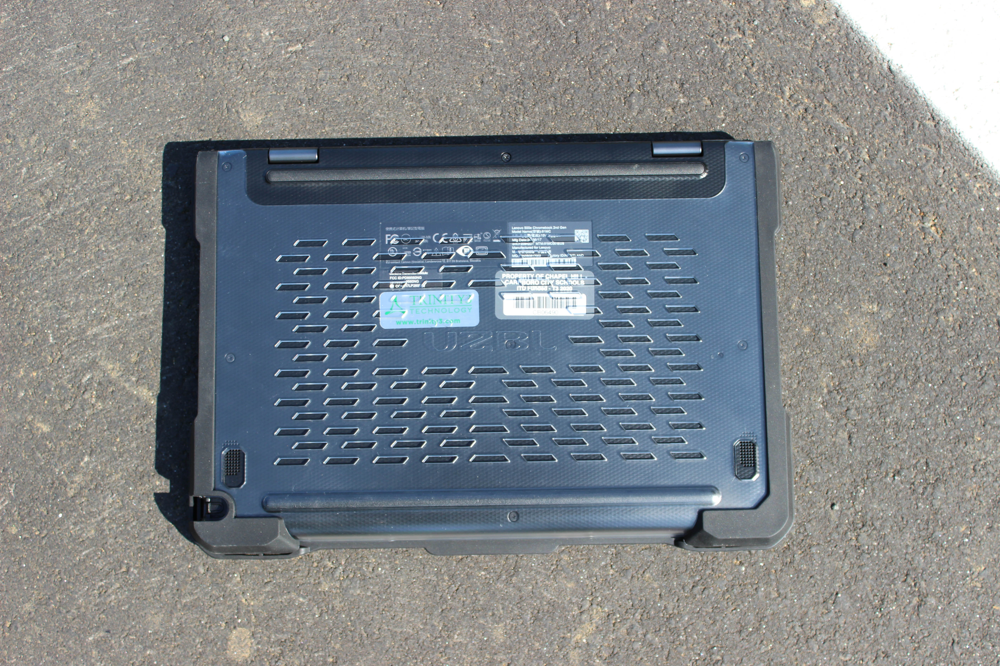
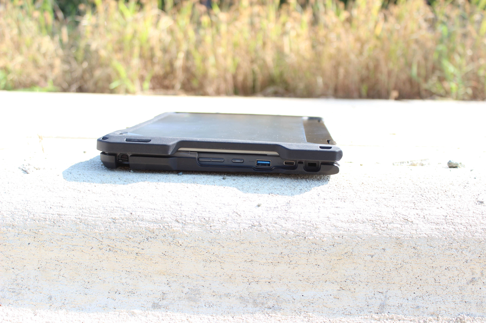
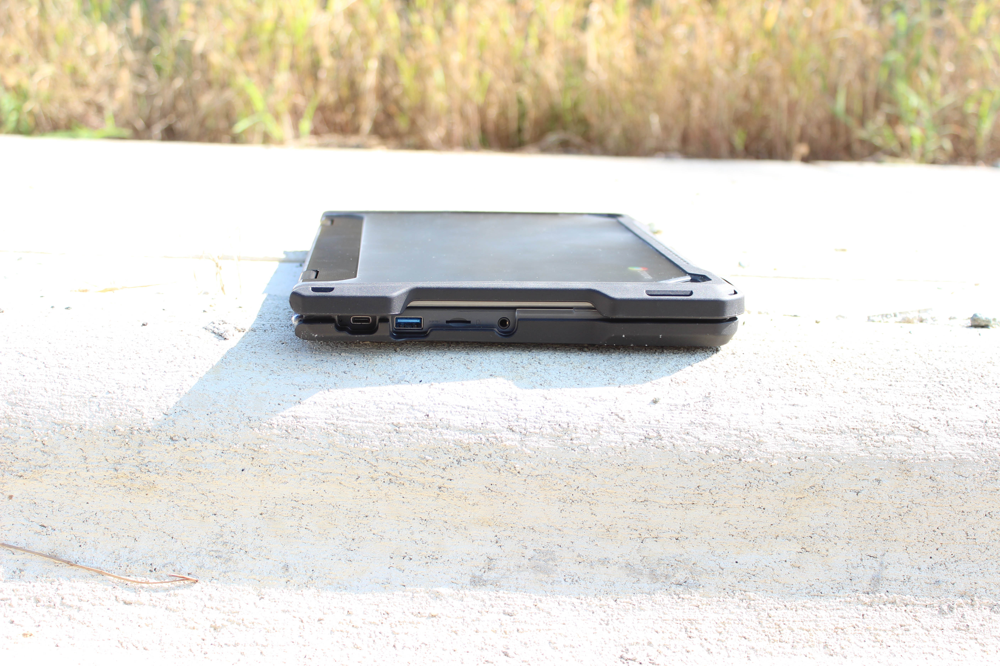
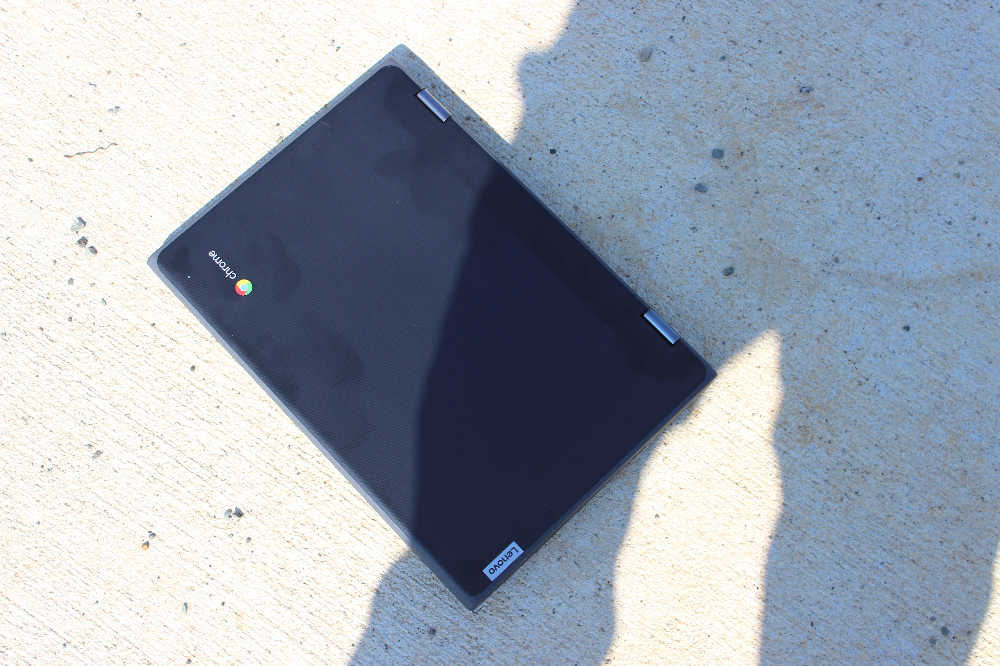
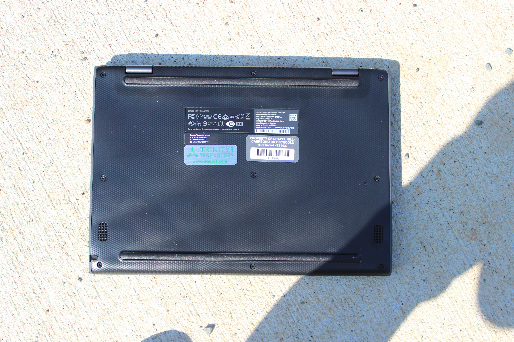
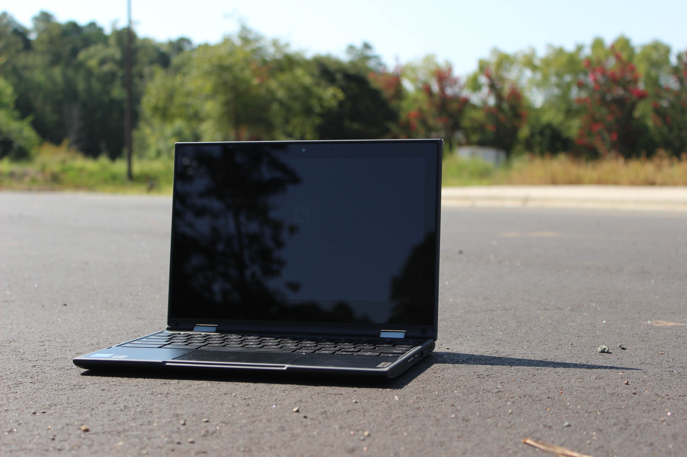
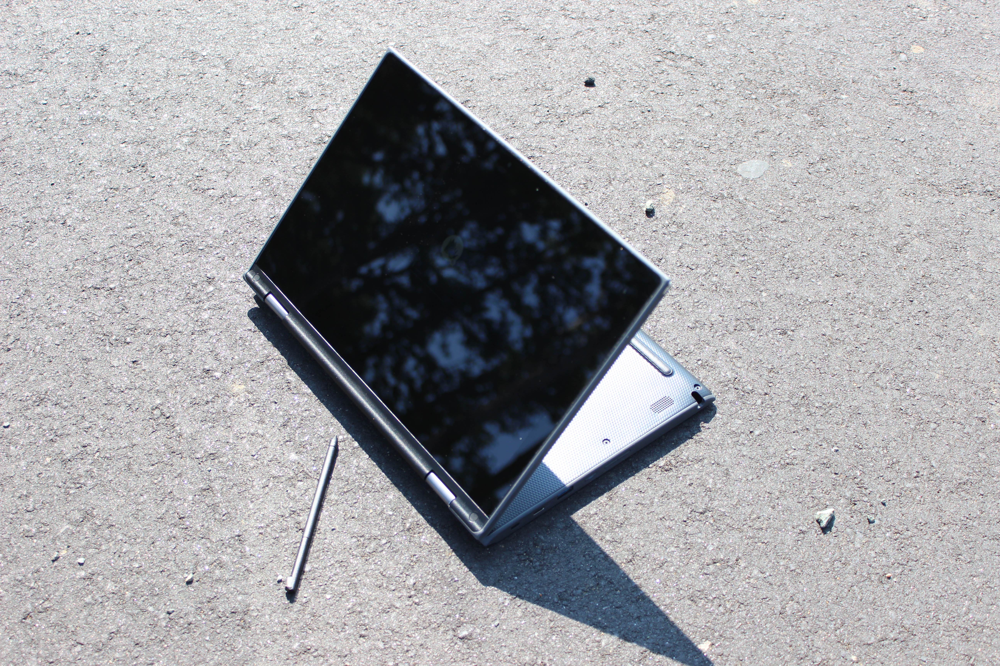

# Lenovo 500e Chromebook 2nd Gen
[Parent directory](../index.md)

<table>
  <tr>
    <td></td>
    <td></td>
    <td></td>
  </tr>
  <tr>
    <td></td>
    <td></td>
    <td></td>
  </tr>
  <tr>
    <td></td>
    <td></td>
    <td></td>
  </tr>
  <tr>
    <td></td>
    <td></td>
    <td></td>
  </tr>
</table>

### Specs

* CPU: Intel Celeron N4120 1.1 GHz
* RAM: 4GB LPDDR4-2400
* Video: Intel UHD Graphics 600
* Storage: 32GB eMMC Flash Storage
* Screen: 1366x768 11" IPS Touch