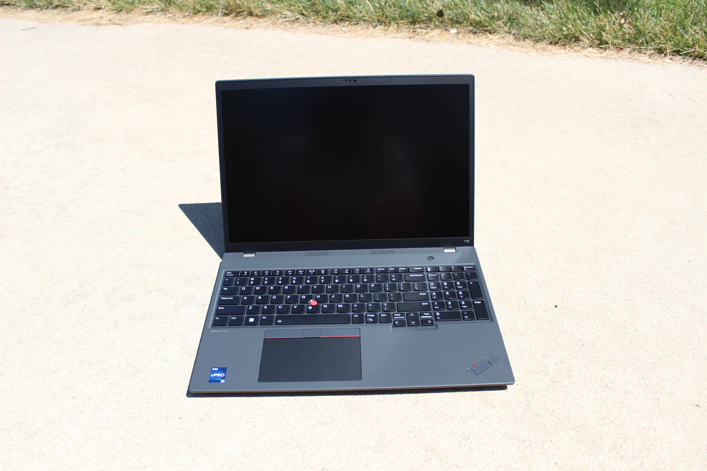

# Lenovo ThinkPad T16 Gen 2
[Parent directory](../index.md)

<table>
  <tr>
    <td></td>
    <td></td>
    <td></td>
  </tr>
  <tr>
    <td></td>
    <td></td>
    <td></td>
  </tr>
  <tr>
    <td></td>
    <td></td>
    <td></td>
  </tr>
  <tr>
    <td></td>
    <td></td>
	<td></td>
  </tr>
  <tr>
    <td></td>
  </tr>
</table>

### Specs

* CPU: Intel Core i7-1365U 1.8 GHz
* RAM: 16GB DDR5-5200 soldered
* Video: Intel Iris Xe Graphics
* Storage: 512GB SK Hynix M.2 NVMe SSD
* Screen: 1920x1200 16" IPS
