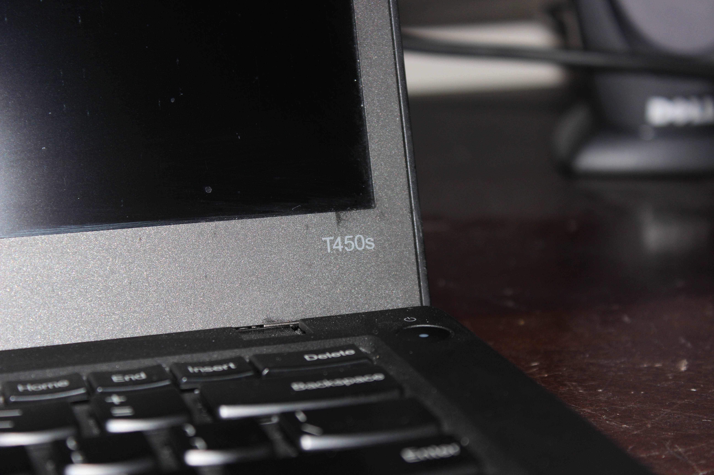
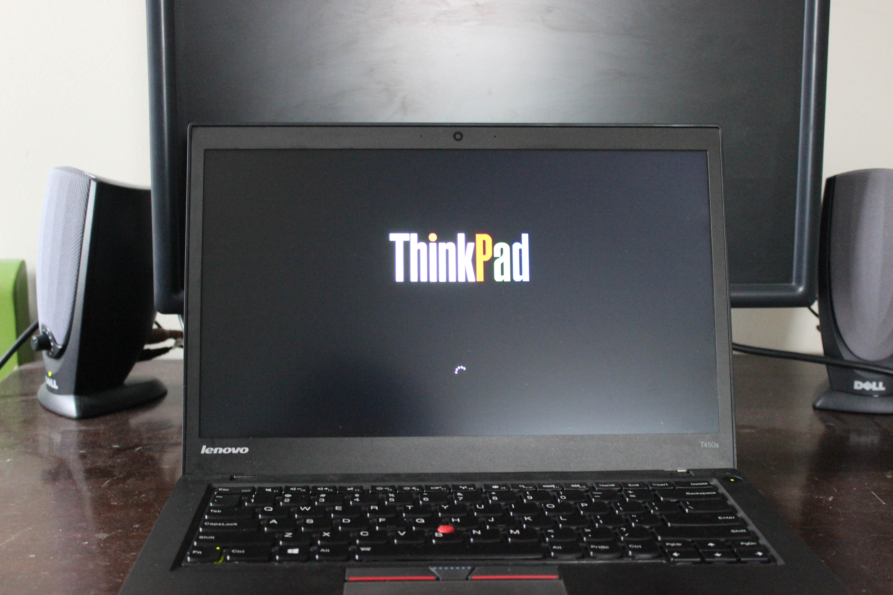

# Lenovo ThinkPad T450s
[Parent directory](../index.md)

<table>
  <tr>
    <td></td>
    <td></td>
    <td></td>
  </tr>
  <tr>
    <td></td>
    <td></td>
    <td></td>
  </tr>
  <tr>
    <td></td>
    <td></td>
    <td></td>
  </tr>
  <tr>
    <td></td>
    <td></td>
    <td></td>
  </tr>
  <tr>
    <td></td>
    <td></td>
  </tr>
</table>

### Specs

* CPU: Intel Core i7 5600U 2.6 GHz
* RAM: 8GB DDR3-1600 (4GB soldered + 4GB upgradeable)
* Video: Intel HD Graphics 5500
* Storage: 500GB Samsung 860 EVO (Upgraded from 500GB WD Black 7200RPM)
* Screen: 1920x1080 14" IPS

### Notes
The cracks in the bottom cover of this laptop are from when I tried to open it without reading the Hardware Maintenance Manual. I ended up unclipping the clips holding it in place in the wrong order and using too much force, eventually breaking it.
