# Lenovo ThinkPad W541
[Parent directory](../index.md)

<table>
  <tr>
    <td>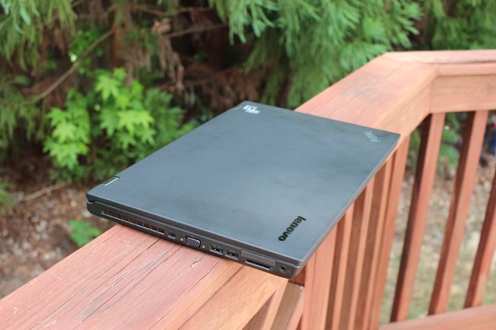</td>
    <td>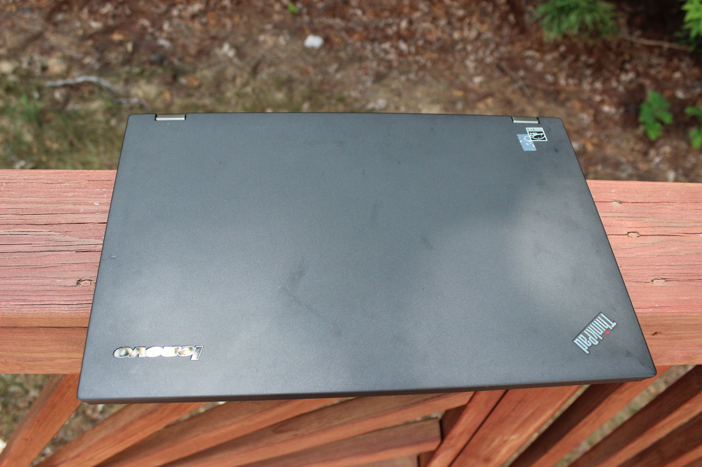</td>
    <td></td>
  </tr>
  <tr>
    <td>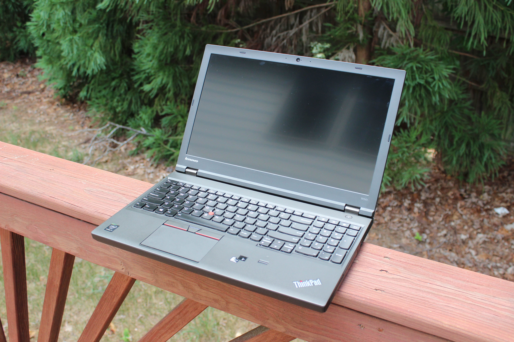</td>
    <td>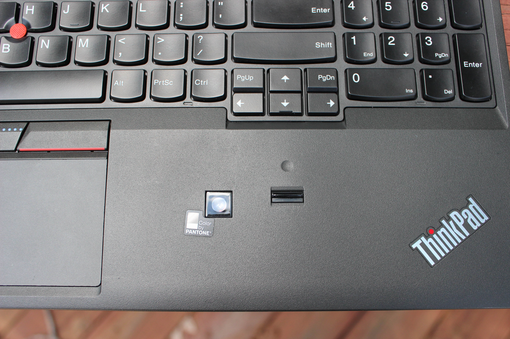</td>
    <td>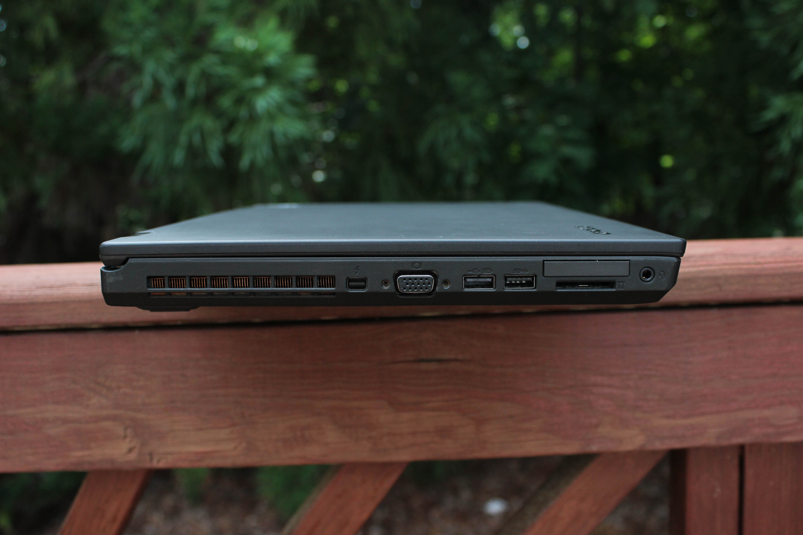</td>
  </tr>
  <tr>
    <td>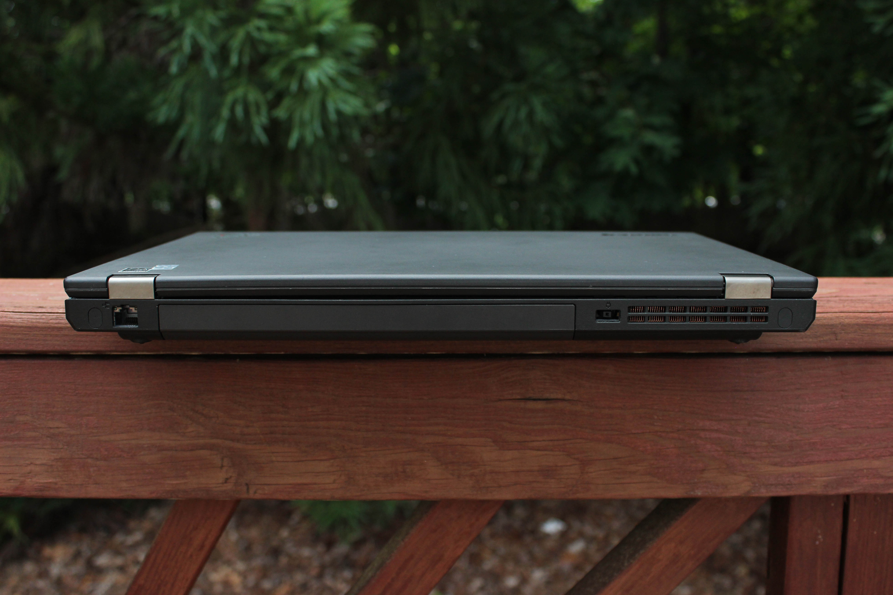</td>
    <td>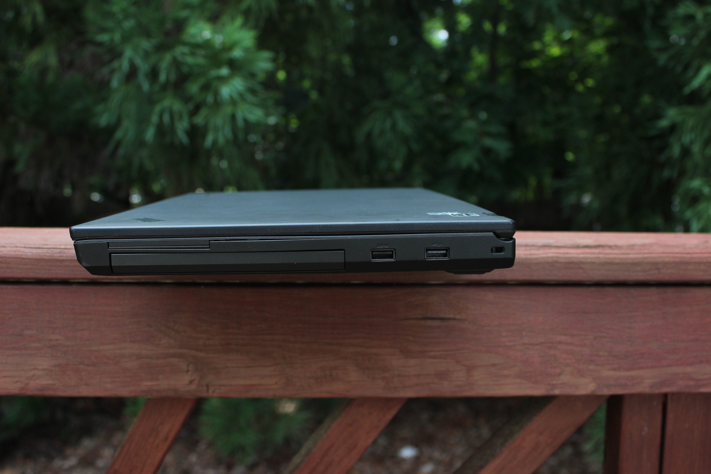</td>
    <td>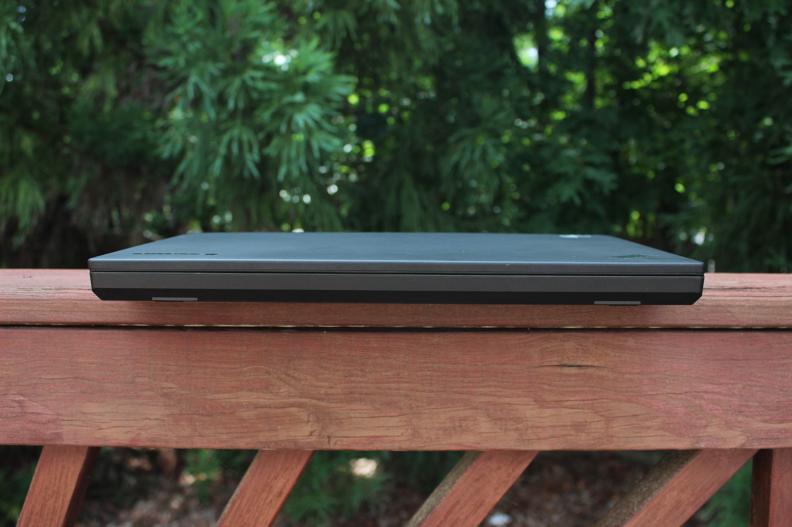</td>
  </tr>
  <tr>
    <td>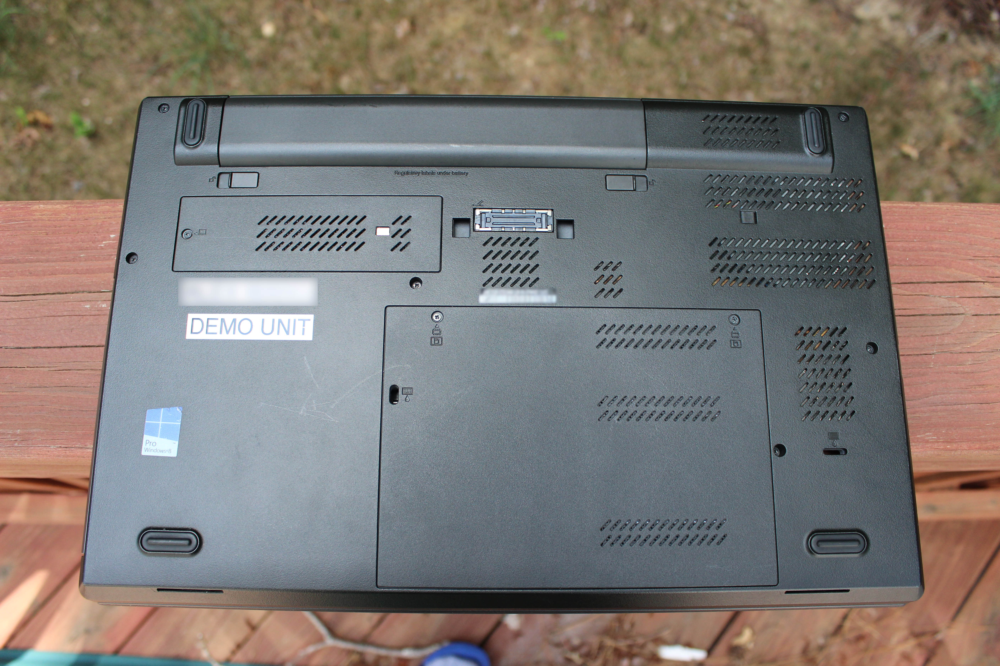</td>
    <td>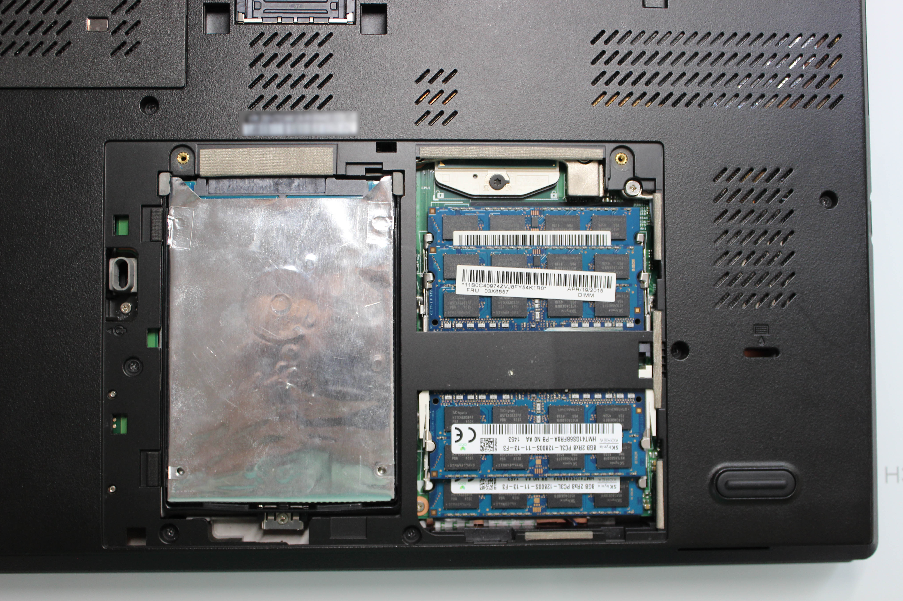</td>
    <td>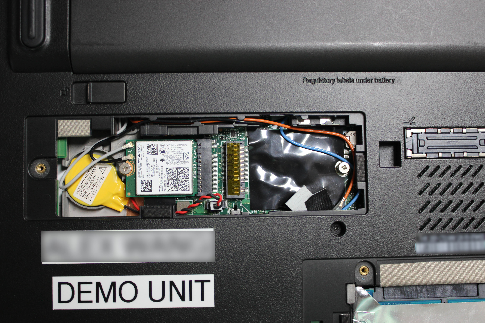</td>
  </tr>
  <tr>
    <td>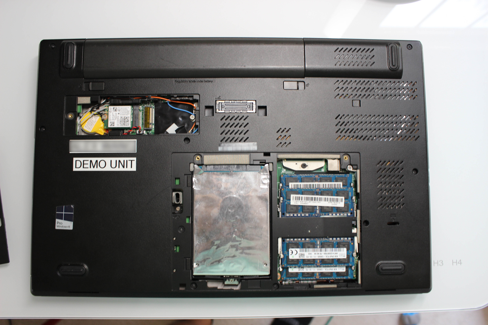</td>
    <td>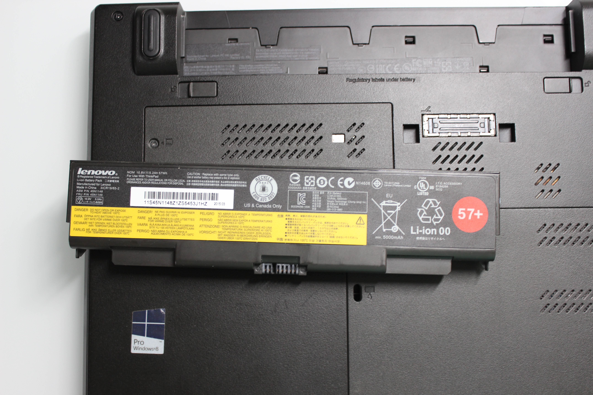</td>
	<td>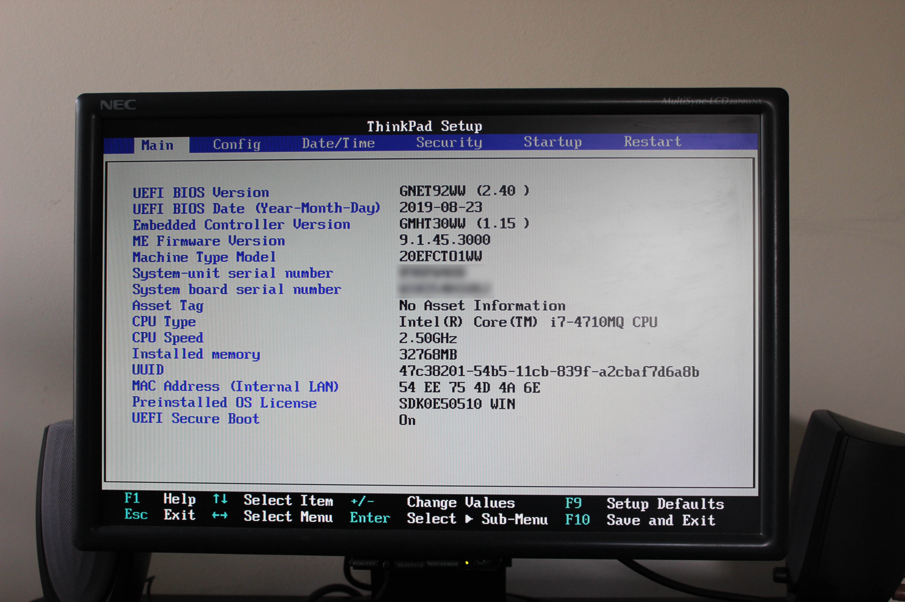</td>
  </tr>
</table>

### Specs

* CPU: Intel Core i7 4710MQ 2.5 GHz
* RAM: 32GB DDR3-1600 (4x8GB)
* Video: Intel HD Graphics 4600, Nvidia Quadro K1100M
* Storage: 2x500GB Seagate 7200RPM, RAID 0
* Screen: 2880x1620 15" IPS (Broken)

### Notes
I got this machine with a broken screen in the summer of 2018. At first, I tried to troubleshoot and repair it myself, but I think I might have ripped the ribbon cable holding the trackpad in and caused the connector on the board to short. After my first attempt, the machine started doing the 3-3-1 beep code. I took it to the repair shop of a friend and we tried to fix it together to no avail until I eventually unplugged the trackpad. Quite unfortunate and I hope to fix the problem eventually someday.
