# Lenovo ThinkPad X1 Carbon Gen 10
[Parent directory](../index.md)

| 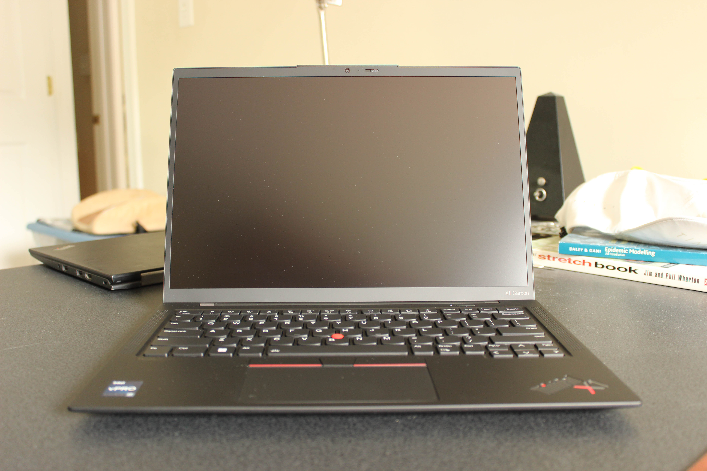 | 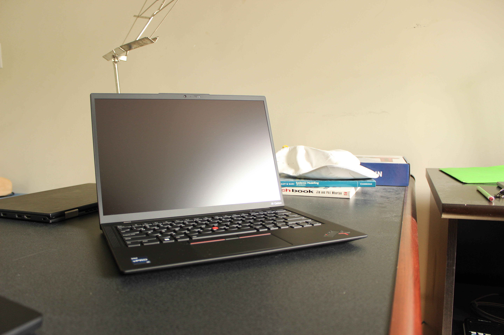 | 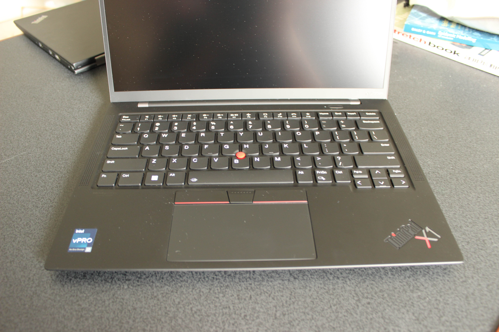
|:---:|:---:|:---:|
| 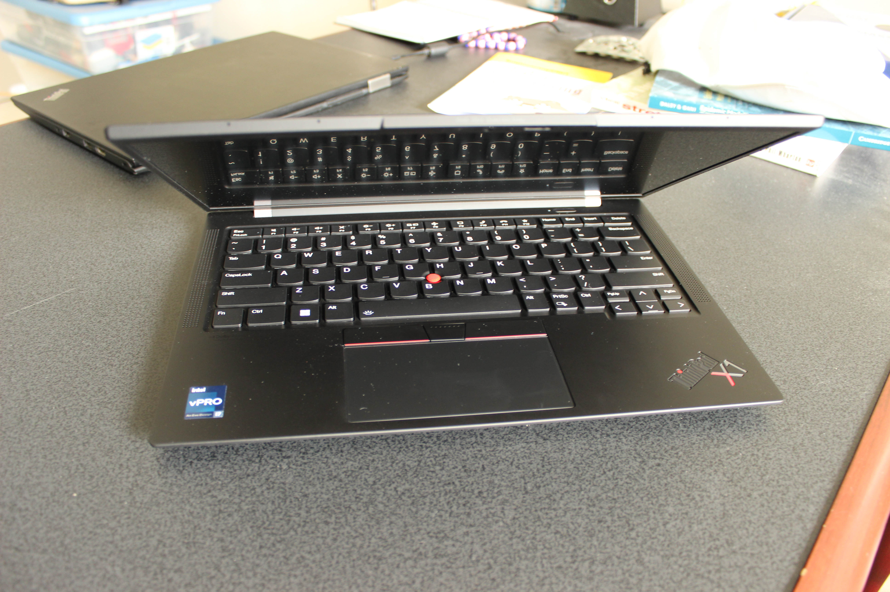 | 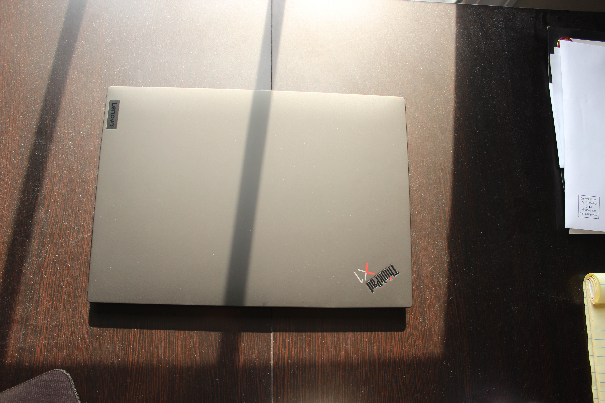 | 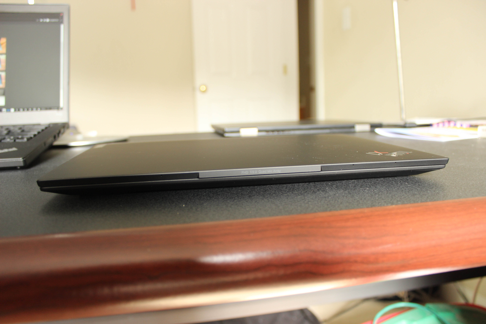
| 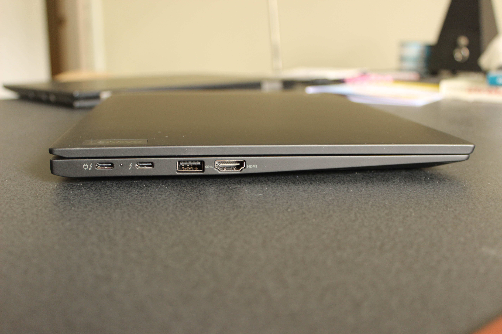 | 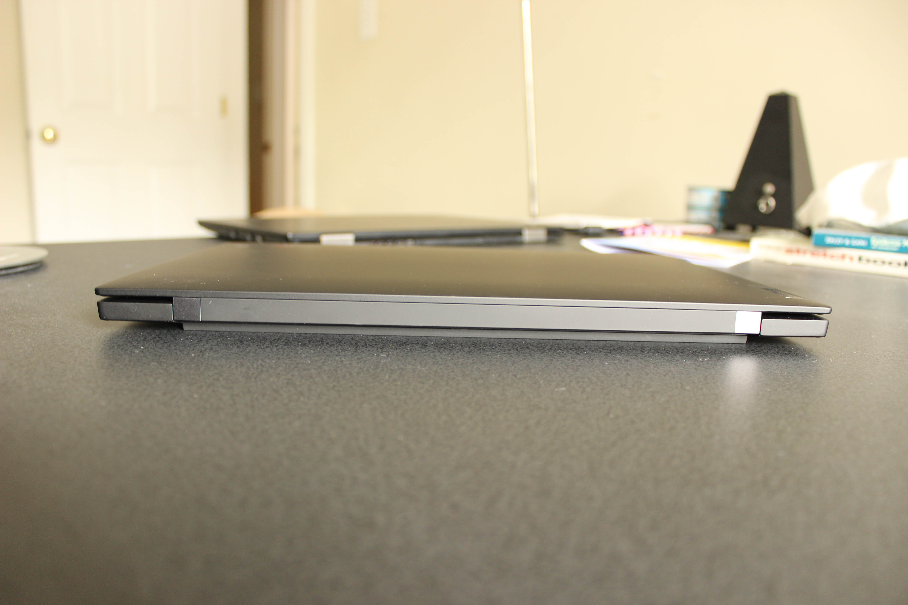 | 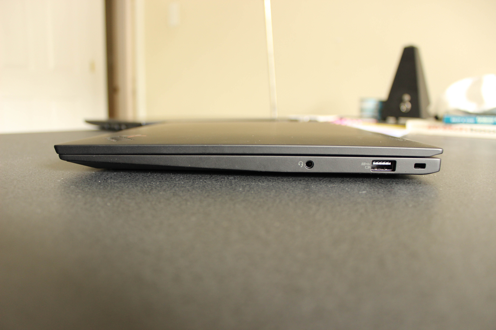
| 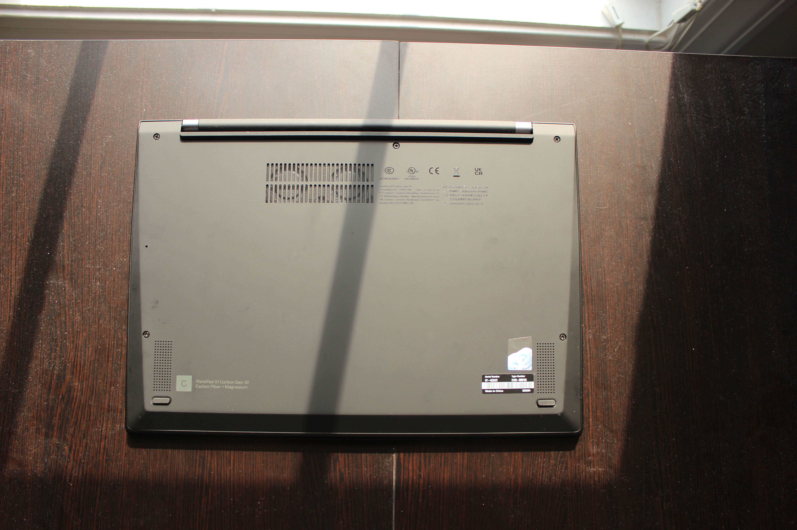 | 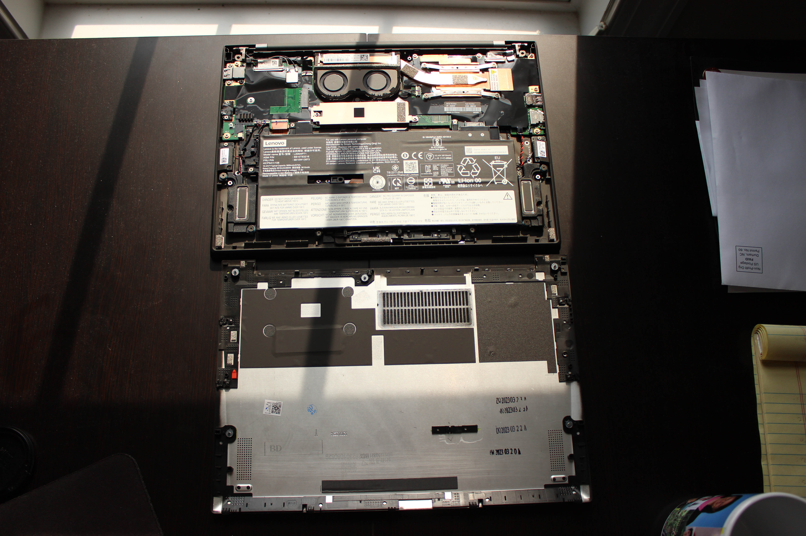 | 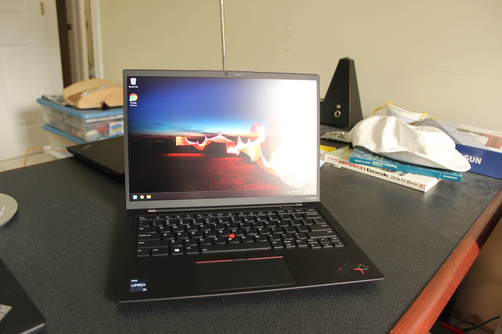
| 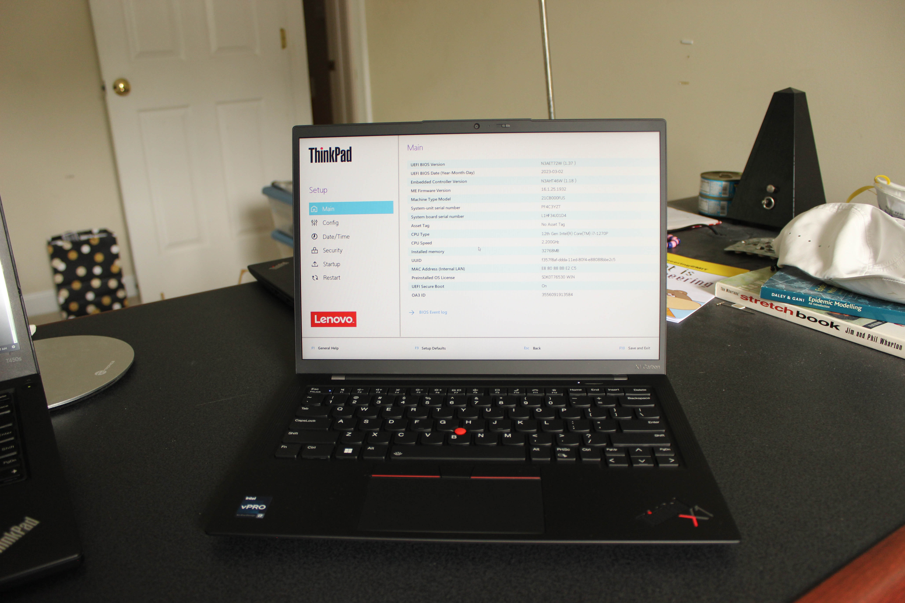

### Specs

* CPU: Intel Core i7-1270P 2.2 GHz
* RAM: 32GB DDR5-5200 soldered
* Video: Intel Iris Xe Graphics
* Storage: 512GB SK Hynix M.2 NVMe SSD
* Screen: 1920x1200 14" IPS, Touch
