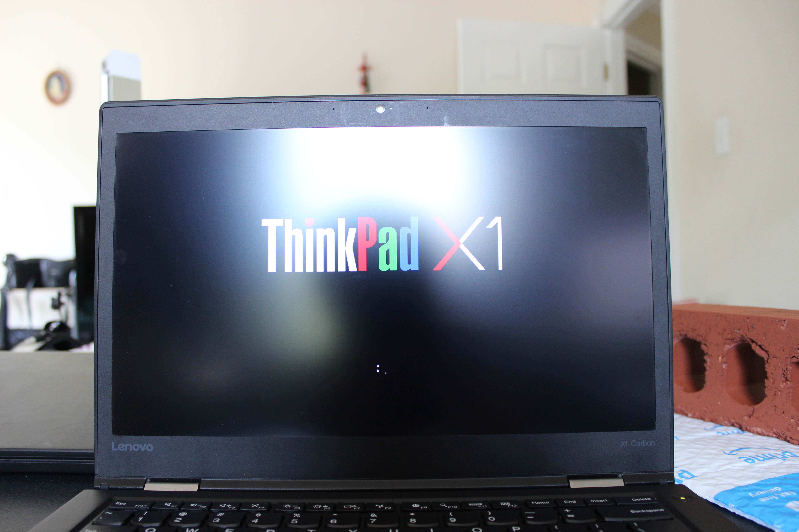

# Lenovo ThinkPad X1 Carbon 4th Generation
[Parent directory](../index.md)

|  |  | 
|:---:|:---:|:---:|
|  |  | 
|  |  | 
|  |  | 

### Specs

* CPU: Intel Core i7 6500U 2.5 GHz
* RAM: 8GB LPDDR3-1866 soldered
* Video: Intel HD Graphics 520
* Storage: 2TB WD Blue M.2 SATA SSD (Upgraded from 256GB Samsung M.2 SATA SSD)
* Screen: 2560x1440 14" IPS