# Lenovo ThinkPad X1 Yoga 4th Generation
[Parent directory](../index.md)

| 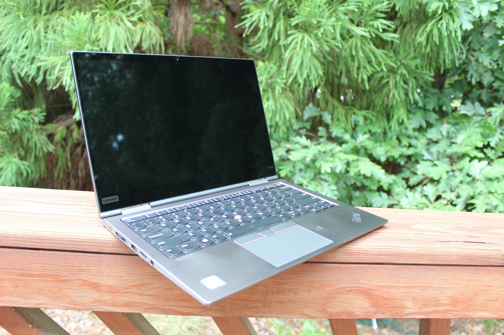 | 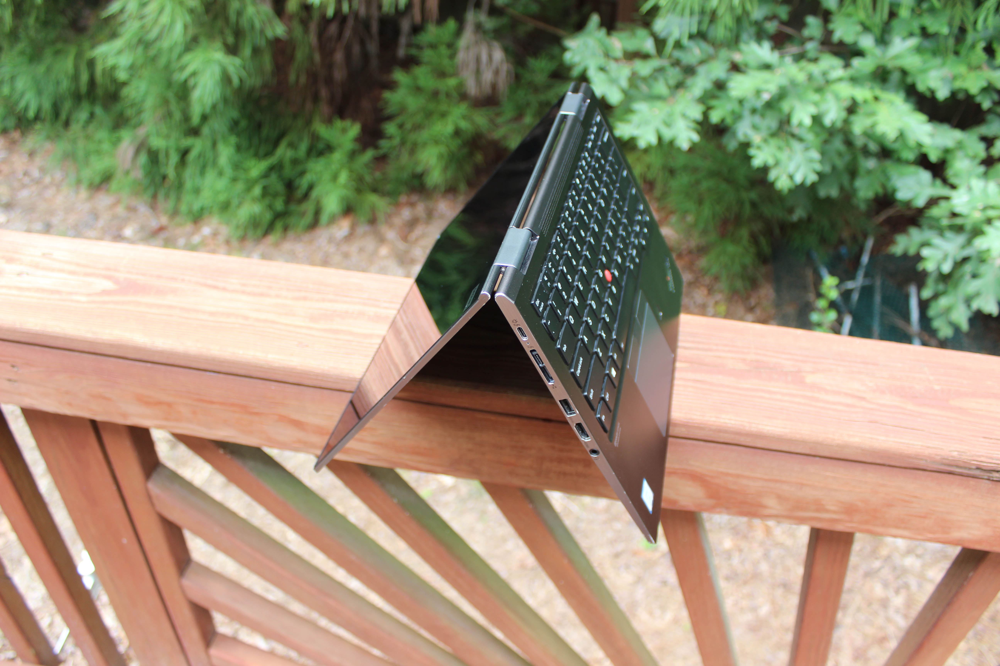 | 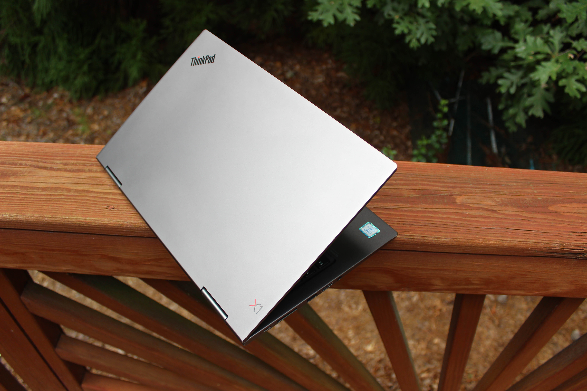
|:---:|:---:|:---:|
| 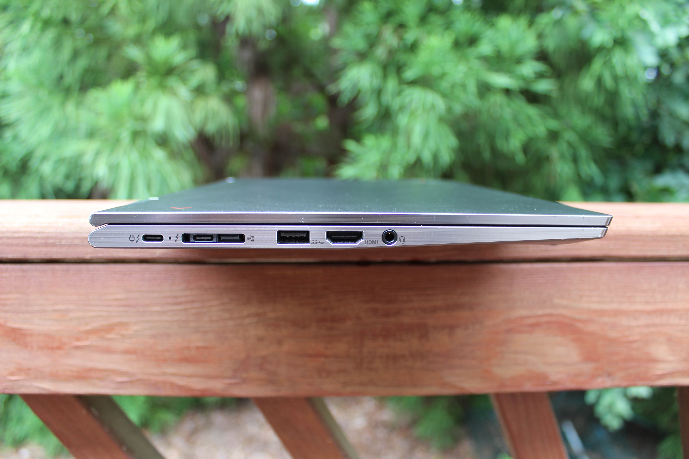 | 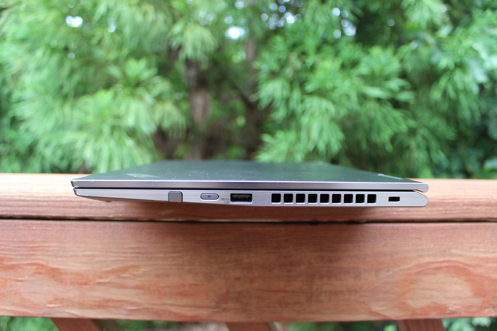 | 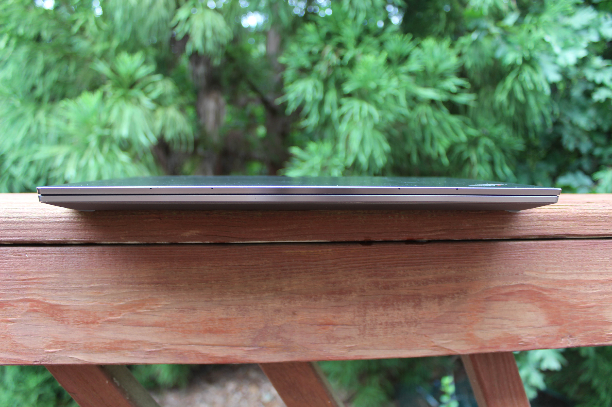
| 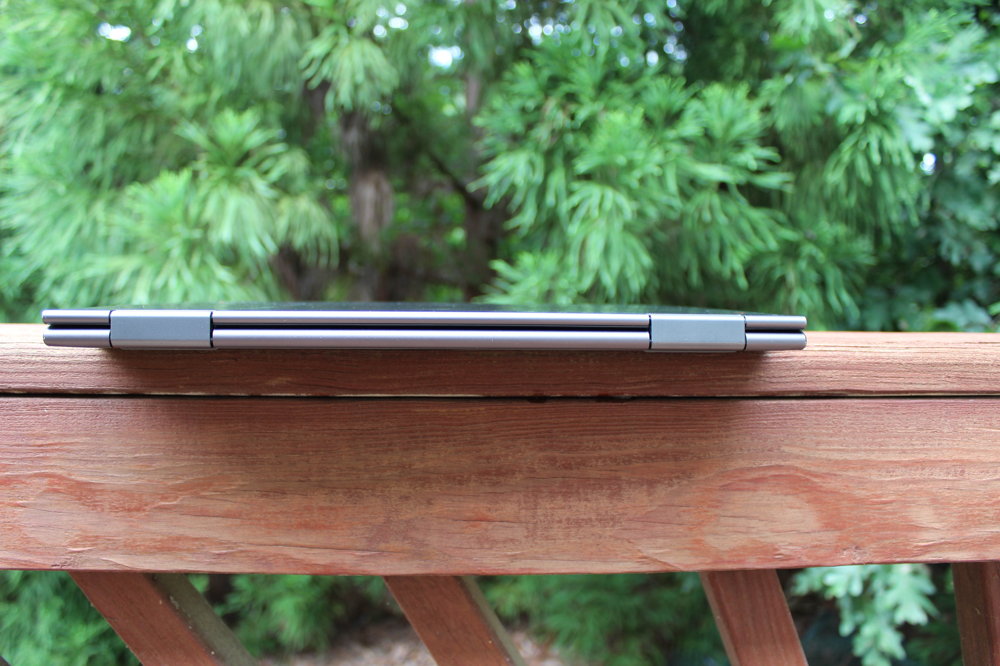 | 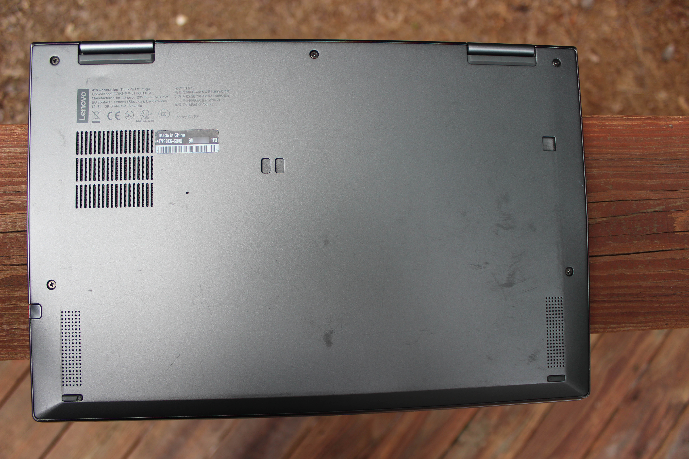 | 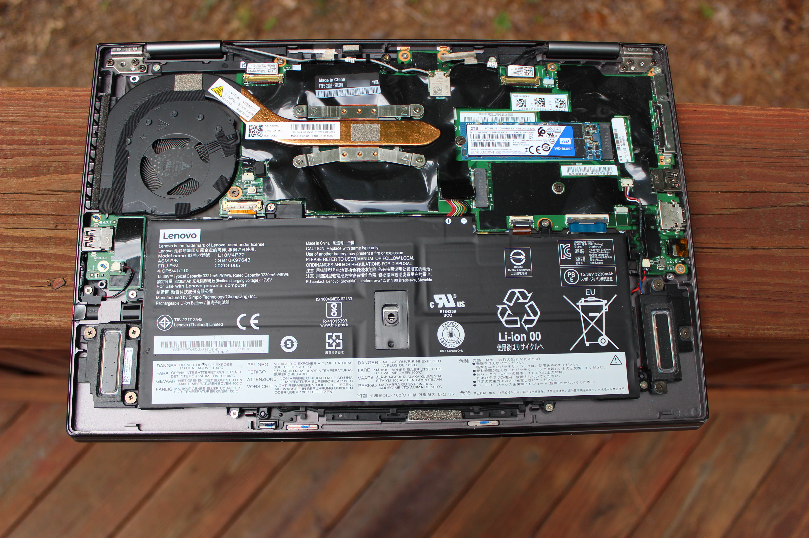
| 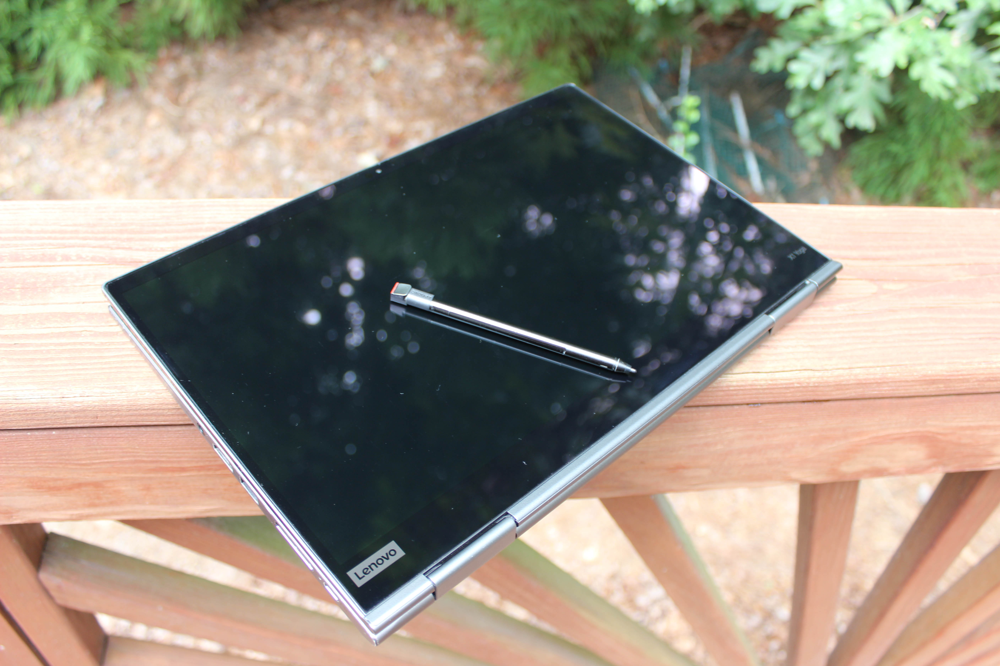 | 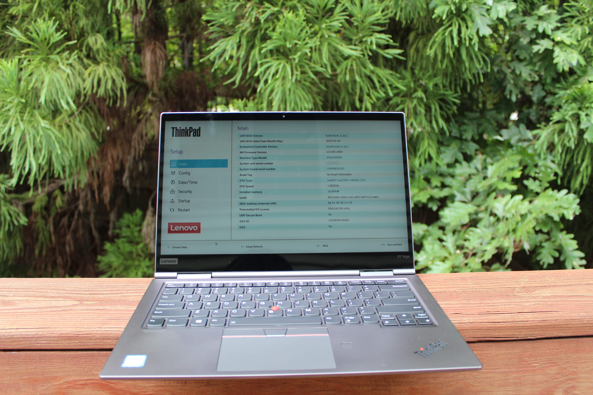 | 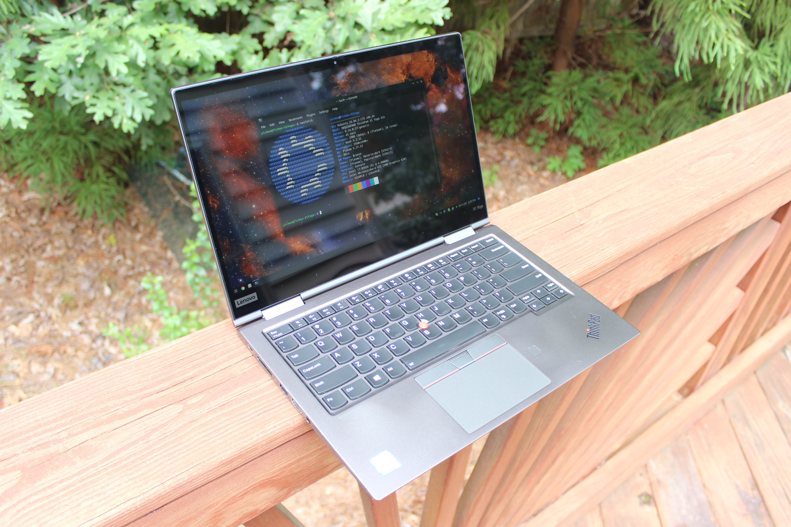

### Specs

* CPU: Intel Core i7 8565U 1.8 GHz
* RAM: 16GB DDR4-2133 soldered
* Video: Intel UHD Graphics 620
* Storage: 2TB WD Blue M.2 SATA SSD
* Screen: 2560x1440 14" IPS Touch