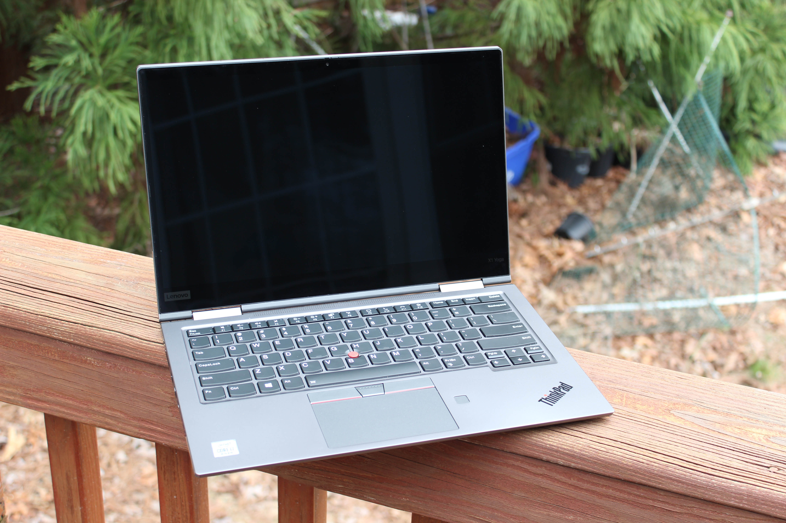

# Lenovo ThinkPad X1 Yoga 5th Generation
[Parent directory](../index.md)

|  |  | 
|:---:|:---:|:---:|
|  |  | 
|  |  | 
|  |  | 

### Specs

* CPU: Intel Core i7 10510U 1.8 GHz
* RAM: 16GB DDR4-2133 soldered
* Video: Intel UHD Graphics (10th Gen)
* Storage: 256GB Samsung M.2 NVMe SSD
* Screen: 2560x1440 14" IPS Touch