# Lenovo ThinkPad X200 Tablet
[Parent directory](../index.md)

<table>
  <tr>
    <td>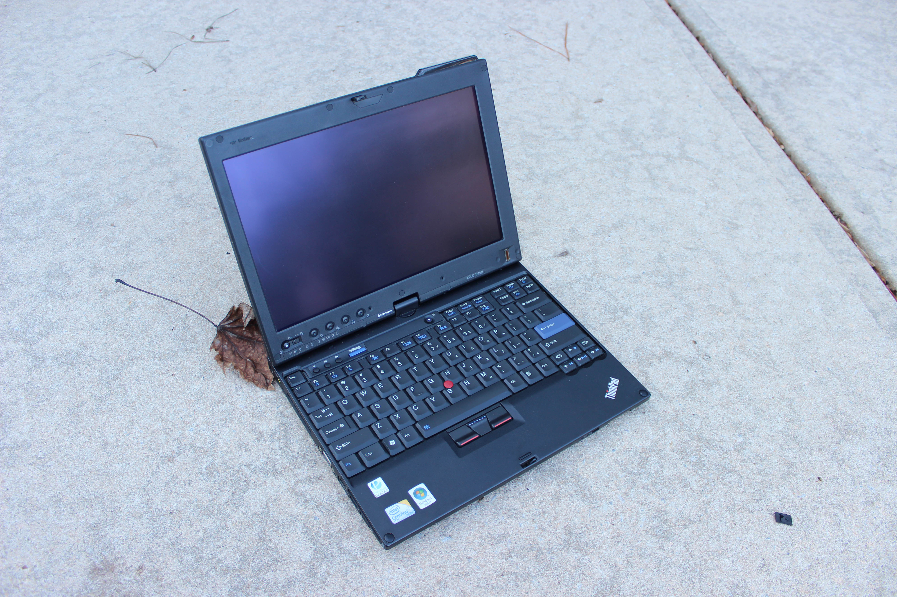</td>
    <td>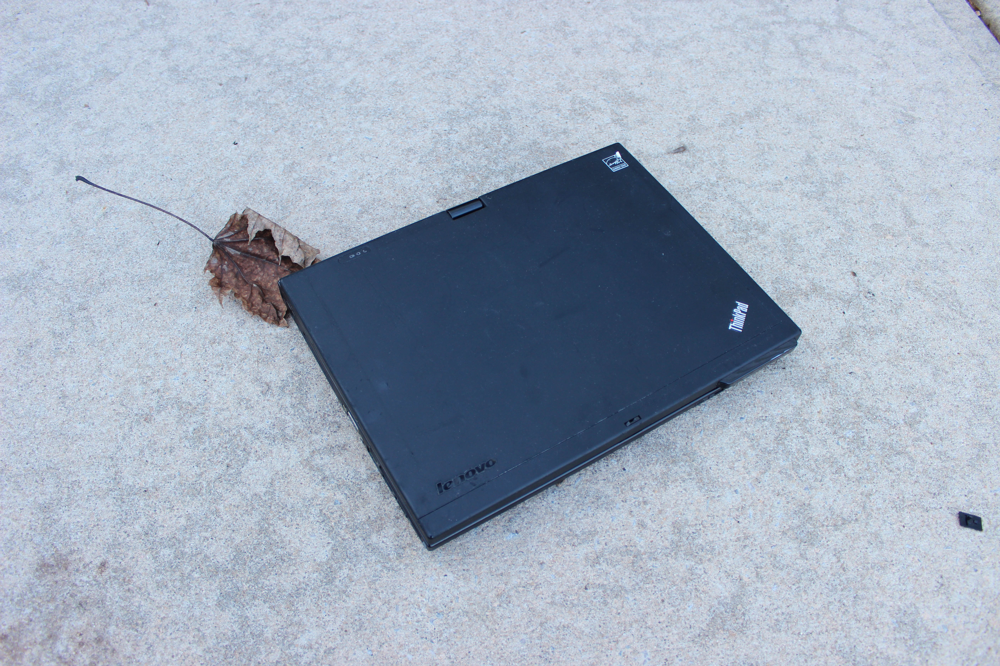</td>
    <td>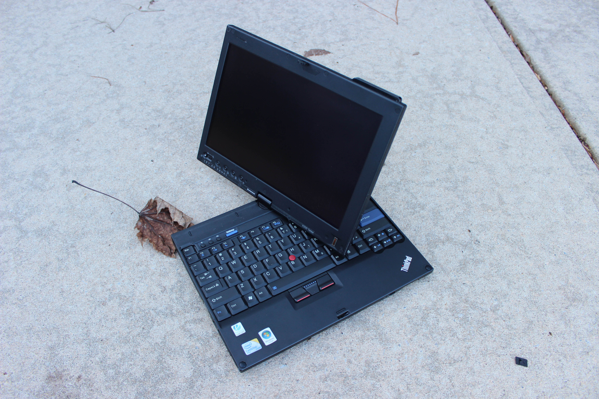</td>
  </tr>
  <tr>
    <td>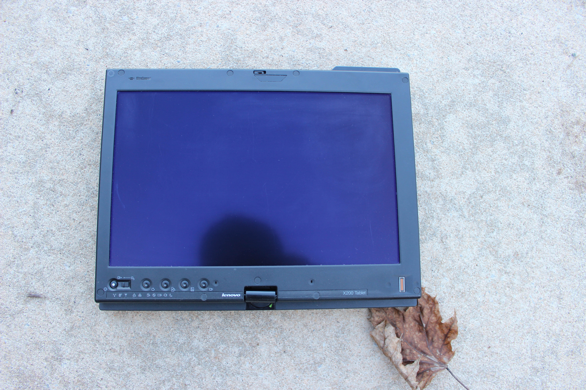</td>
    <td>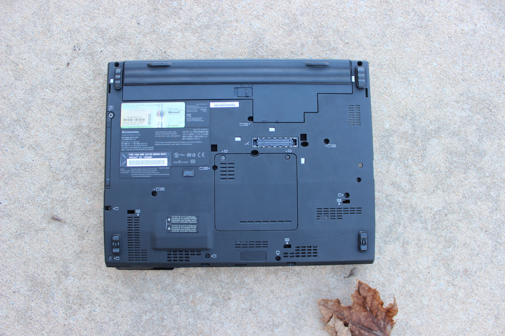</td>
    <td>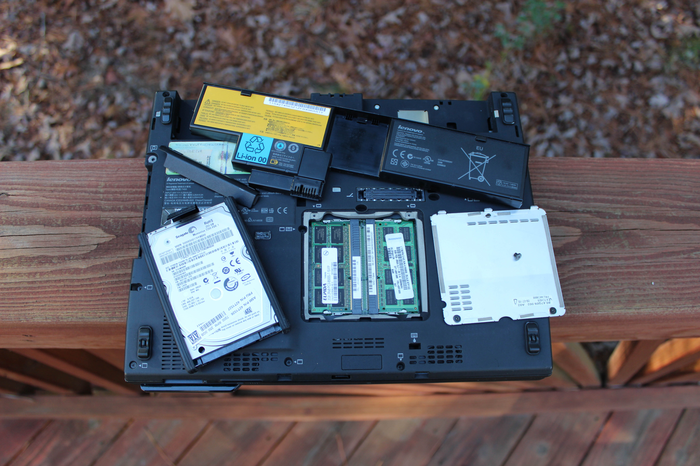</td>
  </tr>
  <tr>
    <td>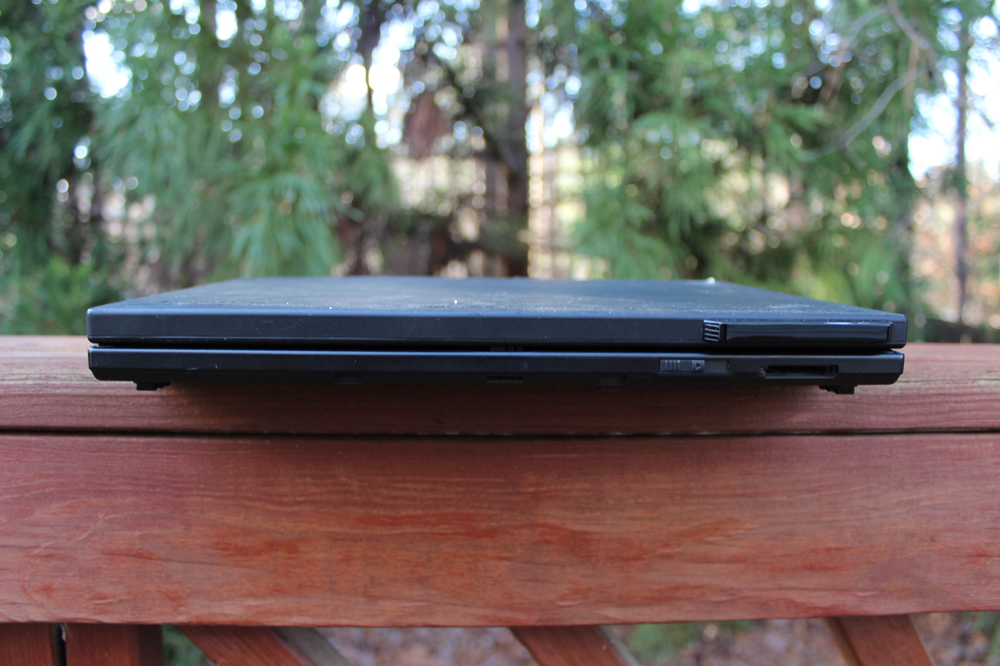</td>
    <td>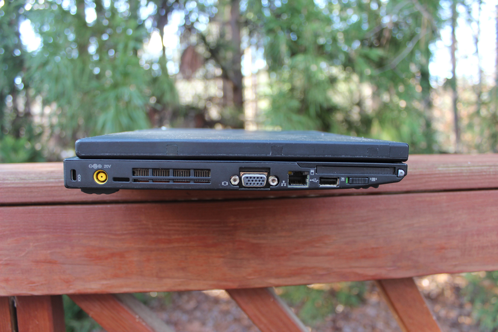</td>
    <td>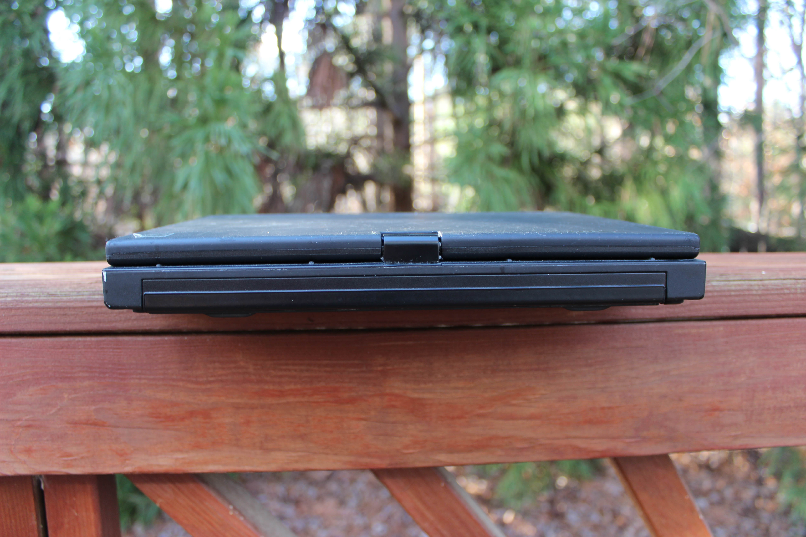</td>
  </tr>
  <tr>
    <td>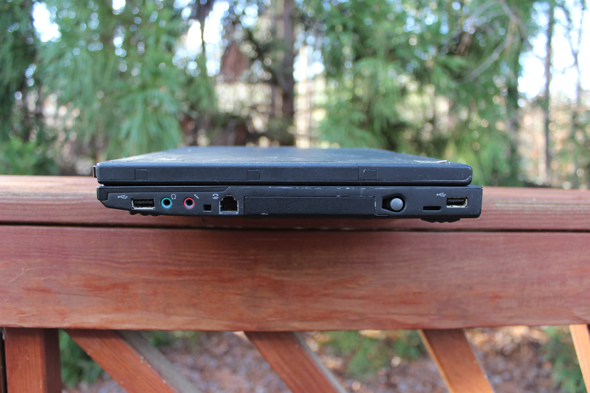</td>
    <td>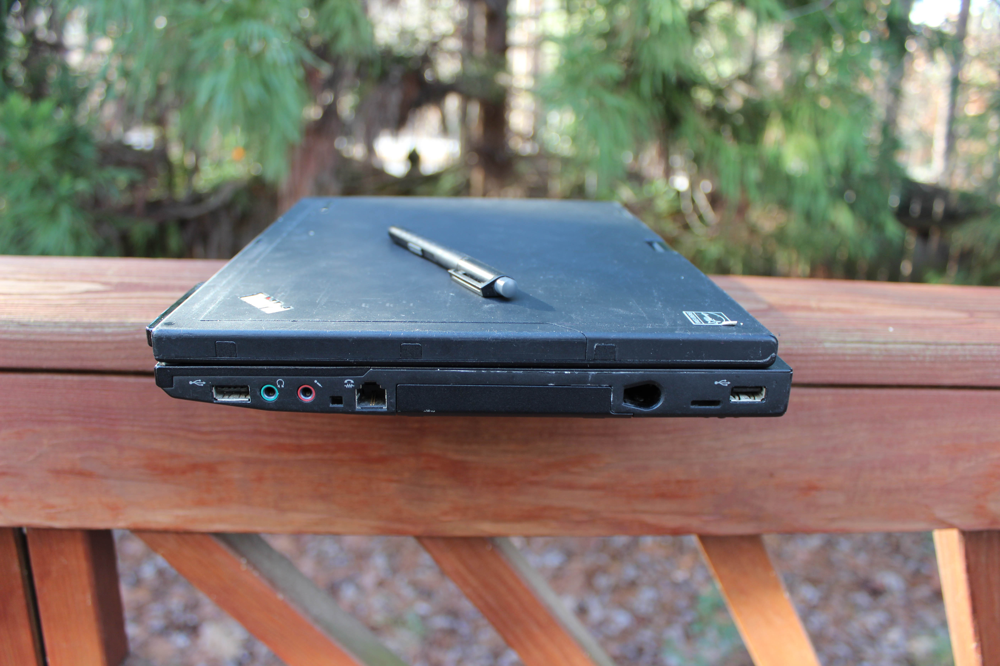</td>
    <td>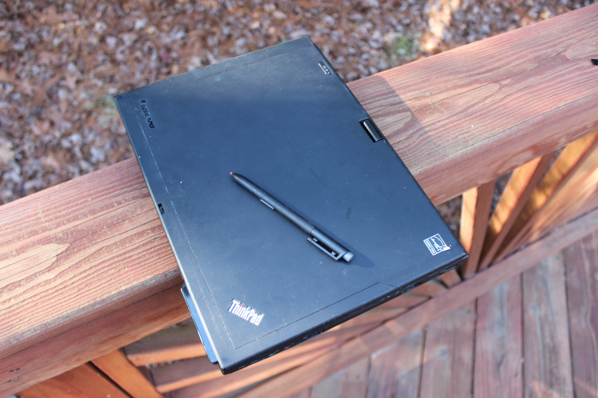</td>
  </tr>
  <tr>
    <td>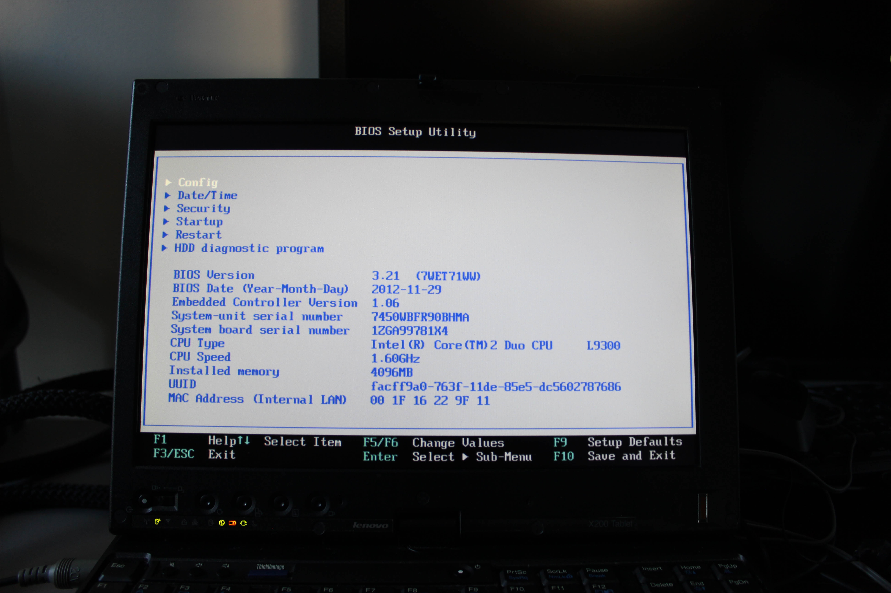</td>
  </tr>
</table>

### Specs

* CPU: Intel Core 2 Duo L9300 1.6 GHz
* RAM: 4GB DDR3-1066
* Video: Mobile Intel GMA 4500MHD
* Storage: 250GB Seagate 7200 RPM
* Screen: 1280x800 12" TN