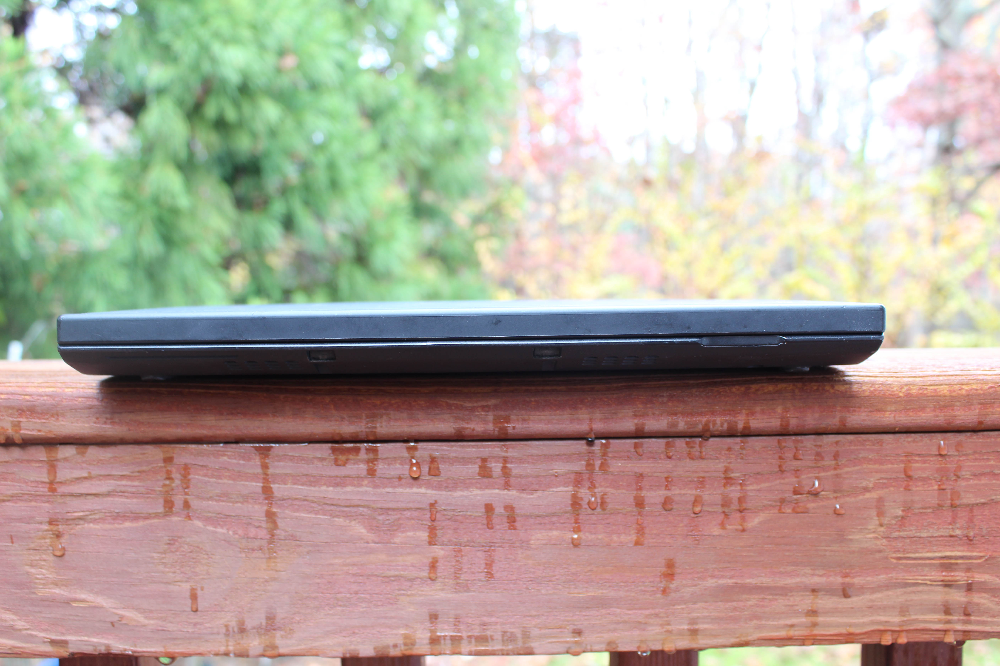
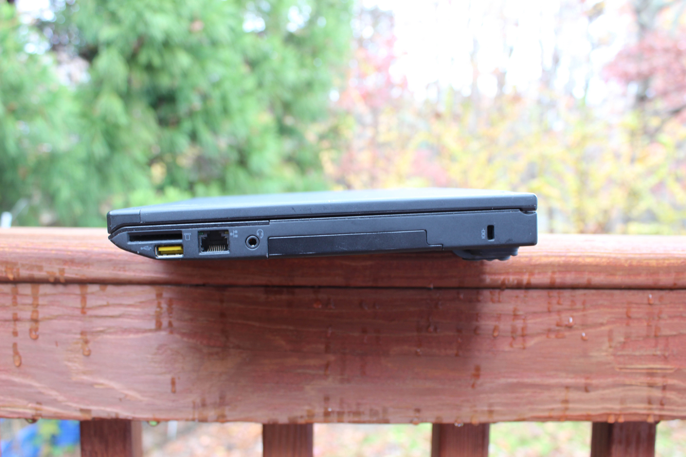
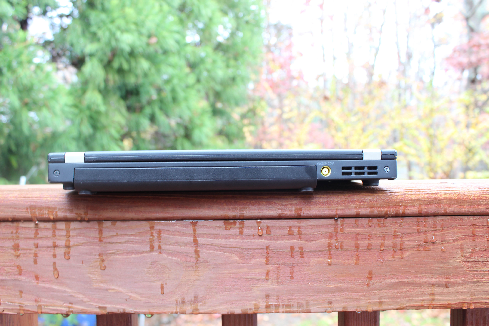

# Lenovo ThinkPad X230
[Parent directory](../index.md)

<table>
  <tr>
    <td></td>
    <td></td>
    <td></td>
  </tr>
  <tr>
    <td></td>
    <td></td>
    <td></td>
  </tr>
  <tr>
    <td></td>
    <td></td>
    <td></td>
  </tr>
  <tr>
    <td></td>
    <td></td>
    <td></td>
  </tr>
  <tr>
    <td></td>
    <td></td>
	<td></td>
  </tr>
</table>

### [Specs](Specs.txt)

<embed src='Specs.txt'>

### Notes
This machine was clearly "refurbished" before it was sold to my friend. The hard drive's SATA connector was mangled, somehow missing the plastic portion holding the contacts in place (the contacts themselves are intact). In addition, some of the screws were missing from the bottom. From the outside, it looked like it was in decent condition, but closer inspection only led to disappointment.
