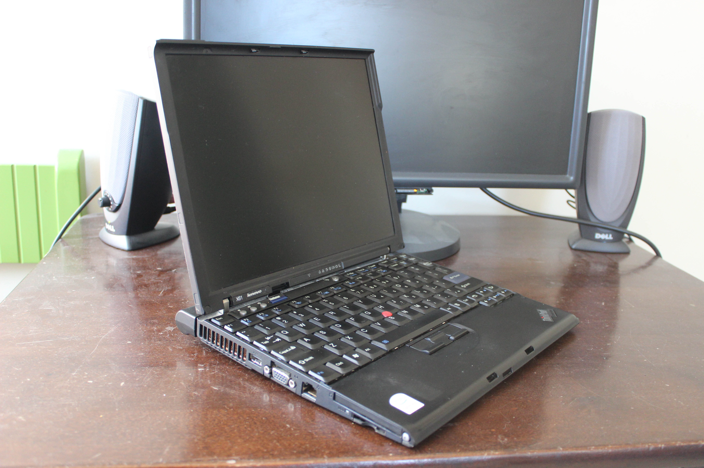

# Lenovo ThinkPad X61
[Parent directory](../index.md)

|  |  | 
|:---:|:---:|:---:|
|  |  | 
|  |  | 
|  |  | 
|  |  | 
|  |  | 
| 

### Specs

* CPU: Intel Core 2 Duo T7300 2.00 GHz
* RAM: 2GB DDR2
* Video: Intel GMA
* Storage: 120GB ADATA SU655 (Upgraded)
* Screen: 1024x768 12"