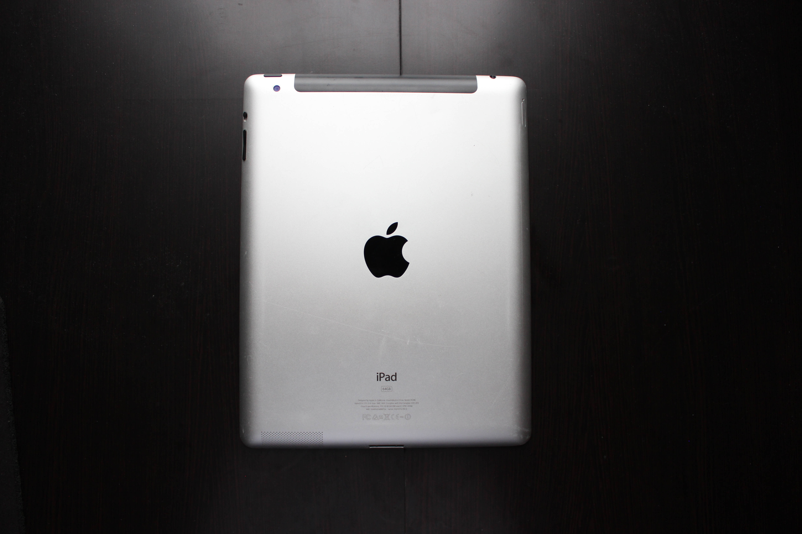

# Apple iPad 2
[Parent directory](../index.md)

|  |  | 
|:---:|:---:|:---:|
|  |  | 
| 

### Specs

* SoC: Apple A5 (45nm)
* RAM: 512MB DDR2
* Storage: 64GB NAND
* Display: 1024x768 9.7" IPS

### Notes

This was the family's first tablet when I was growing up. I still have fond memories of playing Minecraft Pocket Lite with friends on this iPad. Unfortunately, iOS 9 (the last supported version) runs quite poorly on this hardware and makes the device almost unusable with some apps. The screen on my device seems degraded (it shows visible burn-in at some times) and is slightly lifted at the bottom right corner from a dent likely caused by the tablet being dropped before.
