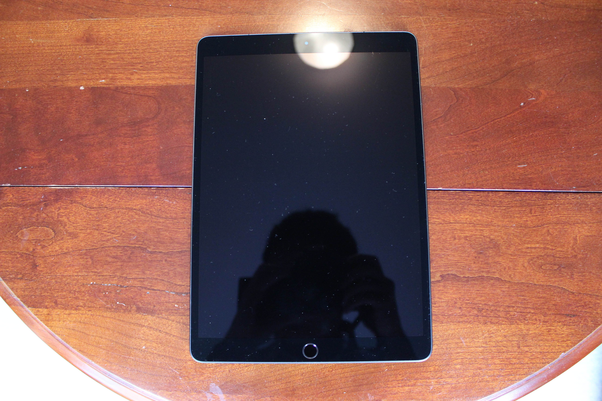
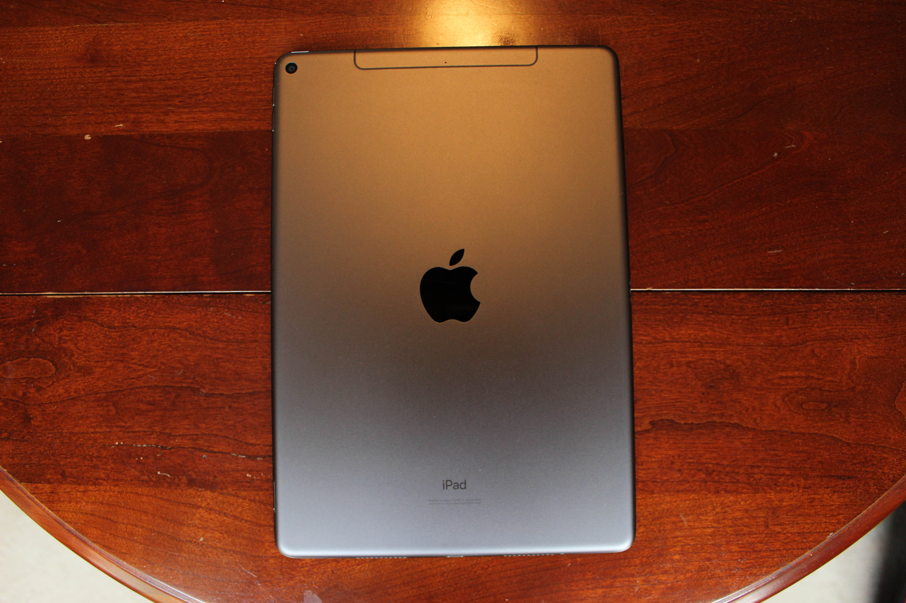
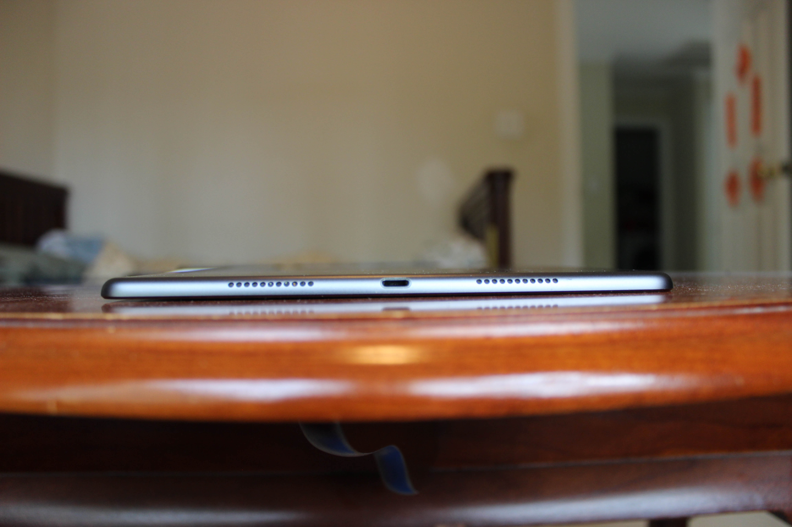
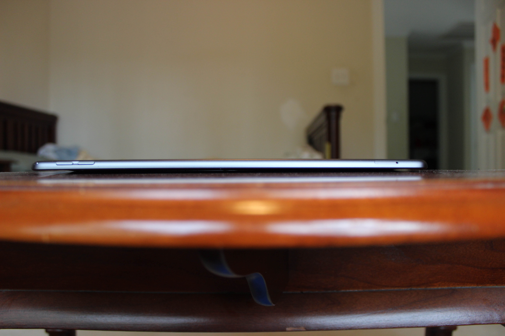
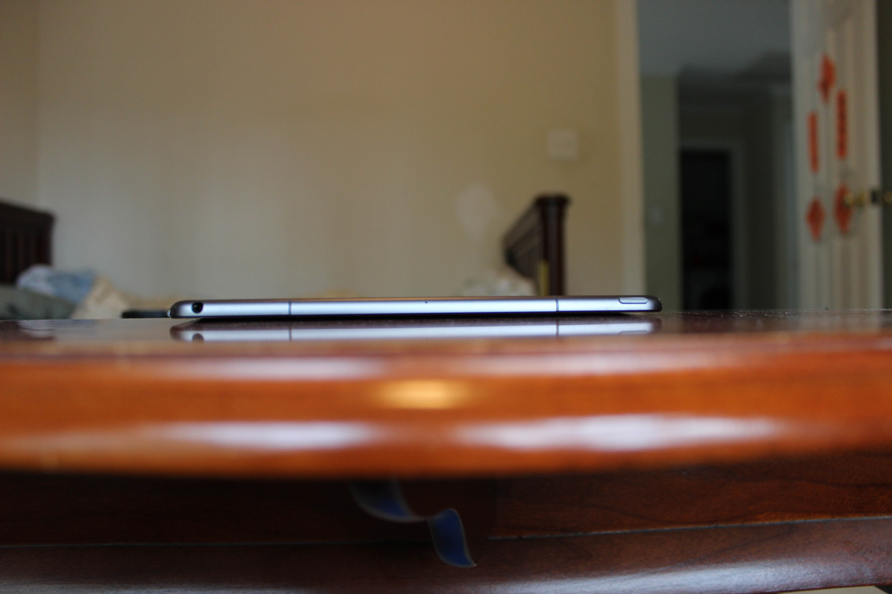
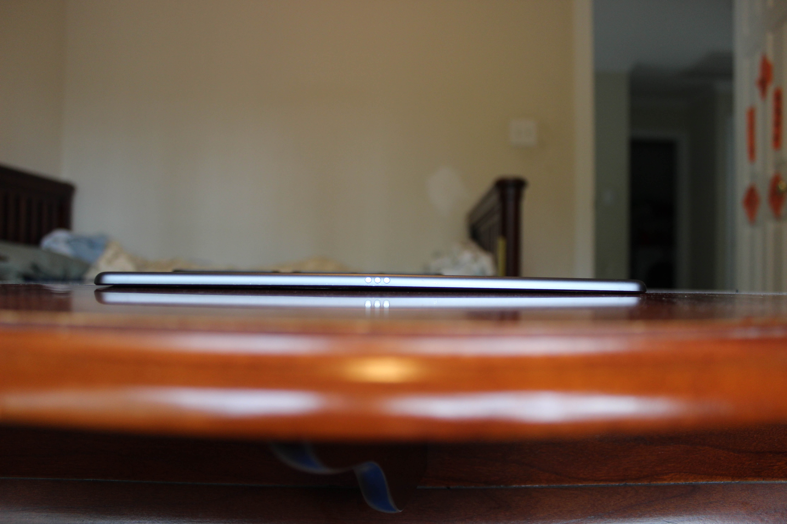
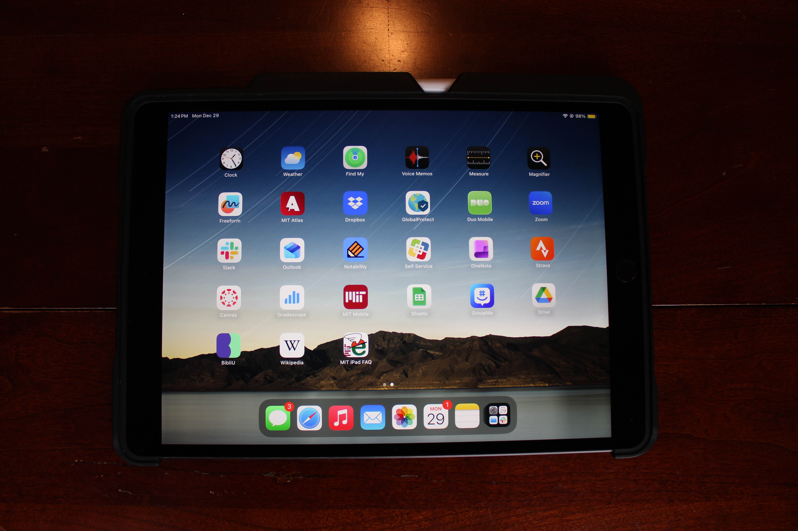
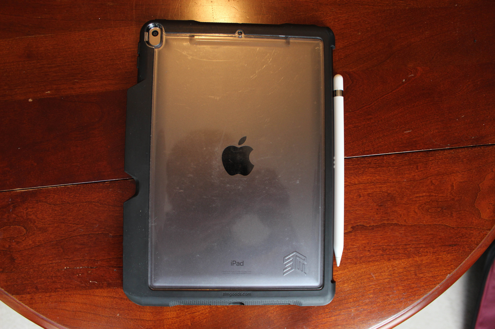

# Apple iPad Air (3rd generation)
[Parent directory](../index.md)

|  |  |  |
|:---:|:---:|:---:|
|  |  |  |
|  |  |

### Specs

* SoC: Apple A12 Bionic
* RAM: 3GB LPDDR4X
* Storage: 256GB NAND (NVMe)
* Display: 2224x1668 10.5" IPS
