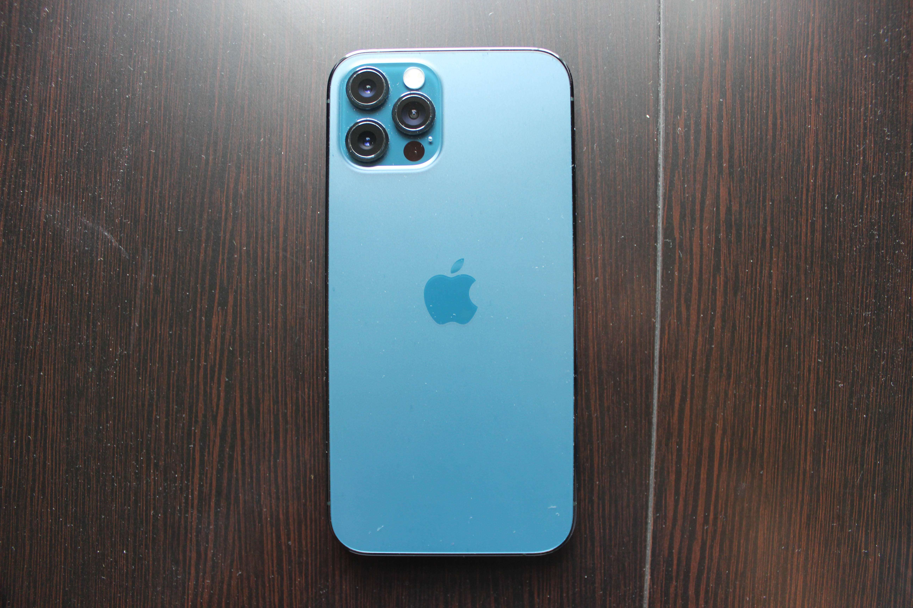

# Apple iPhone 6s
[Parent directory](../index.md)

|  |  |  |
|:---:|:---:|:---:|
|  |  |  |
|  |  |  |
|  |

### Specs

* SoC: Apple A14 Bionic
* RAM: 6GB LPDDR4X
* Storage: 256GB NAND (NVMe)
* Display: 2532x1170 6.1" OLED
