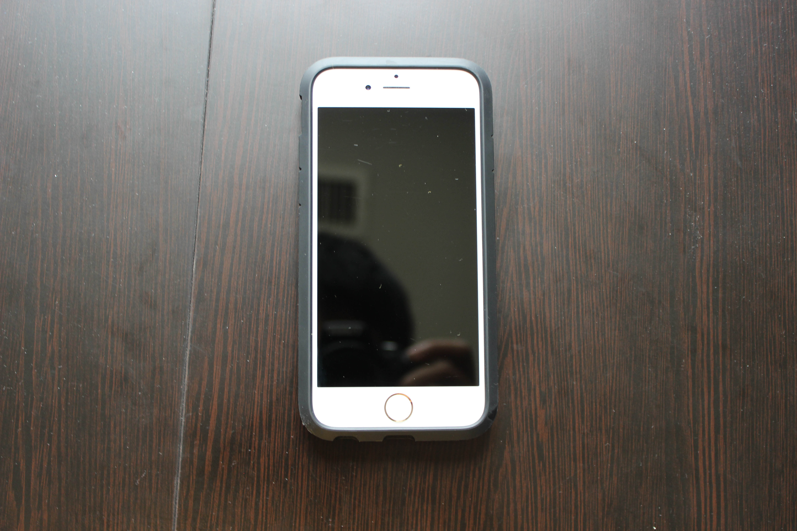
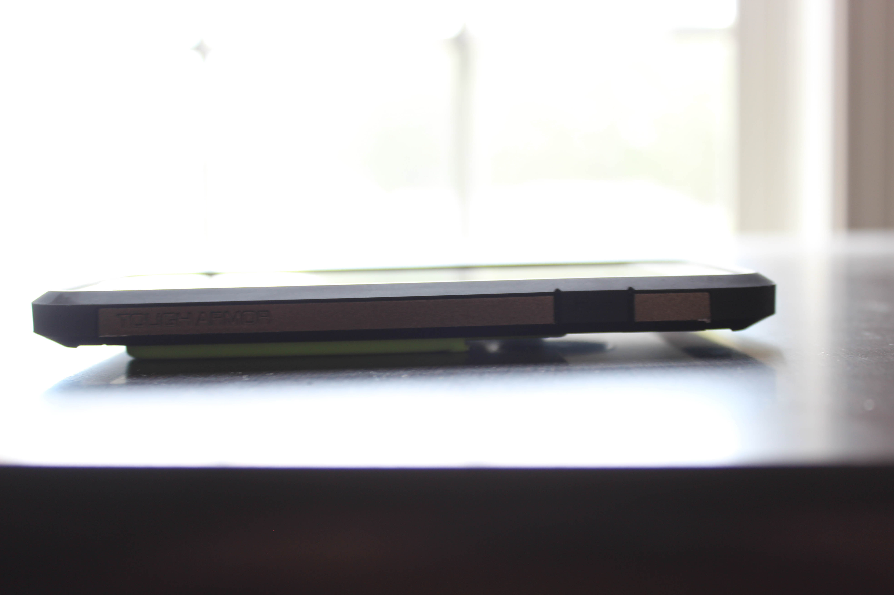
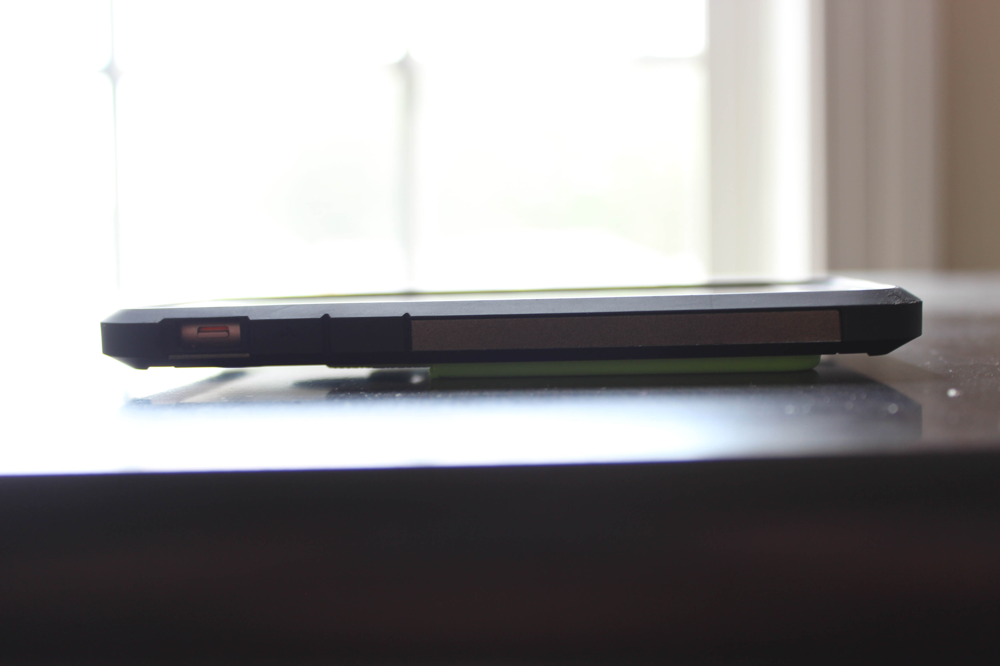
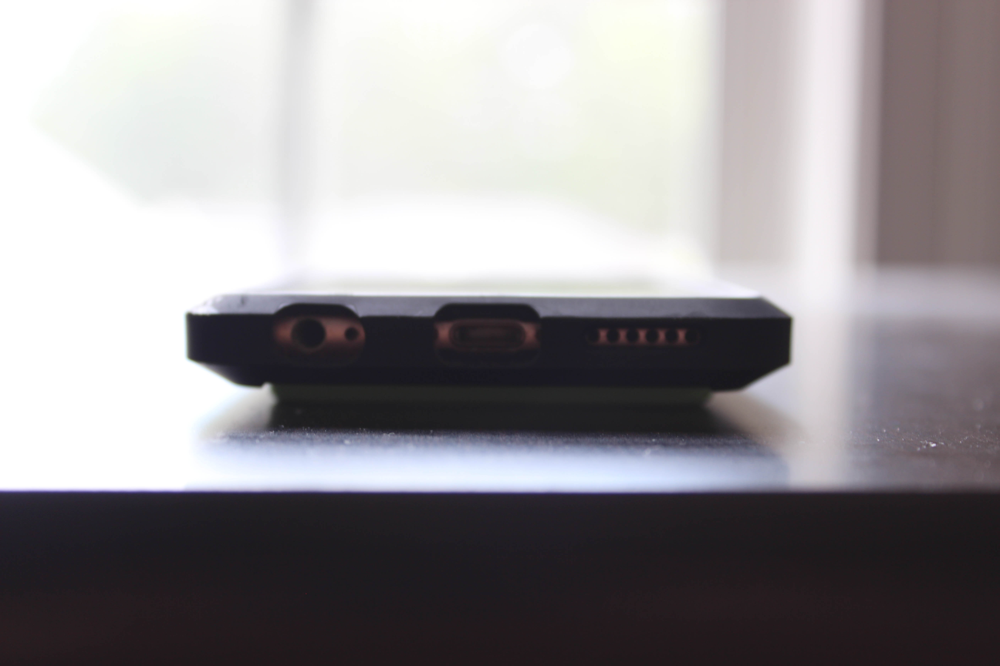
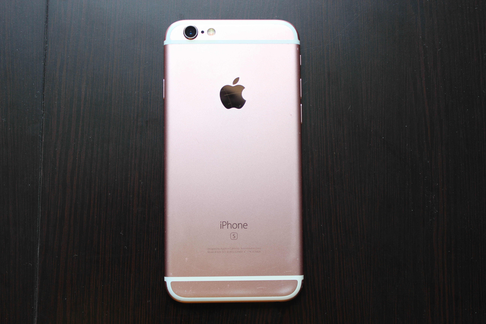
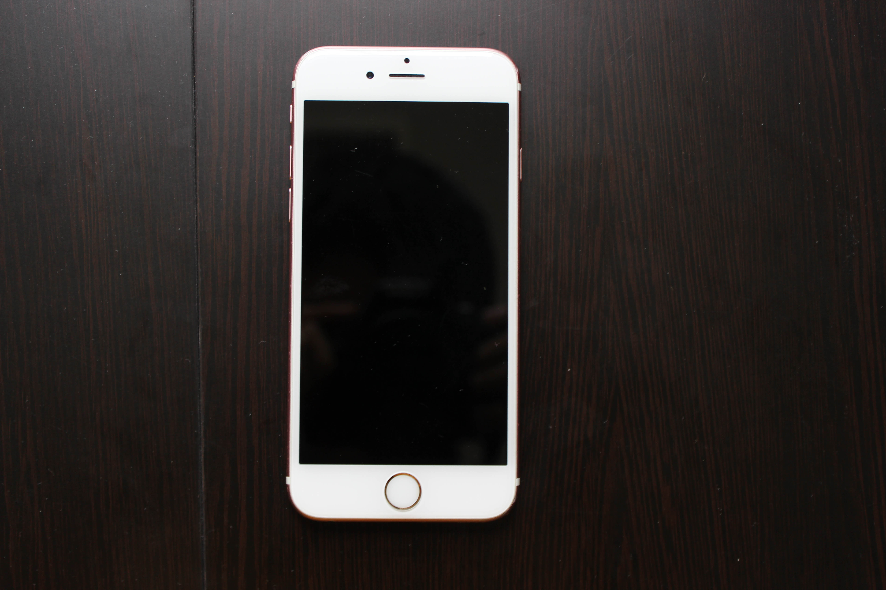
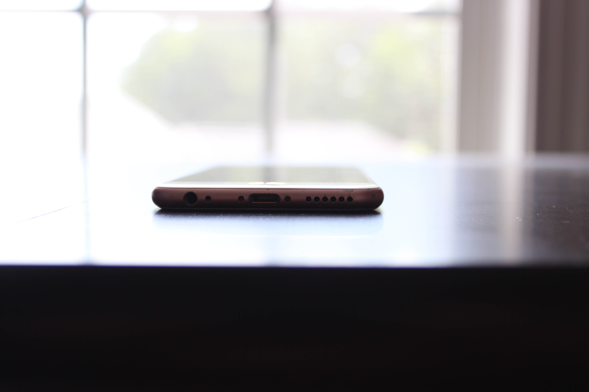
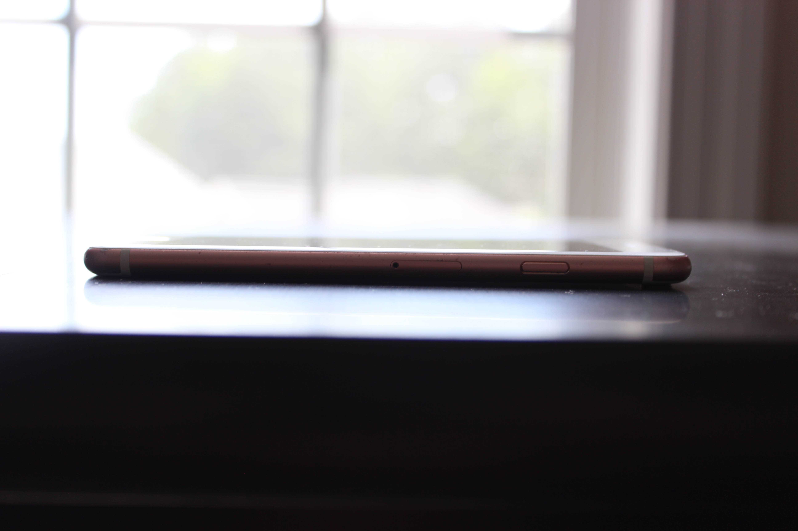
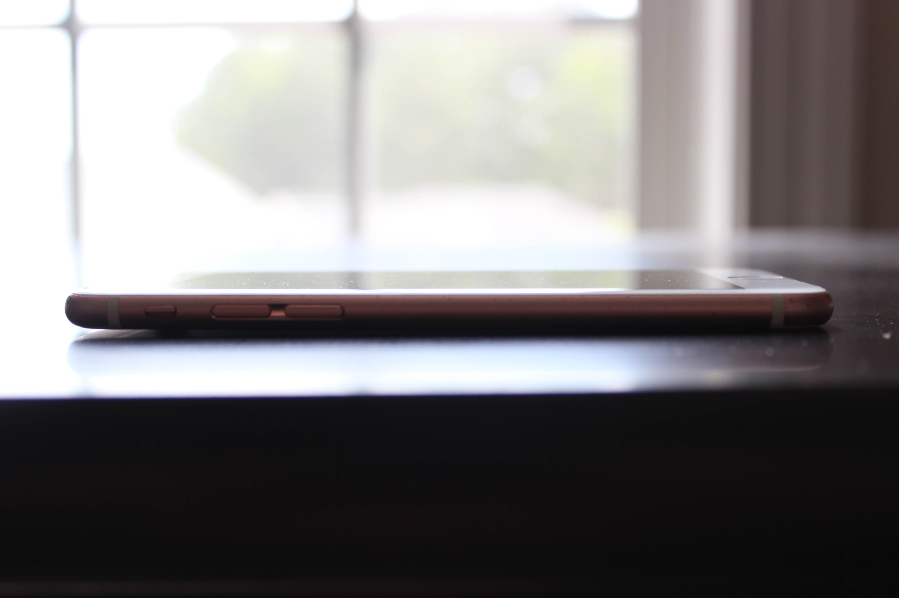

# Apple iPhone 6s
[Parent directory](../index.md)

<table>
  <tr>
    <td></td>
    <td></td>
    <td></td>
  </tr>
  <tr>
    <td></td>
    <td></td>
    <td></td>
  </tr>
  <tr>
    <td></td>
    <td></td>
    <td></td>
  </tr>
  <tr>
    <td></td>
    <td></td>
  </tr>
</table>

### Specs

* SoC: Apple A9
* RAM: 2GB LPDDR4
* Storage: 64GB NAND (NVMe)
* Display: 1334x750 4.7" IPS