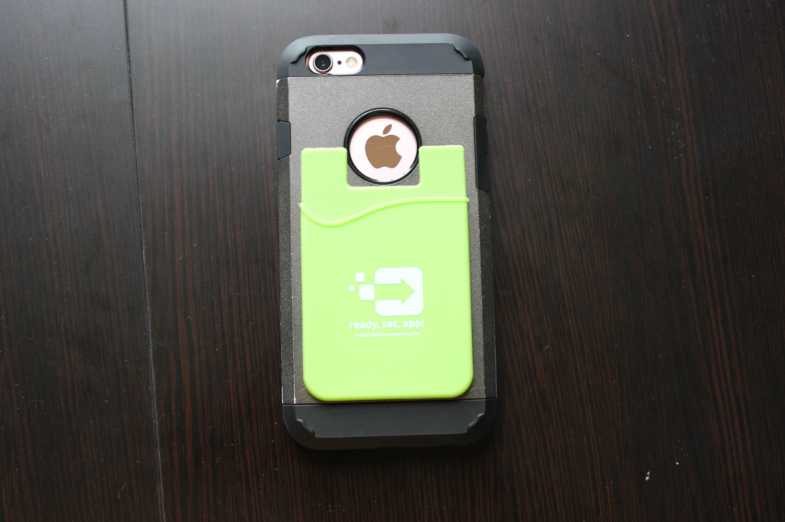

# Apple iPhone 6s
[Parent directory](../index.md)

|  |  |  |
|:---:|:---:|:---:|
|  |  |  |
|  |  |  |
|  |  |

### Specs

* SoC: Apple A9
* RAM: 2GB LPDDR4
* Storage: 64GB NAND (NVMe)
* Display: 1334x750 4.7" IPS
