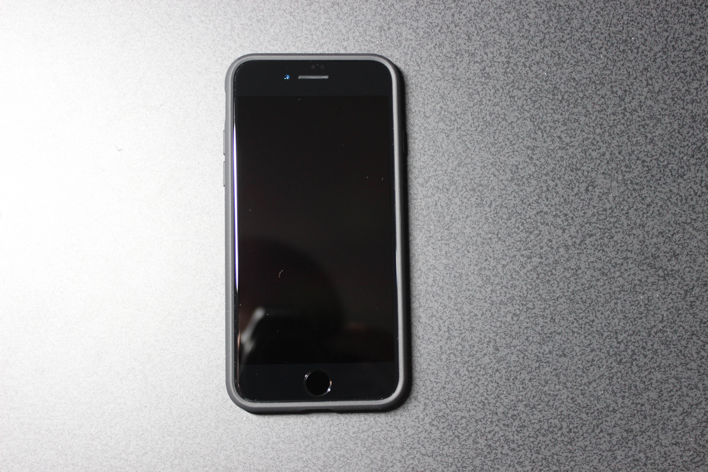
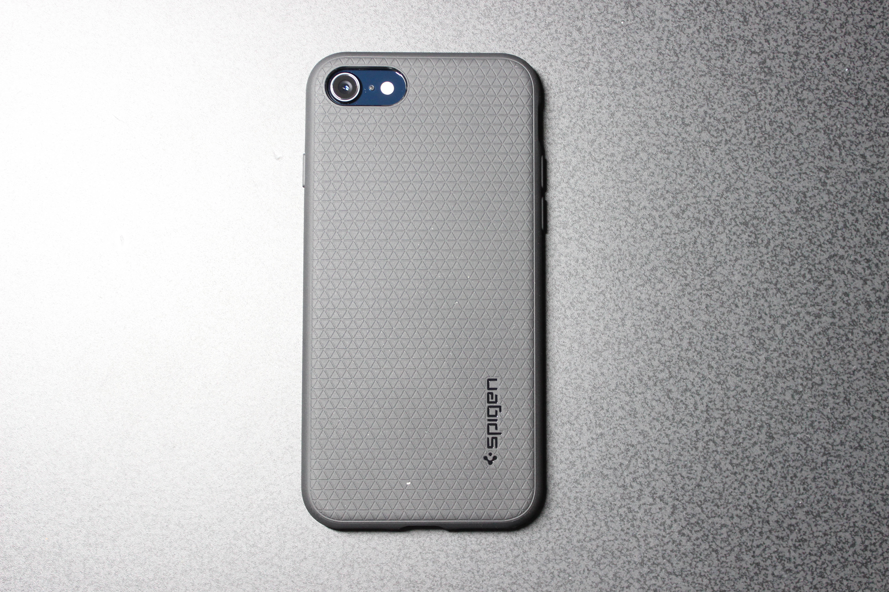
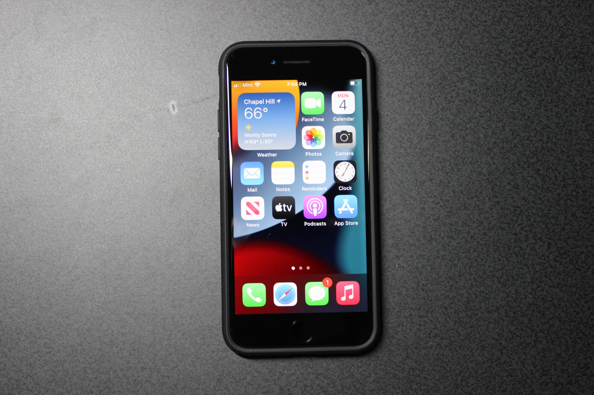
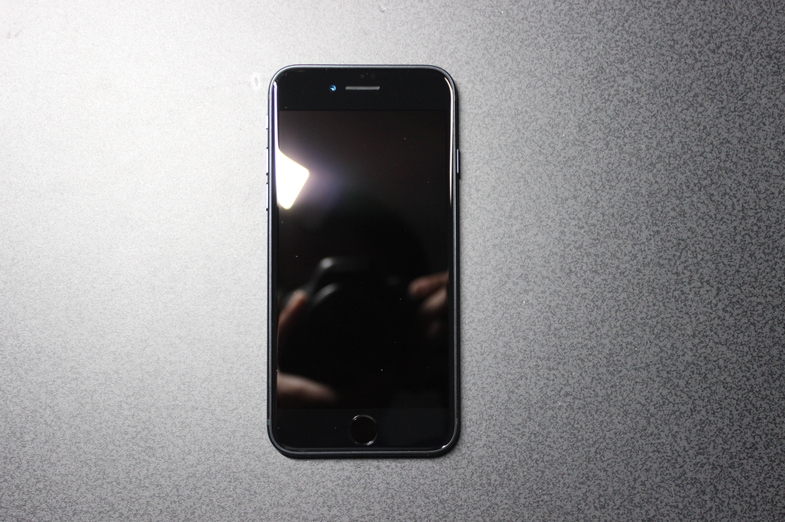
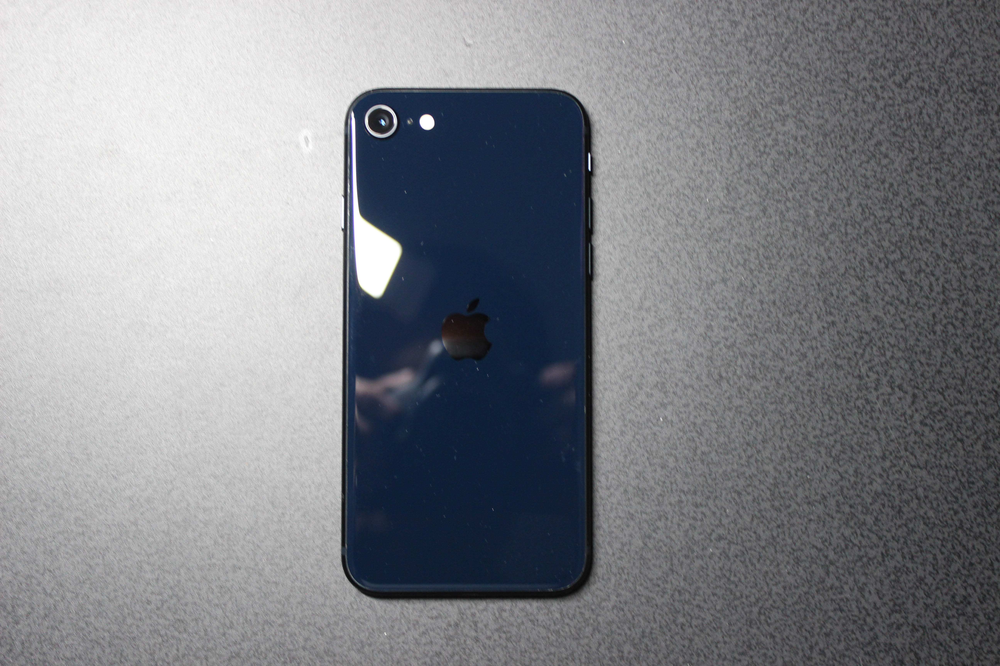
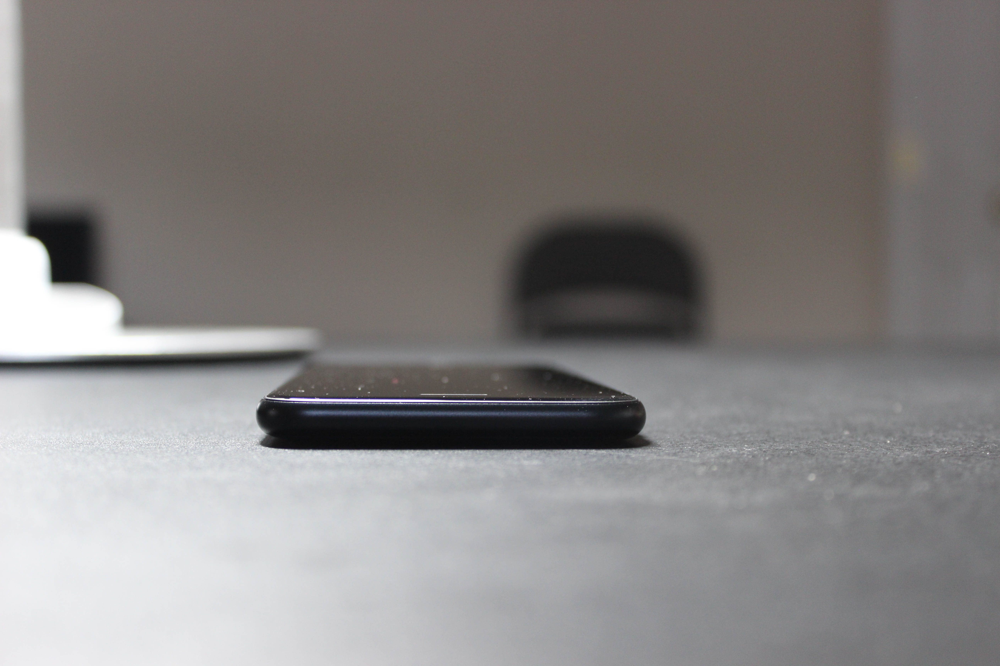
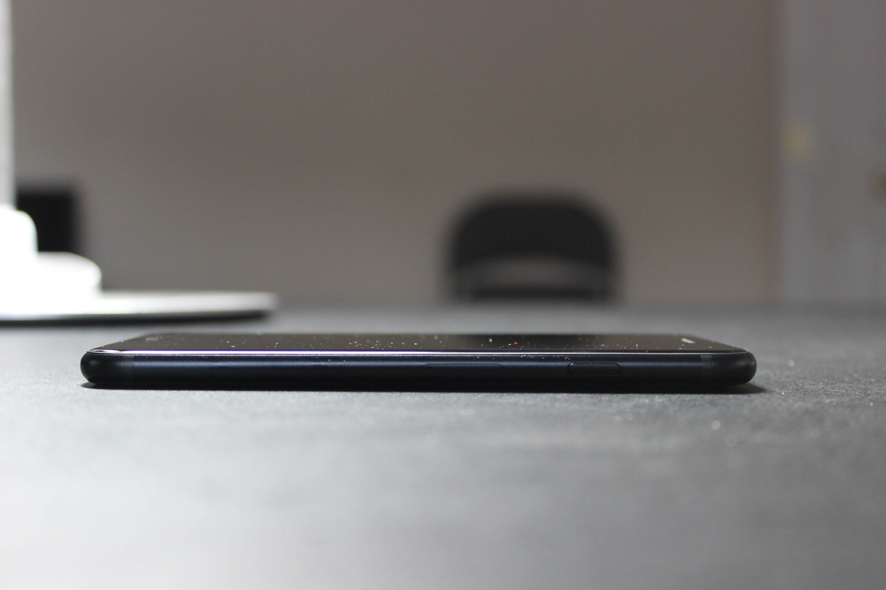
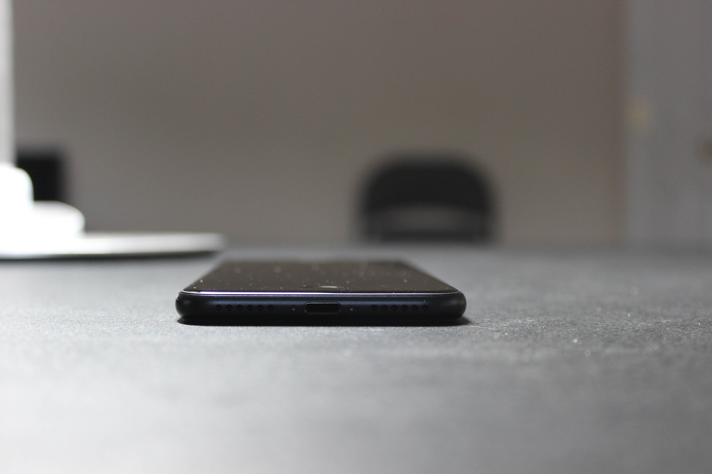
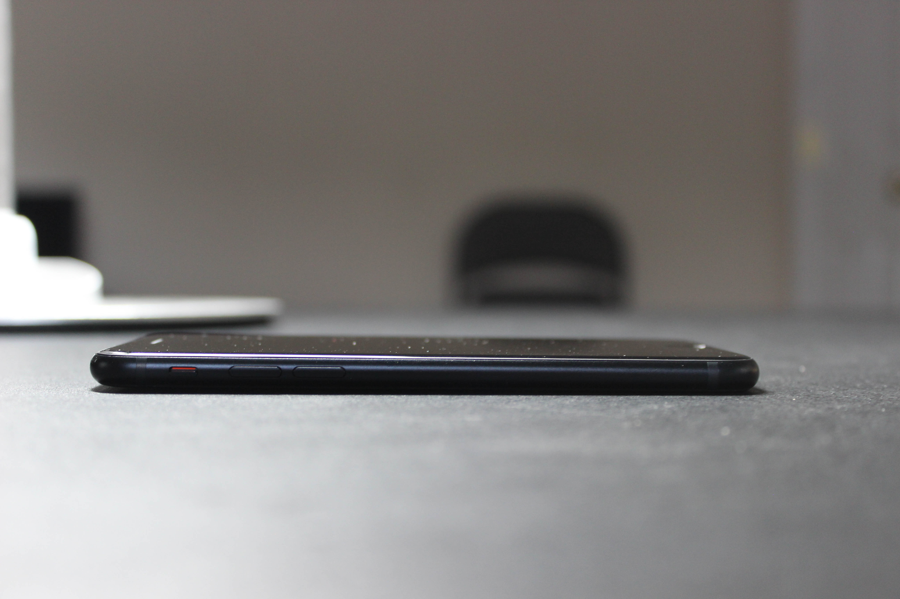

# Apple iPhone SE (3rd Generation)
[Parent directory](../index.md)

|  |  | 
|:---:|:---:|:---:|
|  |  | 
|  |  | 

### Specs

* SoC: Apple A15 Bionic
* RAM: 4GB LPDDR4X
* Storage: 128GB NAND (NVMe)
* Display: 1334x750 4.7" IPS
