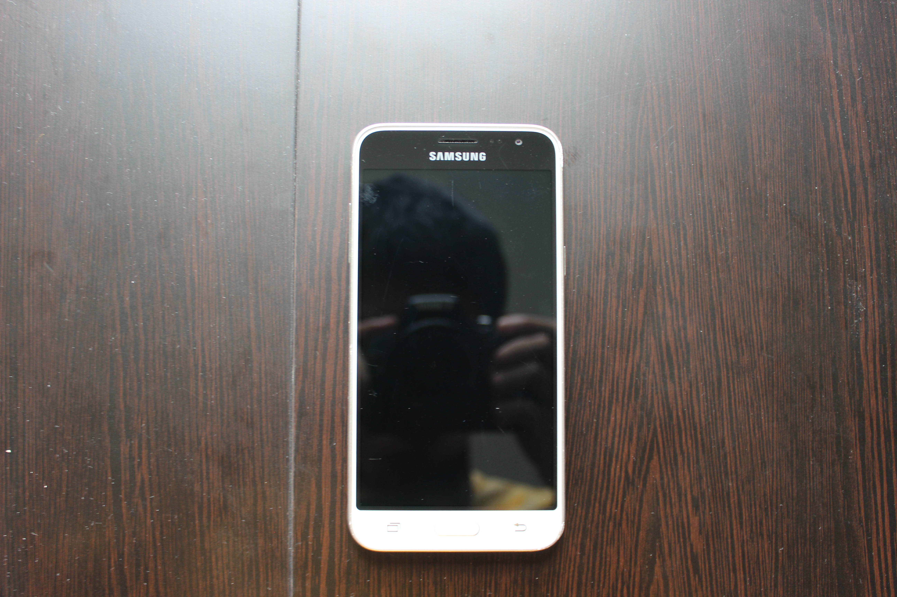
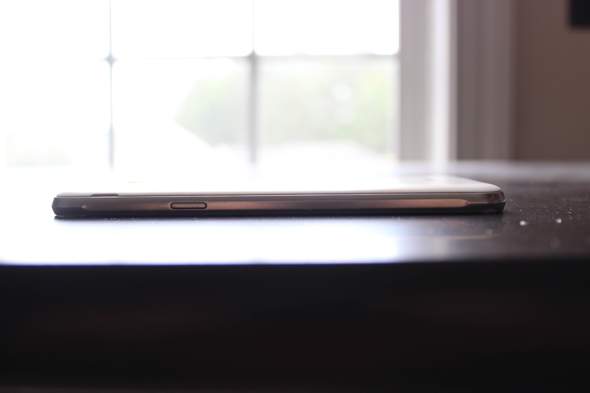
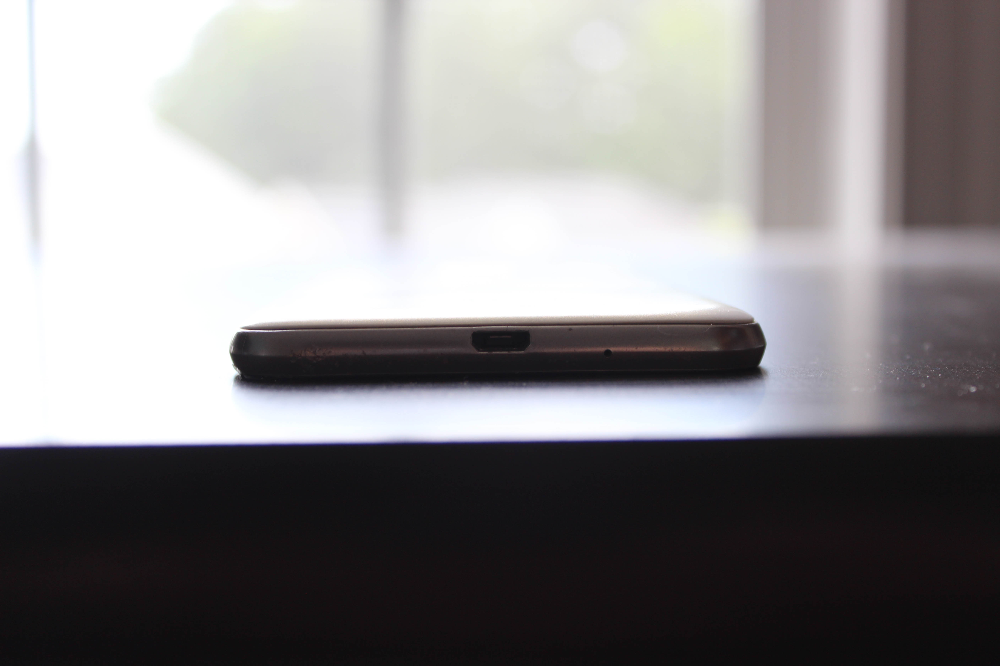
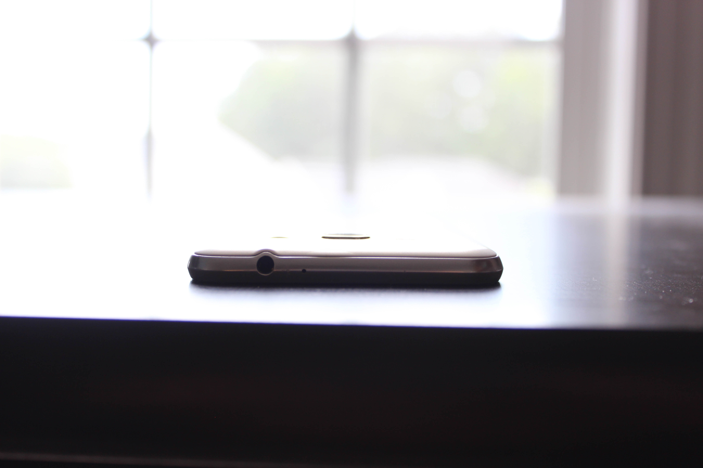

# Samsung Galaxy J3 (2016)
[Parent directory](../index.md)

<table>
  <tr>
    <td></td>
    <td></td>
    <td></td>
  </tr>
  <tr>
    <td></td>
    <td></td>
    <td></td>
  </tr>
  <tr>
    <td></td>
	<td></td>
  </tr>
</table>

### Specs

* SoC: Samsung Exynos 3475
* RAM: 1.5GB LPDDR3
* Storage: 16GB eMMC
* Display: 720x1280 4.8" IPS

### Notes
This was my first phone that I got in the beginning of the summer of 2017. I started my channel with it and used it to record many segments such as the Boot Camp and Hackintoshing videos and the room tour and PS2 YPbPr cable video on my second channel.
